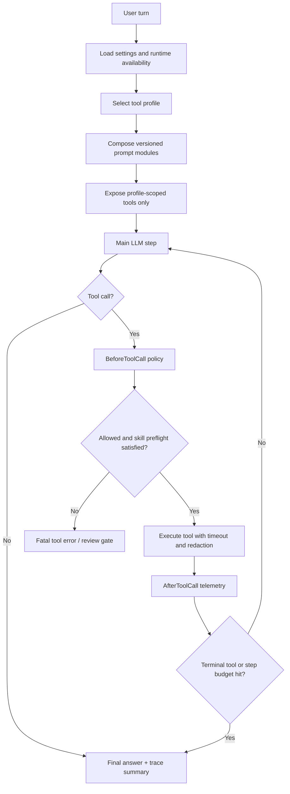

# Codex-Style Skill Orchestration Implementation Plan

> **For agentic workers:** REQUIRED SUB-SKILL: Use `subagent-driven-development` (recommended) or `executing-plans` to implement this plan task-by-task. Steps use checkbox (`- [ ]`) syntax for tracking.

**Goal:** Make Aura orchestrate tools the way a strong coding agent does: small active tool surface, explicit skill preflight, bounded delegation, sandbox-first computation, durable traces, and release-grade evals.

**Architecture:** Keep the main LLM in charge of the loop, but move policy into the runtime. The runtime selects a profile, exposes only matching tools, requires relevant skills before high-risk capabilities, blocks hidden tools, records trace events, and uses swarm/sandbox as bounded execution routes rather than ordinary optional tools.

**Tech Stack:** Go, SQLite settings, existing `internal/orchestration`, `internal/telegram`, `internal/toolsets`, `internal/skills`, `internal/swarmtools`, `internal/tools`, React dashboard, Docker Compose, Pyodide sidecar, Qdrant sidecar, future MCP registry/cache.

---

## Summary

The last v3.1 hardening slice fixed the most visible swarm problem: broad pipeline prompts now route to a bounded terminal swarm and finish under the 30 second gate. The next problem is wider: Aura still needs a repeatable operating model for every common user request.

Codex and Claude Code do not work well because they have a magical intent classifier. They work because the runtime gives the model:

- a compact always-on project contract;
- on-demand skills for procedures and reference material;
- focused tool permissions;
- isolated subagents for self-contained or verbose work;
- deterministic hooks before and after tools;
- a loop budget and stopping policy;
- enough trace data to debug bad decisions.

Aura should copy that shape, adapted to a Telegram second-brain product.

This plan is not DOCX-specific and not MCP marketplace implementation. It is the v3.1 bridge that makes v4.0 safe: before adding many MCP/plugin tools, Aura must prove that it can expose, use, audit, and hide capabilities predictably.

## Online Research Basis

Research checked on 2026-05-07:

- Claude Code extension docs separate always-on context, path-scoped rules, skills, MCP, subagents, hooks, plugins, and marketplaces. Key design lesson: keep permanent instructions small; move repeatable workflows and bulky reference material into on-demand skills.
  - https://code.claude.com/docs/en/features-overview
- Claude Code skills use `SKILL.md` plus optional templates, examples, scripts, and references. Key design lesson: a skill is not just a prompt snippet; it is a small capability package with progressive disclosure.
  - https://code.claude.com/docs/en/slash-commands
- Claude Code subagent docs emphasize isolated context, restricted tools, foreground/background execution, and using subagents for self-contained or high-volume work. Key design lesson: do not let subagents inherit the full parent surface.
  - https://code.claude.com/docs/en/sub-agents
- OpenAI Agents docs and SDK tracing emphasize agent loops, handoffs, guardrails, sessions, and traces that include LLM generations, tool calls, handoffs, and guardrails. Key design lesson: orchestration must be observable as structured events, not inferred from logs after the fact.
  - https://platform.openai.com/docs/guides/agents
  - https://openai.github.io/openai-agents-js/guides/tracing/
- Vercel AI SDK docs describe the tool loop as repeated steps until a stop condition or a final text response. Key design lesson: loop budgets and terminal conditions are product logic, not only prompt text.
  - https://vercel.com/kb/guide/how-to-build-ai-agents-with-vercel-and-the-ai-sdk
- LangGraph durable execution docs highlight checkpointed progress for long-running or human-in-the-loop workflows. Key design lesson: future long tasks should be resumable and idempotent, especially plugin install/review flows.
  - https://docs.langchain.com/oss/python/langgraph/durable-execution
- Google ADK for Go confirms a Go-first agent stack with model, instruction, and tools as explicit runtime configuration. Key design lesson: Aura can keep this native-Go rather than importing a large framework.
  - https://adk.dev/get-started/go/
- MCP security best practices call out MCP-specific attack surfaces. Key design lesson: v4.0 plugin expansion needs review gates, scoped credentials, and suspicious tool-description checks.
  - https://modelcontextprotocol.io/docs/tutorials/security/security_best_practices

## Best Skills To Use

These are the skills that should guide implementation work in Codex and become the model for Aura's own skill-routing policy.

### Process Skills

- `using-superpowers`
  - Purpose: forces the agent to check skills before acting.
  - Aura lesson: install-time skills should be discoverable by name, description, capability tags, and allowed tools.
- `writing-plans`
  - Purpose: turns ambiguous multi-step work into bite-sized tasks.
  - Aura lesson: broad planning prompts should route to `swarm_research` evidence before any write action.
- `subagent-driven-development`
  - Purpose: one fresh worker per independent task with review between tasks.
  - Aura lesson: swarm workers should be role-scoped, bounded, and never inherit full parent tools.
- `systematic-debugging`
  - Purpose: reproduce, isolate, explain, fix, verify.
  - Aura lesson: debug prompts should use sandbox or swarm based on whether the work is compute-local or evidence-wide.
- `test-driven-development`
  - Purpose: test first for behavior changes.
  - Aura lesson: every new profile/tool policy needs route tests and hidden-tool rejection tests before implementation.
- `verification-before-completion`
  - Purpose: prevents false "done" claims.
  - Aura lesson: every release gate must include exact commands, metrics, and failure blockers.

### Capability Skills

- `browser-use`
  - Use for dashboard/localhost verification and screenshots.
  - Aura route: `browser_e2e` or `admin_review` profile when dashboard validation is requested.
- `docker-compose-orchestration`
  - Use for Docker runtime, sidecars, health, and release smoke.
  - Aura route: `admin_review` with review gate for service mutations.
- `documents:documents`, `docx`, `document-pdf`, `xlsx`
  - Use for typed user-facing files and document extraction workflows.
  - Aura route: `document` profile, with `list_skills` and `read_skill` required before file tools.
- `openai-docs`
  - Use for OpenAI API/Agents/Responses questions.
  - Aura route: `document` or `memory` depending on whether a report/file is requested.
- `codex-security:security-scan`
  - Use for security review, prompt injection, MCP/plugin risk, auth, secrets.
  - Aura route: `admin_review` or `swarm_research`; mutation remains gated.
- `github:yeet`
  - Use for commit/push/PR release flows.
  - Aura route: future `release` profile; never exposed in default chat.

### Aura Runtime Skills To Add Later

These are not necessarily Codex-installed skills today; they are skill packages Aura should ship or support.

- `aura-memory-audit`
  - Reads wiki/source/search evidence and runs memory quality closure.
- `aura-source-extraction`
  - Handles PDF, DOCX, XLSX, HTML, TXT, OCR, cleanup, and source artifact contracts.
- `aura-dashboard-e2e`
  - Opens dashboard, reads settings, validates auth, sources, tasks, swarm, and review queue.
- `aura-release-docker`
  - Executes Docker-only release smoke, resource checks, image publishing, rollback notes.
- `aura-mcp-plugin-review`
  - Reviews MCP server manifest, tools, env vars, permissions, network, secret use, and rollback plan.
- `aura-qdrant-search-quality`
  - Compares Qdrant/local retrieval, stale refs, embedding settings, and fallback bounds.

## User Decisions

- Docker is the release runtime.
- No separate intent model for this milestone.
- Main LLM remains the orchestrator.
- Skills, swarm, sandbox, and future MCP/plugin tools must be first-class routes.
- Skill preflight is required for document, source extraction, PDF, XLSX, sandbox/coding, browser, Docker, security, release, and MCP/plugin capability families.
- v4.0 MCP marketplace remains blocked until v3.1 proves profile-scoped tool exposure and telemetry.
- No manual wiki cleanup; memory cleanup remains tool-driven and audited.

## Target Runtime Shape

## Public Interfaces And Settings

Existing settings to preserve:

- `AURA_PROMPT_VERSION=aura-agent-v1`
- `AURA_TOOL_PROFILE_MODE=auto|default|memory|swarm_research|sandbox_compute|document|admin_review`
- `AURA_ORCHESTRATION_LOG_LEVEL=summary|debug`

New settings proposed for this plan:

- `AURA_SKILL_PREFLIGHT=required|advisory|off`
  - Default: `required`.
  - `required` means capability-specific tools fail if the model has not read an applicable skill in the current turn.
- `AURA_SKILL_ROUTING_MODE=manifest|manifest_llm_review`
  - Default: `manifest`.
  - `manifest` uses deterministic metadata. `manifest_llm_review` can be evaluated later for unclear cases.
- `AURA_AGENT_LOOP_MAX_STEPS=6`
  - Default: `6`; lower for terminal profiles.
- `AURA_TERMINAL_TOOL_POLICY=profile|off`
  - Default: `profile`; routes such as `swarm_research` can finish immediately after aggregate tools.
- `AURA_DELEGATION_MODE=fast|bounded|async`
  - Default: `fast`.
  - `fast` uses one bounded worker; `bounded` allows up to three; `async` is future durable task work.
- `AURA_TRACE_RETENTION_DAYS=30`
  - Default: `30`; controls orchestration trace cleanup.

New debug expectations:

- `-expect-skill-read <skill-or-capability>`
- `-expect-hidden-tool-rejected`
- `-expect-terminal-tool <tool>`
- `-expect-loop-steps-max <n>`
- `-expect-trace-field <field>`
- `-expect-no-stale-skill-ref`

## Capability Taxonomy

Create a small taxonomy. Do not route on raw skill names alone.

- `memory_read`
  - Tools: wiki/source/search/conversation reads.
  - Profiles: `default`, `memory`, `swarm_research`, `document`.
- `memory_write_reviewed`
  - Tools: wiki proposals and review-gated updates.
  - Profiles: `admin_review`.
- `source_extraction`
  - Tools: upload, extract, OCR, clean artifacts.
  - Profiles: `document`, `sandbox_compute`, `admin_review`.
- `document_generation`
  - Tools: DOCX/PDF/XLSX/static file tools.
  - Profiles: `document`.
- `sandbox_compute`
  - Tools: `execute_code`, artifact persistence, read-only source inputs.
  - Profiles: `sandbox_compute`.
- `swarm_research`
  - Tools: `run_aurabot_swarm`, `read_swarm_result`, `list_swarm_tasks`.
  - Profiles: `swarm_research`.
- `browser_e2e`
  - Tools: future dashboard/browser tools or external E2E harness.
  - Profiles: `admin_review`.
- `docker_runtime`
  - Tools: Docker smoke/debug commands, health checks.
  - Profiles: `admin_review`.
- `security_review`
  - Tools: read-only code/config/source inspection, proposal tools.
  - Profiles: `swarm_research`, `admin_review`.
- `release_git`
  - Tools: commit/push/PR/release helpers.
  - Profiles: future `release`, or current `admin_review`.
- `mcp_plugin`
  - Tools: registry, install proposal, smoke, rollback.
  - Profiles: v4.0 `plugin_review`; not in v3.1 default.

## File Map

- Modify: `internal/orchestration/orchestration.go`
  - Own profile cards, capability taxonomy, profile selection, profile metadata, terminal tool policy.
- Modify: `internal/orchestration/orchestration_test.go`
  - Lock profile routing and exact tool surfaces.
- Create: `internal/orchestration/capabilities.go`
  - Define capability names, capability-to-tool mappings, capability-to-skill mappings.
- Create: `internal/orchestration/capabilities_test.go`
  - Verify every capability has at least one profile and skill policy.
- Create: `internal/orchestration/skill_policy.go`
  - Decide when `list_skills/read_skill` is required, advisory, or off.
- Create: `internal/orchestration/skill_policy_test.go`
  - Verify document, source extraction, PDF, XLSX, sandbox, browser, Docker, security, release, and MCP/plugin preflight rules.
- Modify: `internal/skills/loader.go`
  - Add normalized manifest output if current loader does not expose capability tags.
- Modify: `internal/skills/loader_test.go`
  - Verify malformed or stale skill metadata is ignored with a clear warning.
- Modify: `internal/telegram/conversation.go`
  - Enforce skill preflight and terminal tool policies in the live loop.
- Modify: `internal/telegram/debug_smoke.go`
  - Include skill preflight, loop steps, terminal tool, hidden tool rejection, token/cost, and trace fields.
- Modify: `cmd/debug_telegram_sandbox/main.go`
  - Add expectation flags and print a compact route report.
- Modify: `cmd/debug_orchestration/main.go`
  - Add non-live route checks for common prompts and stale skill references.
- Modify: `internal/settings/catalog.go`
  - Add the new settings and enum metadata.
- Modify: `internal/settings/applier.go`
  - Persist and apply orchestration settings from SQLite and env without secret leakage.
- Modify: `web/src/components/SettingsPanel.tsx`
  - Show new orchestration settings as combo boxes or numeric inputs.
- Modify: `web/src/i18n/locales/en.json`
  - Add English labels/hints.
- Modify: `web/src/i18n/locales/it.json`
  - Add Italian labels/hints.
- Modify: `web/e2e/settings.spec.ts`
  - Verify settings are visible, editable, and preserved.
- Modify: `.planning/phases/04-agent-orchestration-system-prompt-versioning/VALIDATION.md`
  - Record route eval and live E2E evidence.

## Implementation Phases

### Phase 0: Baseline Inventory

- [ ] Run `git status --short --branch`.
- [ ] Run `go test ./internal/orchestration ./internal/telegram ./internal/skills ./internal/settings ./cmd/debug_telegram_sandbox ./cmd/debug_orchestration -count=1`.
- [ ] Capture current `cmd/debug_telegram_sandbox` output for these prompts:
  - `facciamo il punto di tutta la pipeline Aura`
  - `crea un documento con il riepilogo dei documenti che hai`
  - `calcola una tabella CSV e un grafico sui tempi E2E`
  - `apri le settings e verifica SEARCH_BACKEND`
  - `prepara release docker e dimmi se manca qualcosa`
- [ ] Record current failures in `VALIDATION.md`.
- [ ] Commit only if new evidence was added: `docs: record codex-style orchestration baseline`.

### Phase 1: Capability Taxonomy

- [x] Write failing tests in `internal/orchestration/capabilities_test.go` for all capability families.
- [x] Create `internal/orchestration/capabilities.go`.
- [x] Map existing tool names to capabilities.
- [x] Map each capability to valid profiles.
- [x] Add stale alias tests for old worker names and obsolete `.yaml` skill refs.
- [x] Run `go test ./internal/orchestration -count=1`.
- [x] Commit: `feat: add orchestration capability taxonomy`.

### Phase 2: Skill Manifest And Preflight Policy

- [x] Write failing tests in `internal/orchestration/skill_policy_test.go`.
- [x] Add `SkillRequirement` with fields:
  - `Capability`
  - `Required`
  - `AllowedSkillNames`
  - `Reason`
  - `FreshnessScope=turn`
- [x] Implement `NeedsSkillPreflight(profile, capability, calledTool, turnState)`.
- [x] Require `list_skills` and `read_skill` before tools in document, source extraction, PDF, XLSX, sandbox/coding, browser, Docker, security, release, and MCP/plugin families.
- [x] Make preflight advisory for simple memory reads.
- [x] Add setting `AURA_SKILL_PREFLIGHT`.
- [x] Run `go test ./internal/orchestration ./internal/settings -count=1`.
- [x] Commit: `feat: require skill preflight for capability tools`.

### Phase 3: Profile Cards And Loop Policy

- [x] Replace scattered route conditions with declarative profile cards.
- [x] Add `LoopPolicy` per profile:
  - `MaxSteps`
  - `TerminalTools`
  - `AllowNoToolFinalization`
  - `DuplicateToolPolicy`
  - `MaxElapsed`
- [x] Set `swarm_research` to terminal after `run_aurabot_swarm`.
- [x] Set `sandbox_compute` to allow one final no-tool response after `execute_code`.
- [x] Keep `default` conservative with no admin/plugin mutation.
- [x] Add English and Italian prompt route tests.
- [x] Run `go test ./internal/orchestration ./internal/telegram -count=1`.
- [x] Commit: `feat: add profile cards and loop policies`.

### Phase 4: Live Loop Enforcement

- [x] Add turn state for:
  - profile;
  - exposed tools;
  - called tools;
  - read skills;
  - active capabilities;
  - loop step count;
  - terminal tool status.
- [x] In `BeforeToolCall`, reject hidden tools as fatal.
- [x] In `BeforeToolCall`, reject capability tools when required skill preflight is missing.
- [x] In `AfterToolCall`, record duration, error class, result size, tokens, and cost if available.
- [x] Stop after terminal tools according to profile policy.
- [x] Run `go test ./internal/telegram ./cmd/debug_telegram_sandbox -count=1`.
- [x] Commit: `feat: enforce skill and terminal tool policy`.

### Phase 5A: Automatic Post-Turn Memory Capture

- [x] Treat memory learning as a post-turn pipeline, not extra live-loop write power.
- [x] Keep the default mutation path review-gated through `proposed_updates`.
- [x] Change Docker/default config to `SUMMARIZER_MODE=review`, `SUMMARIZER_TURN_INTERVAL=2`, and `SUMMARIZER_COOLDOWN_SECONDS=0`.
- [x] Preserve `SUMMARIZER_MODE=off` as the no-cost/no-capture escape hatch.
- [x] Preserve `SUMMARIZER_MODE=auto` only as explicit direct-wiki-write mode.
- [x] Make review proposals keep the originating `chat_id`.
- [x] Add duplicate-pending suppression so repeated turns do not flood the review queue before approval.
- [x] Make summarizer prompts include numeric archived turn IDs so `source_turn_ids` can point at real archive evidence.
- [x] Use synchronous archive writes when post-turn capture is active so the extractor sees the just-finished turn.
- [x] Log capture triggered/decision/applied counts in per-turn telemetry.
- [x] Surface capture defaults in dashboard settings and `.env.example`.
- [x] Run `go test ./internal/conversation/summarizer ./internal/telegram ./internal/config ./internal/settings ./internal/api -count=1`.
- [ ] Run full Go verification and Docker smoke before closing the broader phase.
- [ ] Commit: `feat: add automatic post-turn memory capture`.

### Phase 5: Debug And Telemetry Surface

- [ ] Extend `cmd/debug_orchestration` to print:
  - selected profile;
  - reason;
  - capabilities;
  - required skills;
  - exposed tools;
  - loop policy.
- [ ] Extend `cmd/debug_telegram_sandbox` to print:
  - skill reads;
  - hidden tool rejections;
  - loop steps;
  - terminal tool;
  - token/cost;
  - elapsed;
  - trace fields.
- [ ] Add expectation flags for skill reads and loop bounds.
- [ ] Redact API keys, Telegram tokens, bearer tokens, source secrets, and `.env` values.
- [ ] Run `go test ./cmd/debug_telegram_sandbox ./cmd/debug_orchestration -count=1`.
- [ ] Commit: `feat: expose orchestration debug metrics`.

### Phase 6: Dashboard Settings Polish

- [ ] Add settings catalog entries for:
  - `AURA_SKILL_PREFLIGHT`
  - `AURA_SKILL_ROUTING_MODE`
  - `AURA_AGENT_LOOP_MAX_STEPS`
  - `AURA_TERMINAL_TOOL_POLICY`
  - `AURA_DELEGATION_MODE`
  - `AURA_TRACE_RETENTION_DAYS`
- [ ] Render enum settings as combo boxes.
- [ ] Render loop/max/retention settings as bounded numeric inputs.
- [ ] Add i18n keys for English and Italian.
- [ ] Add E2E coverage to verify save/reload.
- [ ] Run:
  - `npm --prefix web run i18n:check`
  - `npm --prefix web run build`
  - settings E2E used by the repo.
- [ ] Commit: `feat: expose orchestration settings`.

### Phase 7: Route Evals

- [ ] Add deterministic route eval fixtures for common prompts:
  - pipeline audit -> `swarm_research`
  - memory answer -> `memory`
  - source/document summary -> `document`
  - chart/CSV/calculation -> `sandbox_compute`
  - dashboard settings check -> `admin_review`
  - Docker release check -> `admin_review`
  - MCP plugin install proposal -> `admin_review` now, future `plugin_review`
- [ ] Assert expected exposed tools for every fixture.
- [ ] Assert forbidden tools are hidden.
- [ ] Assert required skills are listed for capability routes.
- [ ] Assert no stale worker aliases or dead `.yaml` refs appear.
- [ ] Run `go test ./internal/orchestration ./cmd/debug_orchestration -count=1`.
- [ ] Commit: `test: add codex-style route evals`.

### Phase 8: Live E2E Gate

- [ ] Rebuild Docker:
  - `docker compose up -d --build aura`
- [ ] Confirm:
  - `http://127.0.0.1:18080/status`
  - settings page reachable;
  - Pyodide sidecar healthy;
  - Qdrant sidecar healthy if enabled.
- [ ] Run live Telegram-style smokes against DB-selected model:
  - pipeline audit expects terminal swarm and token/cost metrics;
  - document summary expects skill read before file tools;
  - CSV/chart expects sandbox and artifact persistence;
  - dashboard settings expects admin review route;
  - Docker release prompt expects Docker skill preflight or admin review route.
- [ ] Required pass:
  - no hidden tool call succeeds;
  - all required skill reads happen;
  - no stale alias/tool refs;
  - 0 scenarios over 30s for the fast route set;
  - tokens and cost reported for every live LLM route.
- [ ] Append evidence to `VALIDATION.md`.
- [ ] Commit: `docs: record codex-style orchestration e2e`.

### Phase 9: v3.1 Closure Decision

- [ ] Run:
  - `loops/aura-implementation/scripts/verify-go.ps1`
  - `go test ./... -count=1`
  - `npm --prefix web run i18n:check`
  - `npm --prefix web run build`
  - `docker compose config --quiet`
  - Docker rebuild and `/status` smoke.
- [ ] If all strict gates pass, update `.planning/ROADMAP.md` and `.planning/STATE.md` with v3.1 closure evidence.
- [ ] If any gate fails, keep v3.1 active and write the measured blocker in `VALIDATION.md`.
- [ ] Do not start v4.0 MCP marketplace until this gate is clean.
- [ ] Commit either:
  - `docs: close v3.1 orchestration gate`
  - or `docs: record v3.1 orchestration blocker`.

## Quality Bar

The plan is done only when these are true:

- Common prompts route to the expected profile in deterministic tests.
- Live Telegram-style E2E uses the real configured DB model.
- Skill preflight is visible in telemetry.
- Document/source/sandbox/security/release routes do not skip relevant skills.
- Swarm does not keep looping through parent read tools after terminal delegation.
- Hidden tools fail closed.
- Tokens, cost, latency, loop steps, exposed tools, called tools, profile, prompt hash, and skill reads are captured.
- Dashboard settings can override orchestration settings without losing enum values.
- Docker remains the release runtime.

## Explicit Non-Goals

- Do not implement v4.0 MCP marketplace in this plan.
- Do not add a separate lightweight intent model yet.
- Do not expose every installed skill or MCP tool globally.
- Do not manually clean wiki pages as part of orchestration routing.
- Do not replace SQLite for canonical app state in this slice.
- Do not make subagents spawn subagents.

## Handoff

Recommended implementation order:

1. Capability taxonomy.
2. Skill preflight.
3. Profile cards and loop policy.
4. Live loop enforcement.
5. Debug/telemetry.
6. Dashboard settings.
7. Deterministic route evals.
8. Live Docker E2E.
9. v3.1 closure decision.

Use subagents for independent implementation slices, but keep the final integration review in the main session so profile/tool boundaries stay coherent.
