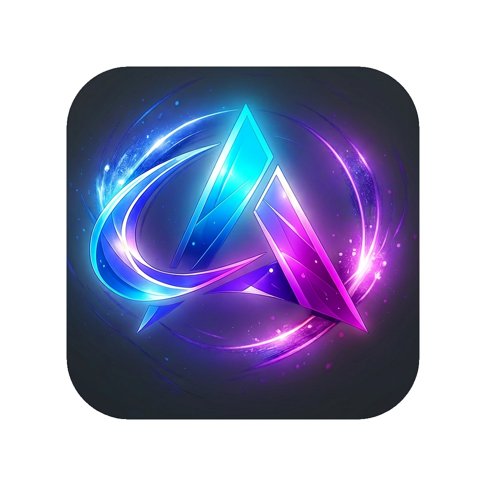
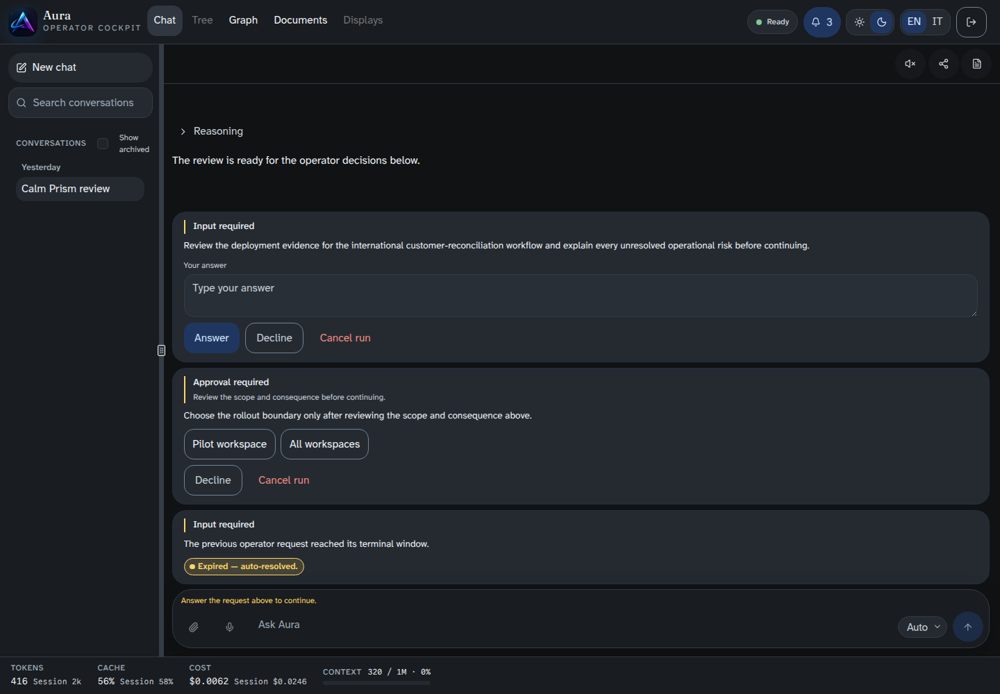

<div align="center">



# Aura

**A local-first, provider-neutral AI agent platform — in Go.**

One binary. Your hardware. Your data. A capable agent with a full terminal,
graph-backed memory, self-authored skills, and multi-channel access.

[](https://github.com/chetto1983/Aura/actions/workflows/ci.yml)
[](https://github.com/chetto1983/Aura/actions/workflows/codeql.yml)
[](LICENSE)
[](go.mod)

[What is Aura?](#what-is-aura) · [Features](#key-features) · [Architecture](#architecture-one-screen) · [Quick Start](#quick-start) · [Docs](#documentation) · [Development](#development)

</div>

---

## What is Aura?

Aura is a personal AI agent that runs on the user's own machine. A single Go binary
hosts the agent runtime, a broad tool surface (host shell + filesystem, web, documents,
scheduling, skills), multi-channel access (CLI, Telegram, AG-UI/SSE web), and a
Postgres + ArcadeDB memory — talking to a swappable LLM (DeepSeek-V4 over OpenRouter by
default) plus a few local CPU sidecars. It is built as a **product, not a prototype**.

> **Strategic context:** Aura is designed to ship as a **DGX Spark + software bundle** for
> SMBs that want a private, capable assistant on hardware they own.

<div align="center">



<sub>The web cockpit (AG-UI/SSE): streaming chat with reasoning, human-in-the-loop approval &amp; input-required gates, and live token/cost accounting.</sub>

</div>

## At a glance

| | |
|---|---|
| **Language** | Go 1.26 |
| **Size** | ~98k LOC non-test (`cmd` + `internal`, of which ~7k sqlc-generated) · 68 internal packages |
| **Tests** | ~143k LOC — table-driven · property-based · fuzz · `-race` · `goleak` · mutation |
| **Test coverage** | owned-surface floor **≥85% per package**, enforced in CI on every push |
| **CI** | green — build/vet/lint · CodeQL · integration (Postgres / ArcadeDB) |
| **Persistence** | Postgres (sqlc, pgx) + ArcadeDB (graph memory, full-text + LSM vector index) |
| **Default LLM** | DeepSeek-V4 via OpenRouter — provider-neutral, swap by config |
| **Status** | v0.0.0 substrate + v1.0.0 web cockpit shipped · v2.0.0 industrial hardening in progress (8/12 phases) |

## Key features

- **Streaming agent loop** with a shared *budget tree* (step + wall-clock caps) and a tool-loop *dedup ring* — bounded, predictable cost.
- **Deferred-tool pattern + semantic `tool_search`** — dozens of tools (incl. dynamic MCP tools) stay discoverable at near-zero per-turn token cost.
- **Adaptive reasoning router** — a local curated-seed embedding classifier picks reasoning effort in ~10 ms.
- **Full host terminal + filesystem tools** — real operating power, with destructive-command approval gates and secret redaction.
- **Graph-native memory** — bitemporal facts and entities live in an ArcadeDB graph (full-text + optional dense leg); conversations persist with a context-management ladder.
- **Self-extension** — the agent authors and runs its own skills, and mounts MCP servers (calculator, calendar, whatsapp, memory).
- **Multi-channel** — CLI REPL, Telegram (voice/photo/docs/HITL), and a web cockpit over AG-UI/SSE.

## Architecture (one screen)

```text
Transport & UX     cmd/aura (CLI) · channels (+telegram) · agui (SSE) · setup · askuser
Agent runtime      agent (LlmAgent, Budget, Events, hooks) · workflow (Seq/Par/Loop) · swarm
Tools & MCP        agent/tools (registry, deferred, tool_search, fs/shell/web/skill) · mcp (+bridge, manager)
Intelligence       llm (+openai_compat) · semindex (embed-index core) · reasoningtrace · adaptive · scoring
Capabilities       web · skills · cron · onboarding · documents · eval
Persistence        db (Postgres+sqlc) · arcadedb (graph memory) · conversations · identity · profile · secret
Observability      obs · panicobs · reasoningtrace · toolinvocations · cachemetrics
```

## Documentation

| Doc | For |
|---|---|
| [docs/ARCHITECTURE.md](docs/ARCHITECTURE.md) | How the system is built — layers, turn lifecycle, invariants |
| [docs/TECHNICAL_OVERVIEW.md](docs/TECHNICAL_OVERVIEW.md) | CTO / due-diligence overview — problem, differentiators, maturity |
| [docs/CAPABILITIES.md](docs/CAPABILITIES.md) | Capability matrix — shipped / in-progress / roadmap |
| [.planning/codebase/](.planning/codebase/) | Package-level inventory + conventions + concerns — generated, refresh with `/gsd-map-codebase` |
| [CLAUDE.md](CLAUDE.md) · [prd.md](prd.md) | Engineering guidance · product requirements (source of truth) |

---

## Deployment (Docker Compose appliance)

Aura is a self-hosted agent runtime packaged as a Docker Compose appliance. The
default stack brings up Aura, Postgres, ArcadeDB and its MCP, the local embedding sidecar, Caddy
TLS/token access, and optional MCP siblings.

## Quick Start

### Linux or macOS

Install Docker, then run the installer from a release tag:

```bash
curl -fsSL https://raw.githubusercontent.com/chetto1983/Aura/vX.Y.Z/scripts/install.sh | bash
```

The installer checks hardware, creates `.env` with generated `POSTGRES_PASSWORD`,
the three `ARCADEDB_*` secrets, and `AURA_ACCESS_TOKEN`, downloads the Compose/Caddy assets, and
starts the stack. Re-running it keeps an existing `.env` intact.

Optional appliance mode installs a systemd unit under `/opt/aura`:

```bash
curl -fsSL https://raw.githubusercontent.com/chetto1983/Aura/vX.Y.Z/scripts/install.sh | sudo bash -s -- --appliance
```

Add `--gvisor` on native Linux Docker hosts that should run Aura under `runsc`.
Docker Desktop is intentionally not supported for that isolation tier.

### Windows

Use Docker Desktop and the shipped Compose files. From PowerShell in the Aura
checkout or release directory:

```powershell
function New-Hex { -join ((1..32) | ForEach-Object { '{0:x2}' -f (Get-Random -Maximum 256) }) }
@"
POSTGRES_PASSWORD=$(New-Hex)
POSTGRES_IMAGE=postgres:18.4-alpine3.24
POSTGRES_USER=aura
POSTGRES_DB=aura
ARCADEDB_PASSWORD=$(New-Hex)
ARCADEDB_APP_PASSWORD=$(New-Hex)
AURA_ARCADEDB_TENANT_SECRET=$(New-Hex)
AURA_IMAGE=ghcr.io/chetto1983/aura:vX.Y.Z
AURA_ACCESS_TOKEN=$(New-Hex)
AURA_BACKUP_DIR=./backups
AURA_EMBED_IMAGE=ghcr.io/ggml-org/llama.cpp:server-cuda
AURA_EMBED_MODEL_PATH=/root/.cache/llama.cpp/embeddinggemma-300M-Q8_0.gguf
AURA_EMBED_POOLING=mean
AURA_EMBED_NGL=99
AURA_EMBED_DIMENSIONS=768
OPENROUTER_API_KEY=
"@ | Set-Content -Path .env -Encoding ascii

docker run --rm --gpus all nvidia/cuda:12.8.0-base-ubuntu24.04 nvidia-smi
docker compose up -d
```

Aura's local embedding sidecar requires Docker GPU passthrough. Fix
Docker/NVIDIA before starting Aura if the `nvidia-smi` container check fails.

Set `OPENROUTER_API_KEY` before production use. For local development images,
replace `AURA_IMAGE` with `aura:local` after building the image.

Postgres 18 is the default Compose image for new installs. When upgrading an
existing Aura deployment from Postgres 17, migrate the data with `pg_dump` /
`pg_restore` or `pg_upgrade`; a Postgres 18 container cannot reuse a Postgres 17
data volume directly.

### Access

Aura publishes AG-UI and setup on loopback and Caddy on HTTPS:

```text
https://localhost/setup/?token=<AURA_ACCESS_TOKEN>
```

Caddy uses `tls internal`. Browsers on other LAN machines will warn until they
trust the local CA root from the `caddy-data` volume:

```bash
docker compose exec caddy cat /data/caddy/pki/authorities/local/root.crt > aura-caddy-root.crt
```

## Updates

Update the appliance with Compose. Volumes persist, and the `aura-migrate`
one-shot runs the Postgres migrations before the Aura service starts (ArcadeDB
needs none — the MCP creates each identity's database on first use):

```bash
docker compose pull
docker compose up -d
```

## Backup And Restore

Scheduled backups run inside the socketless Aura box. Postgres is dumped over the
Compose network with `pg_dump` into `AURA_BACKUP_DIR`:

```text
./backups/postgres-YYYYMMDDTHHMMSSZ.dump
```

**Memory is NOT backed up.** Memory lives in one ArcadeDB database per identity
(`internal/arcadedb/tenant.go`) and nothing dumps them. Snapshot the
`aura-arcadedb` volume out of band until that gap is closed.

Run the restore drill against the current Compose stack:

```bash
set -a
. ./.env
set +a
scripts/restore_drill.sh
```

The drill has three planes — Postgres into a temporary database, the conversation
sidecar archive, and Garage — each checksum-verified into a disposable target and
cleaned up. There is no memory plane; see the gap above.

Manual restore commands:

```bash
docker compose exec -T -e PGPASSWORD="$POSTGRES_PASSWORD" postgres \
  pg_restore -U "${POSTGRES_USER:-aura}" -d "${POSTGRES_DB:-aura}" \
  --clean --if-exists --no-owner --no-acl /backups/postgres-YYYYMMDDTHHMMSSZ.dump
```

Take a fresh backup before restoring over a live database.

## Optional WhatsApp MCP

The `whatsapp` service is an optional sibling mounted through Aura's MCP catalog.
It uses an unofficial whatsmeow-based client, so it carries WhatsApp Terms of Service and account-ban risk. First pairing is headless:

```bash
docker compose logs -f whatsapp
```

Scan the QR code shown in the logs. Aura boot never depends on this service.

## Retired Host Setup

The host needs no Python MCP runtime at all: memory is served by Aura's own
ArcadeDB MCP, a Go binary in the image. Old host-level Python installs and the
earlier WSL WhatsApp MCP install can be removed after migrating to the Compose
appliance.

## CLI

```text
aura serve              run the long-lived agent runtime
aura shell              interactive REPL against the agent loop
aura agent dry-run      drive a mock LoopAgent through the Budget tree
aura tools              print the tool manifest
aura mcp <sub>          managed MCP servers: install | add | list | doctor | tools | enable | disable | remove
aura db <sub>           Postgres lifecycle: migrate | ping | status | reset
aura version            build metadata
```

## Development

For source builds, install Go from [`go.mod`](go.mod), Docker, and a POSIX shell.
Linux is the supported source-build and quality-gate runtime. On Windows, use WSL;
the native Windows Go binary is not a release target because Windows ACLs are not
represented by POSIX `FileMode` bits. Docker Desktop remains supported for running
the shipped Linux Compose appliance.

```bash
git clone https://github.com/chetto1983/Aura.git
cd Aura
cp .env.example .env
make tools
lefthook install
make db-migrate memory-up
go run ./cmd/aura version
go run ./cmd/aura agent dry-run --request-id auto
```

Quality gates:

```bash
make quality
make db-migrate memory-up
make quality-full
```

| Target | Does |
|--------|------|
| `make tools` | install the quality toolchain |
| `make lint` / `make vet` | lint and `go vet` |
| `make vuln` | `govulncheck` supply-chain scan |
| `make test-race` | `go test -race ./...` |
| `make coverage` | owned-surface coverage floor |
| `make restore-drill` | three-plane restore drill (Postgres, sidecars, Garage) |

## Project Layout

```text
cmd/aura/                CLI entry and subcommands
internal/agent/          Agent interface, Event, Budget tree, workflow agents
internal/db/             Postgres: pgx pool, golang-migrate, sqlc bindings
internal/config/         environment to typed config
internal/canonicaljson/  deterministic JSON for dedup fingerprints
scripts/                 install, smoke, restore drill, coverage, file-size cap
.planning/               GSD planning artifacts
```

## Scope

Aura is PRD-first. Persistence is Postgres plus an ArcadeDB graph, with graph access
through MCP for model-facing tools. The default packaged deployment keeps Aura
socketless: no Docker socket is mounted into the Aura container.

## Contributing And Security

See [`CONTRIBUTING.md`](CONTRIBUTING.md). Report vulnerabilities privately per
[`SECURITY.md`](SECURITY.md), never in a public issue.

## License

[MIT](LICENSE) Copyright 2026 Davide Marchetto.
