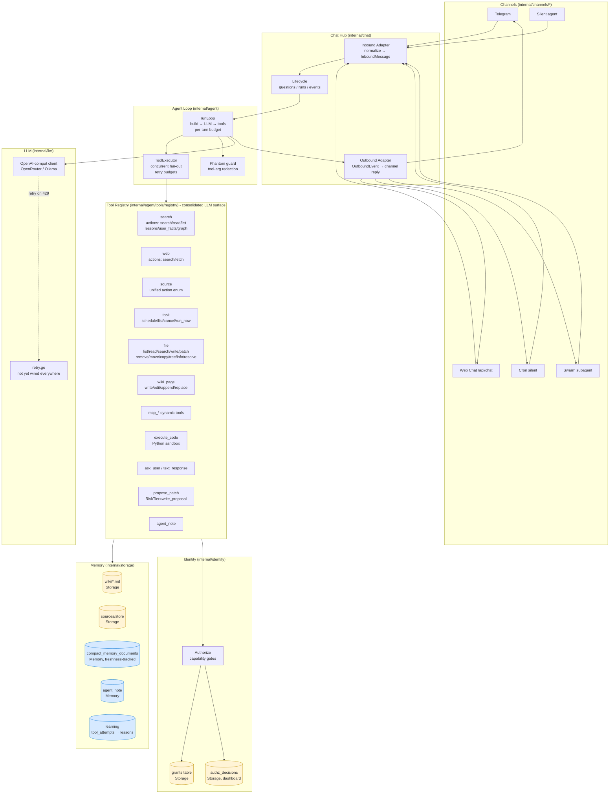

<p align="center">
  
</p>

<h1 align="center">Aura</h1>

<p align="center">
  <em>A private Telegram second-brain that runs as a self-hosted Docker stack.</em>
</p>

<p align="center">
  <a href="https://github.com/chetto1983/Aura/pkgs/container/aura"></a>
  <a href="docs/container.md"></a>
  
  <a href="LICENSE"></a>
</p>

---

**Aura is a personal assistant you own.** It chats through your Telegram bot,
ingests files into a local source inbox, builds a Markdown wiki you can read
on disk, searches memory with embeddings, and gives you a dashboard for
sources, tasks, settings, backups, skills, and health — all behind a single
self-hosted Docker stack.

### Why Aura?

- 🔐 **Your data stays yours** — wiki on disk, SQLite local, no cloud storage required.
- 💬 **Telegram-native** — your phone is the front door; no separate app to install.
- 📚 **Self-building knowledge base** — drop a PDF, get an OCR'd Markdown page with `[[wiki-links]]`.
- 🧠 **Learns from its own mistakes** — operational memory with priority pinning, decay, and a memory-poisoning guard.
- 🛠️ **Pluggable substrate** — MCP servers, skills, prompt overlays, capability gates — extend without forking.
- 🐳 **One-command install** — `docker compose up -d`. Production hardening profile included.

The supported install path is Docker Compose. Release tags publish only the
container image at `ghcr.io/chetto1983/aura:<version>`.

## What Runs

The default stack starts:

- `aura`: the Telegram bot, memory engine, tools, and embedded dashboard.
- `aura-secrets`: sidecar that decrypts secrets for Aura at startup.
- `searxng`: local web search for the `web_search` tool.
- `qdrant`: vector-search sidecar for wiki memory.
- `garage`: S3-compatible artifact and backup storage.
- `garage-webui`: optional Garage admin UI behind a Compose profile.
- `aura-llama-embed`: llama.cpp sidecar serving `embeddinggemma-300m` at 256-d MRL.
- `aura-markitdown`: sidecar that converts docx/xlsx/pptx and 6 other formats to Markdown.
- `aura-whisper`: whisper.cpp sidecar transcribing Telegram voice memos via `ggml-small.bin`.
- `aura-pocket-tts`: Kyutai Pocket-TTS sidecar with the Italian Giovanni voice (INT8, ~200ms first-chunk; default `AURA_TTS_ENABLED=false`).
- `aura-init-models`: one-shot init container that fetches the embedding GGUF + Whisper GGML with SHA-256 verification before the dependent sidecars start. Pocket-TTS downloads its own models at runtime.

Primary user data stays in visible folders beside the Compose file:

- `data/`: SQLite database, logs.
- `runtime-workspace/`: MCP config, prompt overlays, runtime workspace files.
- Docker volume `aura-wiki`: compiled memory pages and source evidence.
- Docker volume `aura-skills`: installed agent skills.
- `garage/`: Garage object storage data.

Code execution runs Python directly inside the Aura container.

## Architecture

Five channels feed one Hub. The Hub routes inbound messages to a single
agent loop and broadcasts outbound events back to whichever channel is
appropriate. The agent loop has one LLM client, one tool registry, and a
typed memory layer split into Storage (durable) and Memory (rebuildable).



**Legend**: yellow = Storage (durable), blue = Memory (rebuildable). See
[`docs/MEMORY-VS-STORAGE.md`](docs/MEMORY-VS-STORAGE.md) for the full
classification of every `internal/` subdir.

## Multimodal

Aura sees and speaks. Voice memos transcribe locally via Whisper, replies
synthesize via Kyutai Pocket-TTS (Italian Giovanni voice, ~200ms first-chunk
streaming, per-chat opt-in), photos route through Anthropic Sonnet 4.6 vision,
and `generate_image` lets the agent create PNGs via Flux.1-schnell when asked.

Defaults:

- **Audio IN** — whisper.cpp local, baseline `ggml-small.bin` (multilanguage, ~3-7s on a 3s memo); `litus-ai/whisper-small-ita` finetuned model is a swap.
- **Audio OUT** — Kyutai Pocket-TTS local with Italian Giovanni voice (INT8, ~200ms first-chunk streaming). Per-chat `voice_mode` (off / voice_only / all), default off.
- **Image IN** — Anthropic Sonnet 4.6 vision via OpenRouter.
- **Image OUT** — Replicate Flux.1-schnell.

All providers are operator-overrideable; local fallbacks (Qwen2.5-VL, Stable Diffusion) become opt-in plugins.

## Plugin architecture

Aura's substrate is domain-neutral. Personality — overlay prompts, wiki,
MCP wiring, tool curation, capability declarations — lives in installable
bundles. The same Aura binary becomes a different assistant depending on
which bundle is loaded.

```mermaid
flowchart TB
  subgraph Substrate
    HUB[Chat Hub]
    LOOP[Agent Loop]
    TOOLS[Tool Registry]
    MEM[Memory layers]
    LLM[LLM Client + multipart]
    IDENT[Identity + capability gates]
  end

  subgraph Loader["Plugin Loader"]
    REG[installed_plugins table<br/>SQLite]
    INST[aura plugin install<br/>aura plugin list<br/>aura plugin remove]
    BOOT[Boot scanner<br/>reads manifest + applies]
  end

  subgraph Plugin1["aura-personal default"]
    P1OV[overlays/<br/>SOUL+AGENT+USER+TOOLS.md]
    P1SK[skills/]
    P1MCP[mcp.json]
    P1TOOL[tool curation<br/>memory + wiki + scheduler]
    P1CAP[capabilities<br/>memory.* + tool.*]
  end

  subgraph Plugin2["aura-marketer sample"]
    P2OV[overlays/<br/>research persona]
    P2SK[skills/<br/>competitor-report]
    P2MCP[mcp.json<br/>SerpAPI + scraping]
    P2TOOL[tool curation<br/>web + source + propose_patch]
    P2CAP[capabilities<br/>web.fetch + source.write]
  end

  Plugin1 -. installed .-> REG
  Plugin2 -. installed .-> REG
  BOOT --> REG
  BOOT --> Substrate

  P1OV -. overlay .-> LOOP
  P1SK -. skill .-> TOOLS
  P1MCP -. mcp .-> TOOLS
  P1TOOL -. allowlist .-> TOOLS
  P1CAP -. grants .-> IDENT

  P2OV -. overlay .-> LOOP
  P2SK -. skill .-> TOOLS
  P2MCP -. mcp .-> TOOLS
  P2TOOL -. allowlist .-> TOOLS
  P2CAP -. grants .-> IDENT

  style Plugin1 fill:#e6ffe6,stroke:#009900
  style Plugin2 fill:#e6f3ff,stroke:#0066cc
  style Loader fill:#fff0e6,stroke:#cc6600
```



Plugins specialize *which model* (Whisper local vs Groq; Sonnet vs Qwen-VL),
but never *whether the system sees audio* — that part is substrate.

## Quick Start

Prerequisites:

- Docker Desktop or Docker Engine with Docker Compose.
- A Telegram bot token from [@BotFather](https://t.me/BotFather).
- An OpenAI-compatible LLM endpoint.

**PowerShell (Windows):**

```powershell
git clone https://github.com/chetto1983/Aura
cd Aura
New-Item -ItemType Directory -Force data,runtime-workspace,garage | Out-Null
docker compose -f compose.yaml -f compose.image.yaml up -d
```

**Bash (macOS / Linux / WSL):**

```bash
git clone https://github.com/chetto1983/Aura
cd Aura
mkdir -p data runtime-workspace garage
docker compose -f compose.yaml -f compose.image.yaml up -d
```

`compose.image.yaml` pulls four images from GHCR: `aura`, `aura-whisper`,
`aura-pocket-tts`, `aura-markitdown`. Cold first start: ~5-10 min. Without
this overlay (`up -d --build`), the four sidecars compile from source —
expect ~45-60 min cold.

Open the setup wizard at `http://127.0.0.1:18080`.

For production hardening (restart-on-failure, no LAN dashboard exposure,
tightened healthcheck thresholds):

```powershell
docker compose -f compose.yaml -f compose.prod.yaml up -d
```

See [`docs/RUNBOOK.md`](docs/RUNBOOK.md) for the full operator runbook
(cold install, upgrade, rollback, SQLite restore drill, secret rotation).

## Update

```powershell
docker compose -f compose.yaml -f compose.image.yaml pull aura
docker compose -f compose.yaml -f compose.image.yaml up -d
```

Pin a release with `AURA_IMAGE`:

```powershell
$env:AURA_IMAGE = "ghcr.io/chetto1983/aura:v1.2.3"
docker compose -f compose.yaml -f compose.image.yaml up -d
```

## Develop

Build the local working tree instead of pulling GHCR:

```powershell
docker compose up -d --build
```

Run the test suite:

```powershell
docker compose --profile test run --rm test
```

Local Go commands:

```powershell
go test ./...
go build ./...
go run ./cmd/aura
```

Lint:

```powershell
~/go/bin/golangci-lint run ./...
```

## Release

```powershell
git tag v1.2.3
git push origin v1.2.3
```

The `Docker image` workflow publishes:

- `ghcr.io/chetto1983/aura:v1.2.3`
- `ghcr.io/chetto1983/aura:latest`
- a `sha-*` traceability tag

## Docs

- [Install guide](INSTALL.md)
- [Container stack](docs/container.md)
- [Operator runbook](docs/RUNBOOK.md) — cold install, upgrade, restore, secret rotation
- [Product requirements](PRD.md) — full PRD with module map, contracts, and roadmap
- [Memory vs Storage](docs/MEMORY-VS-STORAGE.md) — two-layer model + `internal/` subdir classification
- [Vision](VISION.md) — the longer-form product story
- [Archived evidence](docs/_archive/) — superseded planning artifacts kept for provenance
