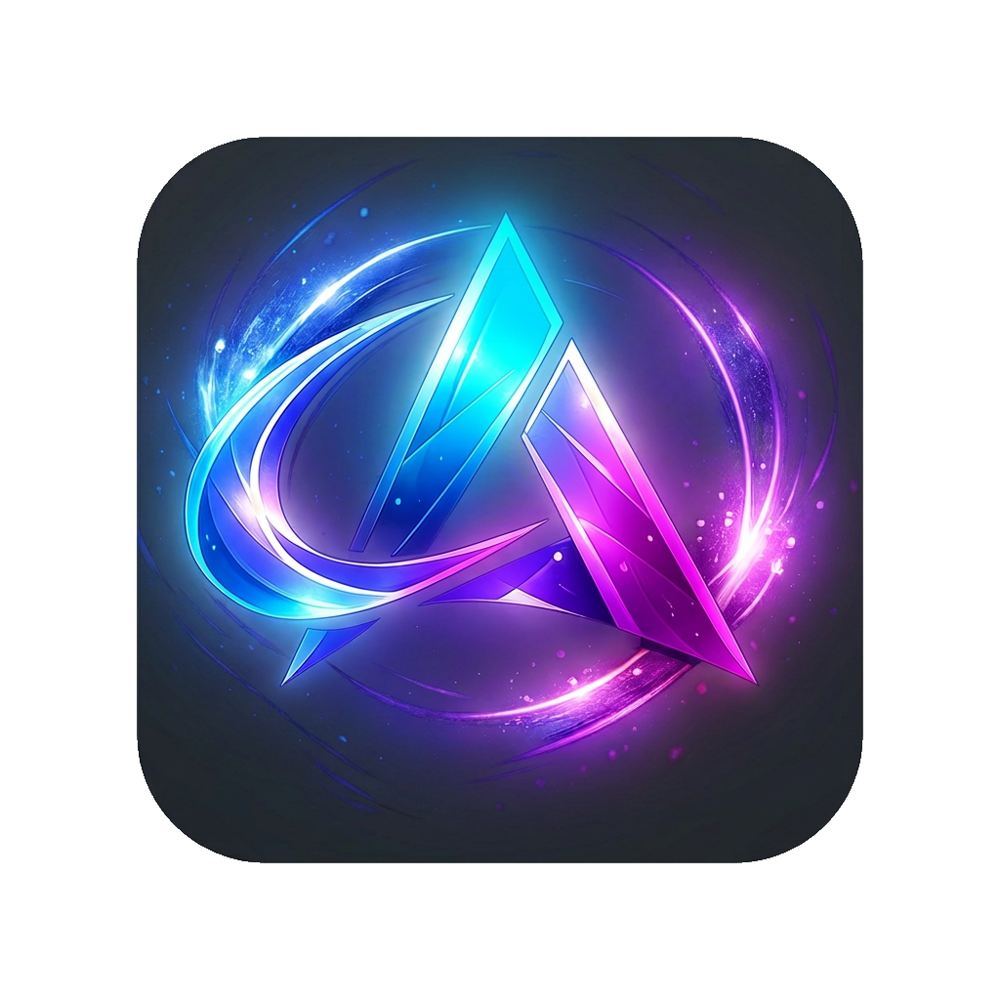

<div align="center">



# Aura

**A local-first, provider-neutral AI agent platform — in Go.**

An agent for ongoing work: tools, document retrieval, temporal memory, scheduled
jobs, and a web cockpit on infrastructure you control.

[](https://github.com/chetto1983/Aura/actions/workflows/ci.yml)
[](https://github.com/chetto1983/Aura/actions/workflows/codeql.yml)
[](LICENSE)
[](go.mod)

[What is Aura?](#what-is-aura) · [What it does](#what-it-does) · [Architecture](#architecture) · [Quick Start](#quick-start) · [Docs](#documentation) · [Development](#development)

<a href="https://buymeacoffee.com/chetto983">
  
</a>

</div>

---

## What is Aura?

Aura is a self-hosted, multi-user AI agent. Its Go binary hosts the runtime, tools,
CLI, Telegram gateway, and embedded web cockpit; each person signs in to their own
identity, with their own memory database, workspace and sandbox. Docker Compose runs
Postgres, ArcadeDB, Garage, embedding, ingestion, web search, voice and the bundled
integrations alongside it.

The model is chosen in the cockpit settings: OpenRouter (the default route), a
ChatGPT plan, the bundled local llama.cpp server, or Ollama. Local storage does not
make cloud inference offline: a cloud provider receives the context sent to its
model; with a local server nothing leaves the host for inference.

> **Hardware:** a mini PC with 16 GB of RAM is enough. The default stack measured
> 7 GB with speech-to-text and text-to-speech running on a 16 GB mini PC
> (2026-09-02). No local LLM runs by default: inference goes to the provider you choose.

<div align="center">


<sub>A real run on a local stack: Aura stores the fact in its memory graph, loads the deferred
<code>task</code> tool and schedules the reminder; a new chat then answers from memory, with
provenance. Model replies were written by Claude through an OpenAI-compatible endpoint;
waiting time is trimmed.</sub>

</div>

## What it does

- **Streaming agent loop** with shared step/time budgets and repeated-call controls to bound work.
- **Deferred tools and `tool_search`** — discover tools and load their schemas when needed, including tools from mounted MCP servers.
- **Adaptive reasoning router** — selects reasoning effort using the configured classifier and the active model's supported capabilities.
- **Full host terminal + filesystem tools** — real operating power, with destructive-command approval gates and secret redaction.
- **Graph-native memory** — facts, sources and validity windows in ArcadeDB; temporal paths return supporting evidence. Postgres-authoritative conversations have a derived recall projection and managed context compaction.
- **Document retrieval** — indexed passages with source hashes and citations, plus access to the original file for calculations and whole-file tasks.
- **Self-extension** — author and run skills, use bundled memory/PIM/WhatsApp integrations, and connect additional MCP servers.
- **Scheduler and self wake-ups** — one `task` tool (`at | every | cron`) for reminders and `agent_job` runs, with job policy, operator controls and outcomes delivered to the owning conversation.
- **Per-identity sandbox** — a full-capability box per operator (opt-in `sandbox` profile; gVisor `runsc` on native Linux), with deliverables handed back over the channel (`send_file`), never as a path.
- **Multi-user** — Authula sign-in (password, plus a TOTP step for accounts enrolled in it), one isolated ArcadeDB database per identity enforced by the server, capability grants, and an admin audit view.
- **Multi-channel** — CLI REPL, Telegram (voice/photo/docs/HITL), and a web cockpit over AG-UI/SSE with mid-turn steering, approvals, voice input/output, and live settings.
- **Studio** — image and video generation, photo and video editing, and a multi-track video editor, all in the cockpit ([docs/STUDIO.md](docs/STUDIO.md)).
- **Bundled integrations** — calendar/e-mail (PIM MCP, OAuth providers), WhatsApp (unofficial client), web search through a bundled SearXNG, snapshot share links to a conversation, and Cloudflare remote access.

Where Aura sits next to Open WebUI and LibreChat: [docs/COMPARISON.md](docs/COMPARISON.md).

## Architecture

```text
Transport & UX     cmd/aura (CLI) · channels (+telegram) · agui (SSE) · webui (embedded SPA) · webauth (Authula) · setup · askuser
Agent runtime      agent (LlmAgent, Budget, Events, hooks, workflow Seq/Par/Loop) · runner · swarm · steer
Tools & MCP        agent/tools (registry, deferred, tool_search, fs/shell/web/skill) · agent/mcptools · mcp (+manager) · mcpoauth · sandbox
Intelligence       llm (+openai_compat) · chatgptplan · semindex (embed-index core) · reasoningtrace · scoring · multimodal · mediagen
Capabilities       web · skills · cron · onboarding · documents · share · retention
Persistence        db (Postgres+sqlc) · arcadedb (memory + retrieval) · conversations · identity · objectstore · secret · settings
Observability      obs · agent/panicobs · reasoningtrace · toolinvocations · cachemetrics
```

## Tech stack

| | |
|---|---|
| **Language** | Go 1.27 |
| **Persistence** | Postgres (sqlc, pgx) + ArcadeDB (graph memory, full-text + LSM vector index) + Garage (S3 object store) |
| **Models** | Default DeepSeek-V4 Flash via OpenRouter; also a ChatGPT plan, the bundled llama.cpp server (Gemma 4 12B QAT, `localllm` profile) or Ollama. The active profile (provider, model, budgets) is hot-reloaded from the cockpit settings, no restart |
| **Cockpit** | React SPA embedded in the binary, served behind Caddy and the Authula sign-in |
| **Tests** | Unit, property, race, leak, mutation, live integration, and browser tests; owned-surface coverage **≥85%** |
| **CI** | build/vet/lint · CodeQL · `-race` + goleak · db/ArcadeDB/embed integration · MUSR two-identity E2E · web lint/test/mutation/Playwright · critical mutation ≥70% killed |
| **Distribution** | Docker Compose appliance; `edge` tracks master, `v1.0.2-rc1` is the latest tagged prerelease (checked 2026-10-03) |

## Project structure

```text
cmd/aura/                CLI entry and subcommands
cmd/arcadedb-mcp/        Aura's own ArcadeDB memory MCP server
cmd/aura-*/              sidecar binaries (Cloudflare and ingest supervisors, media index, file cards)
internal/                the runtime, one package per concern (see Architecture)
web/                     React cockpit, embedded into the binary from internal/webui/dist
services/ingest/         document ingestion sidecar
packages/create-aura/    the npx installer (create-aura-appliance)
docker/ deploy/ caddy/   image builds, systemd units and the updater, Caddy front door
scripts/                 install, smoke, restore drill, coverage, file-size cap
docs/                    install, architecture, capabilities, release and backup guides
.planning/               GSD planning artifacts
```

## Quick Start

You need Docker on the target (4 CPU cores, 14 GiB usable RAM, 20 GiB free disk) and
Node.js 22.13+ on the workstation. The installer generates `.env`, downloads the Compose
assets and starts the stack, locally or on a Linux host over SSH:

```bash
npx create-aura-appliance                 # local
npx create-aura-appliance --mode remote   # Linux target over SSH
```

Then open `https://<host>`, create the first user (the operator), and let the first-run
setup pick the model route, the OpenRouter key and the optional Telegram bot:

```text
https://<host>/setup/?token=<AURA_ACCESS_TOKEN>
```

Windows (Docker Desktop), the curl installer, release channels, the local CA, updates
and WhatsApp pairing: [docs/INSTALL.md](docs/INSTALL.md).

## Documentation

| Doc | For |
|---|---|
| [docs/INSTALL.md](docs/INSTALL.md) | Install and operate — Linux/macOS/Windows, release channels, first access, updates, sidecars |
| [docs/ARCHITECTURE.md](docs/ARCHITECTURE.md) | How the system is built — layers, turn lifecycle, invariants |
| [docs/TECHNICAL_OVERVIEW.md](docs/TECHNICAL_OVERVIEW.md) | CTO / due-diligence overview — problem, differentiators, maturity |
| [docs/CAPABILITIES.md](docs/CAPABILITIES.md) | Capability matrix — shipped / in-progress / roadmap |
| [docs/STUDIO.md](docs/STUDIO.md) | Studio — image and video generation, photo and multi-track video editing |
| [docs/COMPARISON.md](docs/COMPARISON.md) | How Aura compares with Open WebUI and LibreChat |
| [docs/CLI.md](docs/CLI.md) | CLI reference — every `aura` subcommand |
| [docs/BACKUP-RESTORE.md](docs/BACKUP-RESTORE.md) | Backup schedules, restore drill, manual restore, recovery scope |
| [docs/release-readiness.md](docs/release-readiness.md) | How a release is cut — the twelve-report exact-SHA gate, rollback rule, operational checks |
| [CLAUDE.md](CLAUDE.md) · [prd.md](prd.md) | Engineering guidance · product requirements (source of truth) |

## Development

Go from [`go.mod`](go.mod), Docker and a POSIX shell (Linux, or WSL on Windows):

```bash
git clone https://github.com/chetto1983/Aura.git
cd Aura
cp .env.example .env
make tools && lefthook install
make quality                    # vet + lint + deadcode + race + vuln + build, no containers
make db-migrate memory-up       # bring the stack up
make quality-full               # quality + coverage gate
```

Source builds, the local image, make targets and the review discipline:
[CONTRIBUTING.md](CONTRIBUTING.md). Report vulnerabilities privately per
[SECURITY.md](SECURITY.md), never in a public issue.

## License

[MIT](LICENSE) Copyright 2026 Davide Marchetto.
