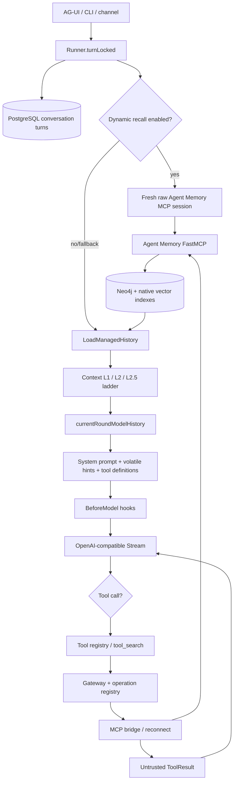
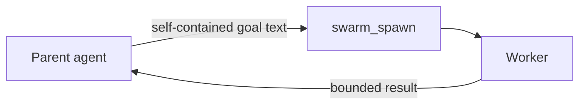

# Current-State Architecture

## Component inventory and ownership

| Plane | Owner/component | Source of truth or responsibility |
|---|---|---|
| Identity | Aura AG-UI/provisioning | PostgreSQL identity and authenticated principal |
| Conversation | `internal/conversations`, `internal/runner` | PostgreSQL turns and runner lifecycle |
| Long-term memory | vendored Agent Memory | Neo4j entities, facts, preferences, embeddings, ownership edges |
| Short-term sidecar memory | vendored Agent Memory | Neo4j conversations/messages, separate from Aura conversation truth |
| Context ladder | `internal/conversations/context.go` | Loads persisted turns, evicts/spills, applies history cap |
| Automatic recall | `cmd/aura/serve_recall.go`, runner dynamic tail | Fresh direct MCP call for owner-scoped long-term entities/preferences |
| Model tools | `internal/agent/tools`, `mcptools` | Discovery, namespace, schema, gateway, trust framing |
| MCP control plane | `internal/mcp/manager` and config | Recipes, governance, managed servers |
| MCP data plane | common stdio/HTTP clients | Initialize, list, call, session and frame handling |
| LLM assembly | `internal/agent` and prompt builder | System prefix, history, volatile hints, tool manifest, hooks |
| LLM transport | `internal/llm/openai_compat` | Exact `/chat/completions` serialization and stream |
| Deprovision | `internal/agui/deprovision.go` | Purge saga; graph/conversation adapters are not wired in production |
| Legacy knowledge MCP | `internal/knowledge/client.go` | Active independent subprocess client bypassing common hardening |

## End-to-end turn and MCP flow

Critical observed boundary facts:

- PostgreSQL is authoritative for Aura conversation history; Neo4j is
  authoritative for Agent Memory long-term nodes. The sidecar also implements
  a second short-term conversation model.
- Automatic recall opens a new raw memory MCP session per eligible turn,
  separate from the process-owned mounted bridge.
- The context ladder budgets persisted history before the system prompt,
  volatile message, tool definitions, hooks, and within-turn tool results reach
  final form.
- Canonical bridge calls frame output as untrusted; direct MCP resources do not
  pass through that bridge.

## Agent Memory lifecycle

```mermaid
flowchart LR
    C[Model tool / CLI / onboarding] --> V[Pydantic shape validation]
    V --> S[Optional user_identifier scope]
    S --> D[Exact/vector dedup lookup]
    D --> W1[Create node]
    W1 --> W2[Validity / metadata]
    W2 --> W3[Owner and subject edges]
    W3 --> E[Corpus epoch increment per write query]
    E --> Q[Scoped or global graph/vector search]
    Q --> RR[5x pool + optional reranker]
    RR --> F[Plain-text formatter]
    F --> DT[Dynamic tail or MCP ToolResult]
    DT --> M[Main model]
    W3 --> U[Update / supersede / per-node forget]
    U --> X[Manual dormant consolidation/archive]
```

The separate `execute_write` calls are individual Neo4j transactions. A node,
its temporal fields, owner edge, and relationship edges are therefore not one
atomic logical write. Embeddings live as node properties, so there is no
external indexing queue, but an indexed node can exist without its ownership
or provenance edges.

## Context construction and trust order

1. Runner validates conversation ownership and persists visible user text.
2. Optional automatic long-term recall retrieves entities/preferences using the
   Aura owner ID and validates corpus epoch/revisions.
3. `LoadManagedHistory` loads all persisted turns, spills selected old tool
   output, warns near the hard cap, then drops oldest rounds as needed.
4. `currentRoundModelHistory` should replace the visible user message with
   richer model-only input; the audited worktree mutates a copy and fails.
5. `NewLlmAgent` prepends the canonical system prompt and always-on block.
6. Prompt builder appends volatile budget/workspace/time/source hints and
   renders currently active tool definitions.
7. `BeforeModel` hooks may replace the full request.
8. A dynamic-tail guard runs only when that tail exists and still does not count
   the complete system/tool request.
9. The OpenAI-compatible client serializes and sends the exact request.
10. Tool calls append results to live history; final synthesis can send this
    grown history without rerunning the persisted-history ladder.

Trust levels are partially explicit:

- Canonical system and host-generated policy: trusted.
- User input: authoritative for current intent, not privileged code.
- MCP output and recalled memory through Aura: untrusted, provenance-tagged.
- Direct MCP resources: outside Aura's trust-framing boundary.
- Hook-rewritten request: trusted by execution despite only weak structural
  validation, which creates CTX-003.

## MCP lifecycle and surfaces

- Managed entries originate from recipes/governance/configuration.
- Boot sorts server names, opens each server with a bounded aggregate mount
  budget, lists tools, validates names/collisions, and publishes the bridge.
- Failed servers are dropped fail-soft; readiness does not require the default
  memory capability.
- Reconnect permits explicit read-only replay but refuses mutation replay after
  ambiguous transport failure.
- Tool additions/removals after reconnect are not atomically reflected in the
  boot-time registry.
- Stdio uses protocol `2024-11-05`; HTTP requests `2025-06-18`. Initialize
  responses are not checked against a shared supported-version/capability
  contract.
- The sidecar extended profile registers tools, resources, and prompts. Aura
  consumes tools; direct clients can consume unscoped resources.

## Agent-to-agent handoff

`internal/agent/tools/swarm_spawn.go:20-35` and
`internal/swarm/swarm.go` make the handoff explicit: a worker receives the
self-contained goal, not the parent conversation, user identity, or other
workers' histories, and cannot nest another swarm. This is a strong isolation
control. Memory access still depends on whatever tools/identity the worker's
constructed environment receives; no implicit conversational context is
copied.

## Persistence, retrieval, and deletion boundaries

- Aura conversation deletion tears down runner/tool/share/PostgreSQL state but
  does not call an Agent Memory session/user purge.
- Sidecar per-node `memory_forget` exists; bulk user graph deletion does not.
- Sidecar conversation TTL defaults to none. The consolidation archive is
  manual and marks archived rather than deleting data.
- Production deprovision constructs nil graph/conversation/session/job purgers,
  then deletes identity. This breaks end-to-end erasure ownership.

## Documented versus actual architecture

- Recent memory-surface design text is a proposal/partially implemented record,
  not proof that all memory tools are deferred or that automatic feeding is
  active.
- The Docker image deliberately omits automatic extraction stages for Aura's
  long-term-only operating model, while direct short-term tools/resources and
  observer code remain registered in the extended profile.
- Runtime profiles do not automatically enable MCP SSRF enforcement despite
  comments describing future binding.
- `HistoryHardCapTurns` is configured and advertised but has no runtime
  consumer.
- Readiness covers PostgreSQL/Neo4j availability, not the Agent Memory MCP,
  embedder/reranker contract, or mounted tool generation.

No relationship in the diagrams is inferred unless stated above; arrows
represent traced callers and consumers in the audited working tree.
