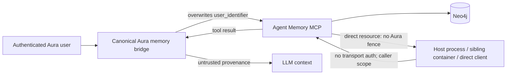

# Security and Privacy

## Overall assessment

Aura correctly labels MCP output and recalled memory as untrusted, but the
Agent Memory server itself lacks an authenticated authorization boundary.
Direct service reachability, global resources, optional caller-selected tenant
identity, and session ownership mutation create confirmed cross-user paths.
Data erasure is also incomplete in production.

## Trust boundaries

The canonical path is defense in depth. The direct path is the actual service
authorization boundary and currently authenticates nobody.

## Cross-user isolation

### Global and forgeable scope

The extended server registers global entities/preferences/session resources,
and tools accept optional identifiers. Compose leaves multi-tenant fail-closed
behavior disabled; the guard is not complete even if enabled. Any reachable
caller can omit scope for global behavior or supply another user's identifier.

This is [SEC-001](08-findings-register.md#sec-001-unauthenticated-memory-mcp-exposes-global-and-forgeable-tenant-scope),
P0.

### Session ownership takeover

Short-term conversation lookup uses globally shared `session_id`. When a caller
supplies an existing session and a different identity, the implementation links
that user and overwrites the denormalized owner field; subsequent scoped reads
authorize either property or edge. This is
[SEC-002](08-findings-register.md#sec-002-session-claiming-can-cross-user-short-term-memory),
P0.

### Alias enforcement bypass

Memory recipe classification is source-based, but bridge identity/hiding policy
is namespace-name-based. The supported custom-name installation path can mount
memory as another name, exposing hidden tools and skipping identity injection.
See [MCP-001](08-findings-register.md#mcp-001-memory-recipe-alias-bypasses-scoping-and-surface-policy).

## Stored prompt injection and poisoning

Facts, preferences, entity descriptions, messages, and metadata can contain
instruction-like text. The sidecar does not classify or sanitize executable
instructions at write time. Risks include malicious direct writers, poisoned
imported/operator content, and a model repeatedly storing model-generated text.

Existing controls:

- canonical MCP output carries `TrustUntrusted`;
- dynamic memory is wrapped in an explicit untrusted reference fence that says
  to ignore embedded instructions;
- current operator input is declared authoritative;
- model-facing memory surface is narrowed to long-term operations.

Residual risk:

- these are LLM-semantic controls, not authorization or content policy;
- direct resources do not cross Aura's fence;
- provenance/age/confidence is stripped from model-visible recall;
- hooks can rewrite the canonical protected request after construction.

The system is therefore resistant on the canonical Aura path but not
comprehensively protected against stored prompt injection.

## Secrets, PII, and logging

- Memory can persist arbitrary PII/secrets by design; there is no DLP or PII
  classification gate.
- Production graph/conversation purge is unwired, so deprovisioned PII remains
  ([PRIV-001](08-findings-register.md#priv-001-production-deprovisioning-retains-agent-memory-and-conversations)).
- The active legacy knowledge client places the Neo4j password in subprocess
  argv ([ARC-001](08-findings-register.md#arc-001-active-knowledge-client-bypasses-common-mcp-hardening)).
- `integration_context.py:96-101` may place preference content in debug logs.
- Default reasoning traces hash/summarize history; an explicitly enabled full
  trace mode can store verbatim content at mode `0600`, with caps/rotation and
  secret-env replacement. This is an operator-visible privacy tradeoff, not a
  default leak.

Required controls include data classification, bounded/redacted structured
events, deletion policy and receipts, access auditing, and explicit debug-data
retention.

## Network and SSRF posture

The sidecar is host-loopback published but listens on `0.0.0.0` inside the
Compose network. Loopback narrows remote exposure but does not protect against
local processes or sibling containers.

Common HTTP MCP initial endpoint classification rejects invalid schemes and
metadata/link-local targets. Strict runtime profiles do not automatically
enable redirect/dial enforcement, and the allow-host plumbing does not reach
the hardened dialer. See
[MCP-003](08-findings-register.md#mcp-003-strict-runtime-profiles-do-not-enable-complete-mcp-ssrf-policy).

No external service mesh/network policy artifact was found. Its presence in a
deployment could reduce reachability but would not repair caller-controlled
tenant authorization.

## Availability abuse

Agent Memory tool schemas do not bound large strings/collections/search limits,
and the sidecar lacks declared Compose resource constraints. A reachable caller
can create expensive embed/rerank/extraction/graph operations
([SEC-003](08-findings-register.md#sec-003-agent-memory-inputs-and-results-lack-application-level-bounds)).
Rate/concurrency/tenant quotas were not located.

## Deletion and retention

The deprovision abstraction explicitly provides a graph purger for memory, but
production passes it as nil and deletes identity later in the saga. Sidecar TTL
defaults to none; archival is dormant and does not delete. The current system
cannot demonstrate a complete right-to-erasure flow or deletion SLA.

Target behavior:

1. suspend access;
2. enumerate owner-scoped data across all planes;
3. idempotently delete/retire owner edges and exclusive nodes;
4. preserve truly shared entities owned by others;
5. verify zero reachable owner data;
6. store a bounded non-PII deletion receipt;
7. delete identity only after required planes acknowledge;
8. retry safely after every crash boundary.

## Realistic attack/failure chains

1. **Direct global read:** compromised sibling container calls
   `memory://preferences`; no auth/scope is required; cross-user PII is returned.
2. **Forged tenant write:** local process calls a write tool with a victim UUID;
   ownership is caller-selected and no transport principal contradicts it.
3. **Session claim:** attacker writes one message with a known/common session ID;
   owner property/edge changes and prior messages become readable.
4. **Alias bypass:** admin installs the shared memory recipe under an alias; the
   model discovers globally scoped hidden tools because namespace policy is not
   source-derived.
5. **Retained-data recovery:** account is purged but graph remains; a direct
   client supplies the stale UUID and retrieves memory through SEC-001.
6. **Stored instruction:** poisoned preference is retrieved; Aura's fence helps,
   but a hook rewrite or direct resource consumer lacks the same invariant.

## Release security gates

- All unauthenticated direct resource/tool requests reject.
- Tenant comes from authenticated connection/session identity, never payload.
- Same session string under two principals creates isolated conversations.
- Every CRUD/search/resource path has adversarial two-user tests.
- Global/admin APIs are separate, privileged, audited, and disabled by default.
- Deprovision proves zero owner-reachable data across all planes.
- PII/secret write and debug-log policy is explicit and tested.
- Sidecar request/rate/resource bounds are enforced.
- Strict profiles activate a tested egress/SSRF policy.
