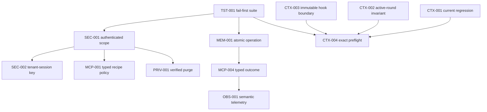

# Findings Register

> **Historical source register.** This file preserves the 2026-07-29 cutoff.
> Later Agent Memory remediations are reconciled one by one in
> [../definitive-closure-ledger-2026-07-31.md](../definitive-closure-ledger-2026-07-31.md).

This is the authoritative deduplicated register. Severity follows the requested
P0-P3/INFO model. All line locations refer to the audited working tree.

## Summary

| Severity | Count | IDs |
|---|---:|---|
| P0 open | 0 | — |
| P0 remediated and verified | 2 | SEC-001, SEC-002 |
| P1 open | 4 | CON-001, CTX-004, OBS-001, TST-001 |
| P1 remediated and verified | 12 | MCP-001–004, ARC-001, PRIV-001, MEM-001–002, CTX-001–003, CTX-005 |
| P2 | 11 | REL-001, SEC-003, MEM-003–005, CTX-006, MCP-005–007, ARC-002–003 |
| INFO | 1 | PERF-001 |

Post-remediation status: 14 REMEDIATED/VERIFIED and 15 CONFIRMED findings; the
single INFO item remains NOT ASSESSABLE. At the audit cutoff the status was 29
CONFIRMED, 0 HIGH-CONFIDENCE, 0 SUSPECTED, 1 NOT ASSESSABLE. Confidence remains
29 High, 1 Medium, 0 Low.

## P1 remediation ledger

This ledger records only fixes that were committed and validated by
2026-07-29. Findings absent from the ledger remain open.

| Finding | Status | Commit | Verification summary |
|---|---|---|---|
| CTX-001 | REMEDIATED / VERIFIED | `caaf33ae4` | Exact model-only user-context regression, full Go tests, vet, build, and lint passed. |
| MCP-001 | REMEDIATED / VERIFIED | `9976f12c1` | Source-bound policy, alias/duplicate policy, bridge scope, and focused Go gates passed. |
| CTX-002 | REMEDIATED / VERIFIED | `36bc8535c` | Active-round boundary and overflow regressions plus focused Go gates passed. |
| CTX-003 | REMEDIATED / VERIFIED | `c3ef04e6b` | Protected hook mutation/reorder/inflation regressions plus focused Go gates passed. |
| CTX-005 | REMEDIATED / VERIFIED | `423cccaf5` | Startup validation rejects impossible token budgets; focused Go gates passed. |
| MEM-002 | REMEDIATED / VERIFIED | `3b021257c` | Superseded-preference recall regression and Agent Memory gates passed. |
| MCP-002 | REMEDIATED / VERIFIED | `94e373d4b` | Deadline-selectable acquisition/close, race coverage, vet, and build passed. |
| MCP-003 | REMEDIATED / VERIFIED | `e7d01a319` | Strict-profile per-hop egress and trusted-sidecar regression gates passed. |
| ARC-001 | REMEDIATED / VERIFIED | `cfb907f77` | Knowledge transport now reuses the hardened MCP substrate; lifecycle and credential regressions passed. |
| PRIV-001 | REMEDIATED / VERIFIED | `9ee2e109f` | Fail-closed purge wiring, shared-node preservation, retry/postcondition tests, vet, race, and build passed. |
| MEM-001 | REMEDIATED / LIVE-VERIFIED | `40e6e0e90` | Fault-injected rollback coverage and authenticated live graph mutation checks passed. |
| MCP-004 | REMEDIATED / LIVE-VERIFIED | `c6bb6f09b` | Typed rejection/error replay, zero-effect rejection, full Python gates, Go race/vet/build, Windows hooks, and authenticated live tests passed on image `REV=c6bb6f09b`. |

The live Agent Memory baseline was intentionally reset under PRD Amendment
#101 and rebuilt with the native 1024-dimensional embedding contract in
`12085a518`. Neo4j migrations, all vector indexes, authenticated MCP
write/recall, and stored embedding width were verified after the reset.

## [SEC-001] Unauthenticated memory MCP exposes global and forgeable tenant scope

- Status: REMEDIATED / LIVE-VERIFIED (2026-07-29)
- Severity: P0
- Confidence / domain / horizon: High / Security, isolation, MCP / Immediate
- Affected components: Agent Memory FastMCP tools/resources, Compose deployment, Aura direct clients.
- Evidence: `docker/agent-memory/src/neo4j_agent_memory/mcp/server.py:103-119` constructs FastMCP without auth; `mcp/_resources.py:41-108` registers unscoped context/entities/preferences resources; `config/settings.py:288-296` defaults `multi_tenant=false`; `compose.yaml:619-630` exposes HTTP to host loopback and the Compose network.
- Caller and consumer: any local process, sibling container, or direct MCP client -> FastMCP -> global graph/vector queries -> returned memory or Neo4j mutation; Aura's bridge is bypassed.
- Current / expected: missing or caller-forged `user_identifier` can select global/other-owner behavior; server scope must be authenticated, derived server-side, and fail closed on every surface.
- Root cause: optional payload identity and incomplete tenant guards are treated as authorization without a transport principal.
- Concrete failure scenario: a compromised sibling container reads `memory://preferences` or supplies a victim UUID to a write.
- User/operational impact: direct cross-user disclosure and unauthorized memory corruption.
- Security/data-integrity impact: confidentiality and ownership boundary failure; retained PII is reachable.
- Recommended remediation: authenticate transport (mTLS/bearer/Unix-socket peer policy), derive principal server-side, remove global tenant resources, reject absent/mismatched scope, separate audited admin APIs.
- Dependencies / effort / change risk: identity contract, server/client auth, schema migration policy / L / High.
- Required validation: unauthenticated, omitted-scope, forged-scope, resource, tool, CLI, and recall two-user tests.
- Acceptance criteria: every non-admin request has a server-derived principal; all forged/absent scope is rejected; no cross-owner result/mutation is possible.
- Remediation: `mcp/auth.py` validates a fixed HS256 issuer/audience/scope
  contract and overwrites `user_identifier` from the JWT subject;
  `mcp/server.py` disables resources and uses stateless authenticated HTTP;
  Aura mints a fresh tenant JWT per tool call from its trusted bridge context.
  Compose and the installer require a generated secret and enable
  `multi_tenant`.
- Closure evidence: the live sidecar returned 401 before MCP initialize without
  a token; Alice's valid JWT plus a forged Bob payload wrote/read only Alice's
  tenant; Bob's valid JWT could not read the result. Unit coverage also rejects
  wrong signature, issuer, audience, scope, expiry, empty tenant, and service
  subject tool calls. See
  [12-p0-remediation-evidence.md](12-p0-remediation-evidence.md).

## [SEC-002] Session claiming can cross user short-term memory

- Status: REMEDIATED / LIVE-VERIFIED (2026-07-29)
- Severity: P0
- Confidence / domain / horizon: High / Security, memory isolation / Immediate
- Affected components: `ShortTermMemory`, conversation queries/schema, direct message/context tools/resources.
- Evidence: `memory/short_term.py:1241-1254` finds an existing global session then links the supplied user; `_link_user_to_conversation` at `1278-1285` adds an edge and overwrites `c.user_identifier`; `graph/queries.py:54-68` lookup is global and scoped read accepts property or any owner edge; `graph/schema.py:83-125` lacks `(tenant,session)` uniqueness.
- Caller and consumer: direct `memory_store_message` or resource caller -> `_ensure_conversation` -> Neo4j owner mutation -> context/message retrieval.
- Current / expected: the same session string can be claimed by another user; conversation identity must be tenant-qualified, immutable, and database constrained.
- Root cause: globally keyed session lookup followed by mutable ownership repair.
- Concrete failure scenario: user B writes one message to user A's session ID, becomes linked/recorded owner, then reads A's messages.
- User/operational impact: cross-user conversation disclosure, corrupt history, nondeterministic concurrent first creation.
- Security/data-integrity impact: PII leakage and owner corruption.
- Recommended remediation: key conversations by `(principal_id, session_id)`, use atomic scoped `MERGE`, reject ownership mismatch, never overwrite owner during lookup.
- Dependencies / effort / change risk: authenticated principal from SEC-001, graph constraint/data migration / L / High.
- Required validation: two-user same-session and barrier concurrent-first-write live tests.
- Acceptance criteria: identical session strings remain isolated; exactly one conversation exists per principal/session and owner is immutable.
- Remediation: the graph now enforces composite conversation uniqueness on
  `(user_identifier, session_id)`; creation is an atomic scoped `MERGE`; reads
  require exactly one matching owner; foreign and ambiguous legacy ownership
  is quarantined instead of linked or overwritten.
- Closure evidence: the live race-enabled E2E wrote different messages for
  Alice and Bob using the identical session ID and proved each tenant could see
  only its own content. Python tests additionally pin scoped lookup, explicit
  foreign conversation rejection, atomic ensure, and the composite constraint.
  See [12-p0-remediation-evidence.md](12-p0-remediation-evidence.md).

## [MCP-001] Memory recipe alias bypasses scoping and surface policy

- Status: REMEDIATED / VERIFIED (2026-07-29)
- Severity: P1
- Confidence / domain / horizon: High / MCP, isolation / Immediate
- Affected components: managed recipe identity, CLI/governance install, bridge namespace, tool discovery.
- Evidence: `internal/mcp/managed_config_identity.go:14-18,58-63` classifies memory by source; `cmd/aura/mcp.go:123-147` and `serve_governance_write.go:39-58,211-223` accept custom names; `internal/agent/mcptools/bridge.go:123-142,236-277,306-308` applies identity/hiding/defer policy only to literal namespace `memory`.
- Caller and consumer: admin installs alias -> boot maps alias to namespace -> `tool_search` exposes aliased tools -> sidecar global query.
- Current / expected: a valid alias discards semantic recipe policy; source-derived singleton policy must survive composition independent of display name.
- Root cause: classification is typed at control plane but enforcement is string-name based in data plane.
- Concrete failure scenario: install memory as `mem`; `mem__memory_search` skips identity injection and retrieves global memories.
- User/operational impact: configuration-dependent cross-user disclosure and expanded model tool surface.
- Security/data-integrity impact: authorization bypass.
- Recommended remediation: pass typed server policy/source into mount/bridge, canonicalize or reject shared-memory aliases/duplicates, fail closed server-side.
- Dependencies / effort / change risk: SEC-001 identity contract, manager/bridge API / M / Medium.
- Required validation: CLI, governance, boot, bridge, tool-search, and two-identity alias E2E.
- Acceptance criteria: every memory recipe instance has identical scoped/hidden policy regardless of name; duplicate singleton instances fail validation.

## [MCP-002] MCP session lock wait ignores cancellation

- Status: REMEDIATED / VERIFIED (2026-07-29)
- Severity: P1
- Confidence / domain / horizon: High / MCP, reliability / Short-term
- Affected components: stdio/HTTP clients and shutdown.
- Evidence: `internal/mcp/client.go:298-338` and `http_client.go:131-180` check context then use non-cancellable `sync.Mutex.Lock`; HTTP close creates its five-second context only after lock acquisition; `internal/agent/mcptools/timeout.go:11-30` permits no timeout.
- Caller and consumer: concurrent agent/host calls -> serialized client lock -> transport request/close; later waiters retain worker goroutines.
- Current / expected: expired callers can wait behind a hung request; acquisition and close must be deadline-selectable and abort in-flight work.
- Root cause: mutex serialization is outside context control.
- Concrete failure scenario: first call hangs; second call expires but remains blocked; shutdown waits indefinitely when timeout is disabled.
- User/operational impact: stuck turns, worker starvation, delayed shutdown.
- Security/data-integrity impact: availability failure; cancellation semantics are false.
- Recommended remediation: context-selectable permit/request queue, recheck after acquire, mark closing and cancel in-flight before bounded wait.
- Dependencies / effort / change risk: transport lifecycle redesign / M / Medium.
- Required validation: blocked first call, short-deadline waiter, concurrent close, race and goleak tests.
- Acceptance criteria: every waiter/close returns within its deadline and no goroutine/process leaks remain.

## [MCP-003] Strict runtime profiles do not enable complete MCP SSRF policy

- Status: REMEDIATED / VERIFIED (2026-07-29)
- Severity: P1
- Confidence / domain / horizon: High / MCP, network security / Immediate
- Affected components: HTTP transport, runtime profiles, allow-host policy.
- Evidence: `internal/mcp/transport.go:30-52` reads only `AURA_MCP_SSRF_ENFORCE`, default false; `internal/config/config_runtimeprofile.go:28-57` defines strict profiles with no binding; `http_client.go:79-86` uses `http.DefaultClient` when false; `transport_ssrf.go:42-78` lacks the promised allow-host input.
- Caller and consumer: configured HTTP MCP endpoint -> redirect/dial -> internal network target or blocked legitimate sidecar.
- Current / expected: production can remain permissive; simply enabling enforcement can reject trusted private recipes; strict profile must derive a complete per-server egress policy.
- Root cause: uncatalogued environment toggle and disconnected initial/dial allowlist layers.
- Concrete failure scenario: a public MCP endpoint redirects to an internal service while production uses the default client.
- User/operational impact: internal network access or production breakage when enforcement is toggled.
- Security/data-integrity impact: SSRF and metadata/internal service exposure.
- Recommended remediation: typed profile/source/trust policy, validate every redirect/dial/DNS result, thread explicit trusted destinations through all layers.
- Dependencies / effort / change risk: config migration, topology inventory / M / High.
- Required validation: strict-profile, redirect-private, DNS-rebinding, metadata, and allowed-private-sidecar E2E.
- Acceptance criteria: strict profiles enforce per-hop policy and required private recipes work only through explicit allowlisting.

## [ARC-001] Active knowledge client bypasses common MCP hardening

- Status: REMEDIATED / VERIFIED (2026-07-29)
- Severity: P1
- Confidence / domain / horizon: High / Architecture, MCP, secrets / Immediate
- Affected components: `internal/knowledge/client.go`, chat/serve/provisioning consumers.
- Evidence: `internal/knowledge/client.go:61-101` launches an independent process; `62-71` places `cfg.Password` in argv; `151-163,247-304,342-355` use unbounded line reads, non-cancellable locking/post-send wait, and unbounded `cmd.Wait`; consumers include `cmd/aura/serve_agui.go:119-131` and `chat_boot.go:557-573`.
- Caller and consumer: chat/provisioning -> knowledge client -> subprocess/Neo4j; bypasses common executable/env/frame/process-group/reconnect controls.
- Current / expected: active parallel transport has weaker safety and argv secrets; all subprocess MCP behavior should use one hardened substrate.
- Root cause: earlier specialized client was generalized but not migrated.
- Concrete failure scenario: process inspection reveals Neo4j password or oversized unterminated frame exhausts memory.
- User/operational impact: secret disclosure, leaks, stuck shutdown, divergent diagnostics.
- Security/data-integrity impact: credential confidentiality and availability risk.
- Recommended remediation: migrate to common transport or shared hardened substrate; pass secrets via supported environment/file/descriptor.
- Dependencies / effort / change risk: Cypher adapter compatibility / L / Medium.
- Required validation: argv-secret, oversized-frame, process-tree, cancellation, shutdown, and contract-parity tests.
- Acceptance criteria: no credentials in argv; one hardened lifecycle meets all common transport bounds.

## [PRIV-001] Production deprovisioning retains Agent Memory and conversations

- Status: REMEDIATED / VERIFIED (2026-07-29)
- Severity: P1
- Confidence / domain / horizon: High / Privacy, lifecycle / Immediate
- Affected components: deprovision saga, Agent Memory graph, conversations, identity deletion.
- Evidence: `internal/agui/deprovision.go:83-87,179-230` defines/calls graph and conversation purgers only if non-nil, before identity delete; `cmd/aura/serve_provisioning.go:339-362` explicitly leaves Conversations/Graph/Sessions/Jobs nil; sidecar `config/settings.py:319-325` defaults TTL none.
- Caller and consumer: account purge -> production deprovisioner -> identity delete; Neo4j/PostgreSQL retained data remains downstream.
- Current / expected: purge can complete while owner memory/conversations remain; erasure must be verified before identity deletion.
- Root cause: optional purge ports are unwired and no bulk Agent Memory user-delete adapter exists.
- Concrete failure scenario: user is deleted, stale UUID memory remains and is retrievable through SEC-001.
- User/operational impact: false deletion guarantee, orphaned data, stale profile resurrection.
- Security/data-integrity impact: retained PII and incomplete right-to-erasure.
- Recommended remediation: idempotent owner-scoped graph/conversation purgers, shared-node preservation, journaled receipts, retry before identity delete.
- Dependencies / effort / change risk: SEC-001 scope, schema/data ownership rules / L / Medium.
- Required validation: seed all memory kinds/shared entity, crash each saga step, retry, assert zero owner-reachable data.
- Acceptance criteria: verified receipt covers every data plane and identity deletion cannot precede required purge acknowledgments.

## [MEM-001] Logical memory mutations are not atomic

- Status: REMEDIATED / LIVE-VERIFIED (2026-07-29)
- Severity: P1
- Confidence / domain / horizon: High / Memory integrity, reliability / Short-term
- Affected components: long/short-term writes, graph client, onboarding.
- Evidence: `memory/long_term.py:690-709,861-900,1161-1194` separates node/validity/owner/relationship writes; `graph/client.py:140-168` makes each call a distinct transaction; `cmd/aura/memory_onboarding.go:48-86` composes sequential mutations.
- Caller and consumer: model/CLI/onboarding -> integration -> multiple Neo4j transactions -> retrieval/index/gateway.
- Current / expected: partial indexed/orphan state can commit; one semantic mutation must be atomic or durably reconcilable.
- Root cause: storage API transaction boundary is narrower than the public operation boundary.
- Concrete failure scenario: fact node commits, owner edge fails, scoped retry cannot see orphan and creates another node.
- User/operational impact: incomplete profiles, duplicates, stale relationships/embeddings.
- Security/data-integrity impact: ownership/provenance divergence and unowned indexed data.
- Recommended remediation: one transaction per logical mutation or durable operation/outbox with incomplete state, compensation, and reconciliation.
- Dependencies / effort / change risk: graph query redesign, migration/repair tooling / L / High.
- Required validation: fault inject after every sub-step and retry; inspect node, edges, epoch, and operation state.
- Acceptance criteria: rollback or detectable/recoverable incomplete state; never an invisible orphan or false complete.

## [MCP-004] Domain errors become successful idempotent MCP results

- Status: REMEDIATED / LIVE-VERIFIED (2026-07-29)
- Severity: P1
- Confidence / domain / horizon: High / MCP contract, data integrity, observability / Immediate
- Affected components: Agent Memory integration, Go bridge, gateway registry, onboarding.
- Evidence: `integration.py:197-226,258-278,307-327` and `integration_context.py:105-146` catch exceptions and return `{"error":...}`; `internal/agent/mcptools/bridge.go:95-120` accepts nil transport error; `internal/agent/llm_agent_retry.go:138-156` completes operation; `internal/gateway/reserve.go:30,65-77,112-155` replays completed results for 30 days; onboarding `memory_onboarding.go:119-128` checks only Go error.
- Caller and consumer: mutation/onboarding -> sidecar partial failure text -> bridge/gateway completion -> model/CLI/onboarding sentinel and metrics.
- Current / expected: semantic failure is success content and replayable; typed result must distinguish success, rejected, partial, indeterminate, and error.
- Root cause: transport success is used as domain success.
- Concrete failure scenario: owner-link failure returns JSON error, onboarding continues/stamps completion, retry replays error text without repair.
- User/operational impact: missing profile data presented as complete, unrecoverable retries, green health.
- Security/data-integrity impact: durable partial corruption and misleading audit trail.
- Recommended remediation: typed MCP errors/result envelope, gate idempotency/onboarding completion on domain success, preserve indeterminate partial state.
- Dependencies / effort / change risk: MEM-001 operation model, contract migration / M / High.
- Required validation: semantic error/partial fixtures through sidecar, bridge, registry, onboarding, metrics.
- Acceptance criteria: no domain failure is cached or displayed as success; partial state is repairable and observable.

## [CON-001] Concurrent memory writers can duplicate, branch, and lose updates

- Status: CONFIRMED
- Severity: P1
- Confidence / domain / horizon: High / Concurrency, memory integrity / Short-term
- Affected components: fact/preference dedup, message ordering, metadata updates, agent parallel dispatch.
- Evidence: `long_term.py:797-885,1098-1189` check then create; `graph/schema.py:81-118` lacks semantic fact/preference uniqueness; `internal/agent/llm_agent_dispatch.go:88-110` runs batches concurrently; `graph/queries.py:78-98,169-173` permits shared-tail branches/unstable ties; update paths `long_term.py:2552-2928` lack versions.
- Caller and consumer: parallel model/direct writers -> Neo4j -> recall/ranking/history readers.
- Current / expected: races produce duplicates/branches/lost updates; canonical keys, atomic writes, version checks, and stable sequence are required.
- Root cause: application check-then-write without database constraints or optimistic concurrency.
- Concrete failure scenario: 50 identical preference calls all miss then create distinct UUID nodes.
- User/operational impact: contradictory recall and nondeterministic history.
- Security/data-integrity impact: lost/corrupt owner data.
- Recommended remediation: owner-scoped canonical hashes + uniqueness/MERGE, optimistic versions, monotonic per-session sequence/serialization.
- Dependencies / effort / change risk: schema migration, conflict semantics / L / Medium.
- Required validation: barrier 10-100 identical/conflicting writes under strict and local profiles.
- Acceptance criteria: one canonical active memory, deterministic sequence, explicit conflict on stale version.

## [CTX-001] Model-only user context substitution mutates a copy

- Status: REMEDIATED / VERIFIED (2026-07-29)
- Severity: P1
- Confidence / domain / horizon: High / Context correctness / Immediate
- Affected components: `currentRoundModelHistory`, AG-UI run/detach callers, runner, LLM request.
- Evidence: `internal/runner/turn_model_context.go:24-35` assigns through a value yielded by `slices.Backward`; callers `internal/agui/server_run.go:70-86,125-128` and `server_run_detach.go:105-108`; downstream `runner.go:381-393`; regression test `runner_test.go:197-236` failed in the audit.
- Caller and consumer: AG-UI builds attachment/document/pinned-skill model text -> runner substitution -> exact LLM request.
- Current / expected: visible text is sent instead of richer model-only text; richer text must appear exactly once on wire while only visible text persists.
- Root cause: Go range variable is a copy.
- Concrete failure scenario: user attaches a document; UI looks correct but model sees no document catalog/authority frame and hallucinates.
- User/operational impact: grounding/tool/skill instructions silently missing.
- Security/data-integrity impact: authority/safety context omission.
- Recommended remediation: index-based mutation; enforce exact-wire invariant.
- Dependencies / effort / change risk: none / S / Low.
- Required validation: existing test plus attach/pinned-skill/document E2E asserting persistence and wire forms.
- Acceptance criteria: focused test passes; one model-form user message reaches LLM and no duplicate visible form does.

## [CTX-002] Resume truncation can delete the current unresolved round

- Status: REMEDIATED / VERIFIED (2026-07-29)
- Severity: P1
- Confidence / domain / horizon: High / Context correctness / Immediate
- Affected components: L2.5 round eviction and runner resume.
- Evidence: `internal/conversations/context.go:412-462` protects only prefix and empties a sole body; `context_boundary_test.go:455-475` pins this; `internal/runner/runner.go:276-289` resumes with no fresh user and existing user/tool state.
- Caller and consumer: resumed runner -> `LoadManagedHistory` -> LLM continuation.
- Current / expected: active user/tool round can vanish while load succeeds; active round must survive intact or fail explicitly.
- Root cause: eviction defines “oldest round” without a protected last-active boundary.
- Concrete failure scenario: resumed oversized tool round is the only body, becomes empty, and model receives unrelated prefix.
- User/operational impact: wrong continuation and silent task loss.
- Security/data-integrity impact: required tool evidence/business constraints removed.
- Recommended remediation: protect last real user plus matching assistant/tool pairs; compact spillable result or return overflow.
- Dependencies / effort / change risk: exact request compactor / M / Medium.
- Required validation: property tests and recording-client resume integration.
- Acceptance criteria: active round byte-survives or explicit `ErrContextWindowExceeded`; never silent empty state.

## [CTX-003] BeforeModel hooks can rewrite protected request state

- Status: REMEDIATED / VERIFIED (2026-07-29)
- Severity: P1
- Confidence / domain / horizon: High / Context security / Immediate
- Affected components: hook API/command hooks, system prefix, final request.
- Evidence: `internal/agent/hooks.go:158-182` exposes full mutable request; `hooks_command.go:187-205` replaces it; validation `364-382` checks counts/field bytes only; `llm_agent_prefix.go:22-35` drift is warning-only; `llm_agent.go:386-387` sends rewritten request.
- Caller and consumer: configured hook -> full request mutation -> provider.
- Current / expected: hook may remove/reorder system/current user/tool pairs; protected invariants must be immutable/fail closed.
- Root cause: extensibility surface has authority over security-critical structure.
- Concrete failure scenario: compromised hook deletes system policy and current user, leaves counts within limits, request is streamed.
- User/operational impact: policy bypass, wrong task, provider protocol error.
- Security/data-integrity impact: privileged instruction boundary corruption.
- Recommended remediation: constrained hook deltas, immutable protected prefix/active round, post-hook structural and token validation.
- Dependencies / effort / change risk: hook contract versioning / M / High.
- Required validation: malicious remove/rewrite/reorder/inflate hook tests.
- Acceptance criteria: altered protected state never reaches provider; violation is explicit, metered, and audited.

## [CTX-004] Token budget does not cover the exact final request

- Status: CONFIRMED
- Severity: P1
- Confidence / domain / horizon: High / Token safety, reliability / Immediate
- Affected components: history ladder, prompt builder, tool manifest, hooks, tool loop, final synthesis.
- Evidence: `internal/conversations/context.go:20-28,91-108,465-474` uses fixed 13K and counts turns; `internal/agent/prompt/builder.go:120-132` adds system/volatile/tools later; `llm_agent_dispatch.go:113-138` grows history; `llm_agent_finalize.go:196-229` sends live history; `context_dynamic.go:101-127` conditional check omits full system/tools.
- Caller and consumer: every main/final model request -> provider/local model.
- Current / expected: “fitting” history can overflow after exact assembly/hook/tool growth; no above-window request may reach transport.
- Root cause: budgeting stage precedes final representation and uses an estimate for unbounded schemas.
- Concrete failure scenario: active tool schemas exceed 13K headroom, provider rejects or applies lossy middle-out truncation.
- User/operational impact: 400s, truncation, lost current state, cost/latency amplification.
- Security/data-integrity impact: provider-side truncation may remove safety/tool pairing unpredictably.
- Recommended remediation: target-model exact preflight after every assembly/hook/tool iteration; recompact safe old content or fail explicitly.
- Dependencies / effort / change risk: tokenizer/capability contract, protected compactor / L / High.
- Required validation: large manifests, hook growth, 25-step tool growth, final synthesis exact-wire tests.
- Acceptance criteria: computed full request + output/reasoning reserve never exceeds supported window.

## [CTX-005] Token configuration can disable or under-reserve protection

- Status: REMEDIATED / VERIFIED (2026-07-29)
- Severity: P1
- Confidence / domain / horizon: High / Configuration, token safety / Immediate
- Affected components: LLM config loading and context hard cap.
- Evidence: `internal/conversations/context.go:101-126,271-282` makes `ContextWindow<=0` yield zero and return full history; `internal/llm/config.go:216-232,303-350` parses without positive/range invariants; prompt uses `MaxTokens` while ladder reserves independent `MaxOutputTokens`.
- Caller and consumer: env/config/settings -> context loader -> LLM request.
- Current / expected: zero/negative window disables bounding and output can exceed reservation; invalid combinations must fail validation.
- Root cause: syntactic integer parsing without semantic configuration contract.
- Concrete failure scenario: operator sets context window 0 or MaxTokens above MaxOutputTokens; full/unreserved request is sent.
- User/operational impact: unbounded prompt or prompt+completion overflow.
- Security/data-integrity impact: unpredictable truncation/state loss.
- Recommended remediation: require positive values, `MaxOutputTokens>=MaxTokens`, and viable prompt budget; zero is never “unlimited.”
- Dependencies / effort / change risk: config compatibility/default migration / S / Medium.
- Required validation: env/file/settings zero, negative, and inconsistent value tests.
- Acceptance criteria: every invalid combination fails boot/settings update with actionable error.

## [MEM-002] Superseded preferences remain eligible for recall

- Status: REMEDIATED / VERIFIED (2026-07-29)
- Severity: P1
- Confidence / domain / horizon: High / Memory correctness / Immediate
- Affected components: preference supersession, vector/category search, automatic recall.
- Evidence: `memory/long_term.py:969-993` writes `valid_until`/`SUPERSEDED_BY`; `1017-1049` has active-aware accessor; actual recall `integration_context.py:190-200` uses search; `graph/queries.py:464-493` search omits active/supersession filters.
- Caller and consumer: correction/update -> Neo4j -> `memory_get_context` -> formatted model context.
- Current / expected: obsolete preference can outrank replacement; default search must return active-time records only.
- Root cause: temporal semantics implemented in one accessor but not canonical retrieval queries.
- Concrete failure scenario: old “use X” is superseded by “never use X”; old embedding ranks first and reaches model.
- User/operational impact: Aura contradicts current user intent.
- Security/data-integrity impact: stale personal/business policy applied.
- Recommended remediation: central active/as-of predicate on every normal fact/preference search; explicit time-travel API only.
- Dependencies / effort / change risk: query/index performance review / S-M / Medium.
- Required validation: old/new conflicting preference through exact automatic-recall wire.
- Acceptance criteria: only active replacement appears; explicit as-of is deterministic and audited.

## [OBS-001] Semantic memory outages remain healthy and unalerted

- Status: CONFIRMED
- Severity: P1
- Confidence / domain / horizon: High / Observability, operability / Immediate
- Affected components: sidecar errors, bridge metrics, health/readiness, alerts/runbook.
- Evidence: error-as-text paths in MCP-004; `internal/obs/catalog.go:134-135` generic counters; `observability/prometheus/rules/aura-recording.yml:43-46` counts only error/timeout; alerts `aura-alerts.yml:99-121`; `compose.yaml:631-636` TCP health; readiness lacks memory MCP state.
- Caller and consumer: failing Neo4j/embedder/reranker -> successful HTTP/MCP text -> green health/dashboards/operator.
- Current / expected: semantic outage looks healthy; functional contract/dependency state and domain outcomes must drive readiness/alerts.
- Root cause: transport telemetry is used as service-semantic telemetry.
- Concrete failure scenario: embedder fails after boot; every memory call returns JSON error while TCP and MCP error ratio remain green.
- User/operational impact: silent loss of personalization/onboarding and delayed incident detection.
- Security/data-integrity impact: partial writes/retrieval drift remain undiagnosed.
- Recommended remediation: typed errors, dependency-aware readiness/synthetic read, domain SLIs, bounded trace IDs, runbooks.
- Dependencies / effort / change risk: MCP-004 typed contract / M / Low.
- Required validation: fail each dependency and prove readiness, metric, alert, trace, and runbook identify it.
- Acceptance criteria: semantic outage is observable within defined SLO window and cannot report healthy success.

## [TST-001] Critical cross-plane behaviors lack automated protection

- Status: CONFIRMED
- Severity: P1
- Confidence / domain / horizon: High / Testing / Immediate
- Affected components: CI, Agent Memory live tests, runner/context tests, security/recovery suites.
- Evidence: `.github/workflows/ci.yml:850-858` excludes three live Python tests and `890-897` serializes graph tests with `-p 1`; searches found no tests for P0 isolation, alias, partial-step, deprovision, semantic-idempotency, hook invariants, or final exact budget; `runner_test.go:197-236` exists but currently fails.
- Caller and consumer: CI/release gate -> production behavior.
- Current / expected: highest-risk chains are absent or red; release must fail-first then protect them.
- Root cause: tests are organized by component/transport, not semantic cross-plane invariants.
- Concrete failure scenario: a refactor mutates a range copy; existing focused test is not green in current release state.
- User/operational impact: regressions ship undetected.
- Security/data-integrity impact: isolation/corruption/erasure defects lack gates.
- Recommended remediation: adversarial two-user, barrier concurrency, transaction fault, restart, exact-wire, and telemetry suites.
- Dependencies / effort / change risk: test fixtures/failure hooks/deployment topology / L / Low.
- Required validation: reproduce each P0/P1 before fixes, then enforce CI without skip-as-green.
- Acceptance criteria: all P0/P1 fail-first tests are green and required live stages run deterministically.

## [REL-001] Short-term observer work is untracked and unbounded

- Status: CONFIRMED
- Severity: P2
- Confidence / domain / horizon: High / Reliability, resource safety / Short-term
- Affected components: message integration and observer state.
- Evidence: `integration_context.py:125-137` launches untracked `asyncio.create_task`; `mcp/_observer.py:104-114,134-189` uses session-only unbounded dict/lists and unscoped reflection read; `reset_session` at `387-389` has no located caller.
- Caller and consumer: direct short-term store -> background observations/reflections -> LLM/Neo4j/in-memory state.
- Current / expected: work is lost on restart, unbounded, and cross-session-owner unsafe; use a bounded durable tenant-keyed worker.
- Root cause: fire-and-forget prototype lifecycle in a persistent extended server.
- Concrete failure scenario: high-volume session grows state/tasks; SIGTERM drops work; same session across users mixes reflection.
- User/operational impact: memory/RSS growth, duplicate/lost summaries, shutdown uncertainty.
- Security/data-integrity impact: possible cross-user derived summary.
- Recommended remediation: bounded durable queue, task group/drain, `(tenant,session)` key, LRU/TTL, singleflight.
- Dependencies / effort / change risk: SEC-002 identity key / M / Medium.
- Required validation: sustained load, cancellation, SIGTERM, collision, duplicate-reflection tests.
- Acceptance criteria: bounded state/tasks, explicit delivery semantics, clean shutdown/recovery, tenant isolation.

## [SEC-003] Agent Memory inputs and results lack application-level bounds

- Status: CONFIRMED
- Severity: P2
- Confidence / domain / horizon: High / Security, performance / Short-term
- Affected components: MCP schemas, search/context/message/mutation tools, Compose resources.
- Evidence: `mcp/_tools.py:123-506` accepts unrestricted strings/collections/limits; `integration_context.py:323-423` forwards per-bucket limit; `compose.yaml:542-636` declares no service resource limits.
- Caller and consumer: reachable direct client -> embedding/reranker/LLM/Neo4j -> response and host resources.
- Current / expected: multi-megabyte/unbounded requests can amplify work; every boundary needs body/schema/rate/concurrency/output/resource caps.
- Root cause: type validation without quantitative limits.
- Concrete failure scenario: sibling submits huge content or extreme limit, exhausting CPU/RAM/paid model capacity.
- User/operational impact: latency, cost, denial of service.
- Security/data-integrity impact: availability abuse; storage bloat.
- Recommended remediation: middleware body cap, Pydantic ranges/lengths, per-tenant quota/rate/concurrency, response and container caps.
- Dependencies / effort / change risk: capacity policy / M / Low.
- Required validation: boundary/property and controlled oversized-request load tests.
- Acceptance criteria: CPU, memory, time, storage, and response remain within declared limits.

## [MEM-003] Retention and consolidation are dormant and not fully owner-safe

- Status: CONFIRMED
- Severity: P2
- Confidence / domain / horizon: High / Memory lifecycle, privacy / Short-term
- Affected components: consolidation jobs and conversation TTL.
- Evidence: `memory/consolidation.py:1-23` defaults dry-run; repository searches found no production callers of dedupe/summarize/supersede/archive; `319-383` archive does not delete; `243-301` scopes old preference but not vector-selected new candidate before linking.
- Caller and consumer: currently no scheduler; if activated, job -> Neo4j memories/conversations.
- Current / expected: no hygiene runs; dormant supersession can cross owners; scheduled jobs must be tenant-safe, observable, and policy-driven.
- Root cause: maintenance primitives are disconnected from lifecycle ownership and authorization.
- Concrete failure scenario: activation links user A's old preference as superseded by similar user B preference.
- User/operational impact: unbounded stale data now; unsafe mutation later.
- Security/data-integrity impact: latent cross-owner graph edge and indefinite retention.
- Recommended remediation: explicit retention policy/scheduler, same-owner candidate predicate, true deletion, metrics and dry-run review.
- Dependencies / effort / change risk: SEC-001, PRIV-001, policy/SLA / M / Medium.
- Required validation: two-owner fixtures, scheduler idempotency, archive/delete, backlog/restart tests.
- Acceptance criteria: no cross-owner maintenance edge; retention executes and verifies declared deletion policy.

## [MEM-004] Recall strips item provenance and misreports reranker revision

- Status: CONFIRMED
- Severity: P2
- Confidence / domain / horizon: High / Memory provenance, explainability / Short-term
- Affected components: recall formatter/metadata, dynamic tail, reranker.
- Evidence: `integration_context.py:207-245,281-298` keeps IDs/revisions out-of-band but emits plain text; `_RERANKER_REVISION="none-v1"` at `18-19`; `compose.yaml:582-598` enables reranker; `core/memory.py:166-206` calls it; `internal/agent/dynamic_tail.go:242-268` sends only tail content to model.
- Caller and consumer: retrieval/reranker -> metadata + plain text -> adaptive ledger and main model.
- Current / expected: model lacks ID/source/confidence/age/validity/score and ledger records false revision; bounded provenance must match actual ranking.
- Root cause: presentation formatter and audit metadata are disconnected from retrieval implementation.
- Concrete failure scenario: conflicting memories arrive without age/validity while audit says no reranker despite changed order.
- User/operational impact: poor conflict resolution and irreproducible answers.
- Security/data-integrity impact: provenance loss weakens poisoning investigation.
- Recommended remediation: structured per-item envelope and actual model/revision/degraded status.
- Dependencies / effort / change risk: context budget and schema version / M / Medium.
- Required validation: exact-wire provenance; reranker on/off result-order/revision tests.
- Acceptance criteria: every model-visible item maps to immutable ID and accurate retrieval/reranker evidence.

## [MEM-005] Recall can inject twice the configured item cap

- Status: CONFIRMED
- Severity: P2
- Confidence / domain / horizon: High / Memory/context configuration / Immediate
- Affected components: recall provider, dynamic-tail metadata, config.
- Evidence: `internal/config/config.go:55` describes per-turn cap; `internal/runner/dynamic_recall.go:21-24` says per-kind; `integration_context.py:191-200` requests `max_items` for preferences and entities separately; `internal/agent/dynamic_tail.go:136-176` validates each, not aggregate.
- Caller and consumer: configured cap -> sidecar retrieval -> context tail/model.
- Current / expected: cap 8 permits 16 items; either enforce aggregate top-K or document separate per-kind caps.
- Root cause: one setting has incompatible host and provider semantics.
- Concrete failure scenario: 8 preferences plus 8 entities increase context pressure beyond operator expectation.
- User/operational impact: misleading control and avoidable token cost.
- Security/data-integrity impact: bounded availability/control weakness.
- Recommended remediation: merged cross-kind ranking with aggregate limit or explicit distinct settings.
- Dependencies / effort / change risk: ranking/provenance contract / S-M / Low.
- Required validation: provider 8+8 response is reduced/rejected according to declared semantics.
- Acceptance criteria: observed injected cardinality never exceeds documented aggregate.

## [CTX-006] Advertised history hard cap is not wired

- Status: CONFIRMED
- Severity: P2
- Confidence / domain / horizon: High / Context performance, operability / Short-term
- Affected components: configuration, conversation store, context loader.
- Evidence: `internal/config/config.go:51,413`, `.env.example:56`, and `compose.yaml:85` expose `HistoryHardCapTurns`; no runtime consumer was found; `internal/conversations/context.go:195-240` loads all rows through `store.go:289-294`; L2.5 does not persist compaction/delete.
- Caller and consumer: every turn -> full PostgreSQL history load/tokenization -> truncated request.
- Current / expected: long-lived conversations grow O(N) despite advertised cap; storage/query/compaction policy must be explicit and bounded.
- Root cause: configured knob was not connected after durable compaction removal.
- Concrete failure scenario: years-long thread reloads/tokenizes all turns on every message.
- User/operational impact: rising latency/CPU/storage and misleading operations.
- Security/data-integrity impact: retention expansion.
- Recommended remediation: round-aware bounded query/checkpoint/archival or remove knob; preserve audit policy.
- Dependencies / effort / change risk: active-round invariants, retention design / M-L / Medium.
- Required validation: >N-turn integration measures rows/tokenization/request and preserved latest round.
- Acceptance criteria: declared cap bounds work/storage behavior without silent active-state loss.

## [MCP-005] Reconnect does not publish added or removed tools

- Status: CONFIRMED
- Severity: P2
- Confidence / domain / horizon: High / MCP lifecycle / Short-term
- Affected components: reconnect refresh, immutable registry, tool search.
- Evidence: `internal/agent/mcptools/bridge_reconnect.go:201-227,284-310` refreshes only initially bridged raw names; `internal/agent/tools/spec.go:146-158` registry is boot-time immutable; `bridge.go:492-507` invalidates search only for changed existing specs.
- Caller and consumer: sidecar restart/upgrade -> reconnect list -> registry/model/tool_search.
- Current / expected: added tools absent and removed tools remain callable; publish atomic generations or explicit degraded/restart-required state.
- Root cause: reconnect assumes stable tool identity set.
- Concrete failure scenario: removed memory tool remains model-visible and repeatedly fails until Aura restart.
- User/operational impact: stale manifests, unreachable additions, repeated errors.
- Security/data-integrity impact: removed capability remains advertised.
- Recommended remediation: diff added/changed/removed, atomic registry snapshot/generation, collision revalidation.
- Dependencies / effort / change risk: mutable registry architecture / M-L / High.
- Required validation: reconnect add/remove/rename/schema/collision tests.
- Acceptance criteria: live generation exactly equals accepted server snapshot or server is suppressed/degraded.

## [MCP-006] Initialize negotiation is not contract validated

- Status: CONFIRMED
- Severity: P2
- Confidence / domain / horizon: High / MCP compatibility / Short-term
- Affected components: stdio/HTTP initialize.
- Evidence: `internal/mcp/client.go:273-295` sends `2024-11-05` and discards result; `http_client.go:110-128` accepts any nonempty server version and echoes it; neither requires tools capability or common supported-version table.
- Caller and consumer: server mount -> initialize -> discovery/calls.
- Current / expected: incompatible/malformed server can mount then fail late; negotiation must be typed, versioned, capability-checked.
- Root cause: initialize is treated as session bootstrap, not a contract.
- Concrete failure scenario: arbitrary protocol string is accepted and sent in headers; missing tools capability fails at list.
- User/operational impact: late, poorly diagnosed compatibility failure.
- Security/data-integrity impact: contract confusion at trust boundary.
- Recommended remediation: shared typed result, supported set, required capabilities/fields, explicit compatibility policy.
- Dependencies / effort / change risk: protocol support decision / S-M / Medium.
- Required validation: mismatch, malformed, missing capability, supported backward-version tests.
- Acceptance criteria: incompatible server fails mount with precise error before any tool use.

## [ARC-002] Readiness excludes the default-on memory capability

- Status: CONFIRMED
- Severity: P2
- Confidence / domain / horizon: High / Architecture, operability / Immediate
- Affected components: boot mount, readiness, automatic recall, onboarding.
- Evidence: `internal/config/config_mcp.go:73-78,159-162` calls memory default-on core; `cmd/aura/main.go:369-402` drops failed mounts/zero tools; `internal/readiness/state.go:13-28,163-189` has no MCP state; `cmd/aura/serve_agui.go:187-208` probes only PostgreSQL/Neo4j.
- Caller and consumer: deployment health/readiness -> orchestrator/operator while recall/onboarding/model tools consume memory.
- Current / expected: ready can mean no memory tools/recall/onboarding contract; strict profiles need required/degraded dependency state.
- Root cause: readiness models infrastructure stores, not product capabilities.
- Concrete failure scenario: memory sidecar/embedder is broken; `/readyz` remains green and onboarding reappears.
- User/operational impact: silent personalization loss and false rollout health.
- Security/data-integrity impact: failed writes/reads may continue under false healthy state.
- Recommended remediation: required/optional/degraded capability registry, tool-generation/functional check, structured fallback reason.
- Dependencies / effort / change risk: OBS-001, shared MemoryService / M / Medium.
- Required validation: mount/tool/dependency failure matrix against readiness and product state.
- Acceptance criteria: strict profile cannot report fully ready without required memory contract; degraded state is explicit.

## [ARC-003] Automatic recall opens a fresh raw MCP session per turn

- Status: CONFIRMED
- Severity: P2
- Confidence / domain / horizon: High / Architecture, performance / Medium-term
- Affected components: `serve_recall`, CLI memory helper, mounted bridge.
- Evidence: `cmd/aura/serve_recall.go:41-42` binds `callMemoryToolText`; `cmd/aura/memory.go:358-374` loads config, opens/initializes/calls/closes one session; `cmd/aura/chat_boot.go:520-555` separately owns mounted lifecycle.
- Caller and consumer: eligible runner turn -> fresh raw MCP session -> sidecar; model tools use separate reconnecting server.
- Current / expected: each recall pays session churn and bypasses shared breaker/tool/health state; host/model adapters should share a process-owned typed service.
- Root cause: CLI helper reused as runtime service abstraction.
- Concrete failure scenario: many concurrent turns create initialize/call/delete churn and divergent restart behavior.
- User/operational impact: avoidable latency/load and inconsistent diagnostics.
- Security/data-integrity impact: duplicated policy/lifecycle increases bypass risk.
- Recommended remediation: process-owned `MemoryService` with scoped host operations and managed transport/pool; retain distinct surfaces.
- Dependencies / effort / change risk: SEC-001 policy, ARC-002 health / L / Medium.
- Required validation: concurrent recall load, sidecar restart, identity, breaker, shutdown parity tests.
- Acceptance criteria: one lifecycle/policy/health contract serves host and model paths without per-turn initialization.

## [MCP-007] CLI memory update and operation context bypass idempotency controls

- Status: CONFIRMED
- Severity: P2
- Confidence / domain / horizon: High / MCP, idempotency / Immediate
- Affected components: CLI mutation registry and memory command context.
- Evidence: `cmd/aura/idempotency.go:73-118` registers other memory mutations but omits update; `146-159` rejects operation key; `cmd/aura/memory.go:258-291` maps to mutating `memory_update`; `40-43` starts `context.Background` despite `cmd/aura/main.go:54-60` invocation context; `internal/mcp/tool_methods.go:27-40` can serialize metadata if present.
- Caller and consumer: operator CLI update -> raw memory MCP -> Neo4j.
- Current / expected: update cannot use durable command replay protection and memory calls drop operation context; every mutation should share explicit idempotency semantics.
- Root cause: incomplete mutation inventory and context replacement.
- Concrete failure scenario: CLI update times out ambiguously and operator retry applies it twice/conflicts.
- User/operational impact: inconsistent CLI retry behavior and diagnostics.
- Security/data-integrity impact: duplicate or lost mutation attribution.
- Recommended remediation: register update, inherit invocation context, derive transport operation identity where supported.
- Dependencies / effort / change risk: MCP-004 typed outcome / S / Low.
- Required validation: explicit-key replay/conflict and emitted `_meta` inspection for every memory mutation.
- Acceptance criteria: update behaves like other mutations and operation identity propagates end to end.

## [PERF-001] Current production-scale memory performance is not assessable

- Status: NOT ASSESSABLE
- Severity: INFO
- Confidence / domain / horizon: Medium / Performance / Before production go
- Affected components: memory retrieval/ranking, Neo4j, embeddings/reranker, context latency.
- Evidence: `docs/aura-quality-snapshot.md:25` explicitly invalidates the 100K figure after embedding-model change; lines `47-58` label memory figures advisory small-corpus results from 2026-06-12.
- Caller and consumer: production sessions/corpora -> full retrieval and LLM path.
- Current / expected: historical figures cannot establish current capacity; representative current-version benchmark is required.
- Root cause: model/index change invalidated benchmark evidence.
- Concrete failure scenario: not asserted; runtime scale behavior cannot be inferred safely.
- User/operational impact: unknown latency, capacity, cost, and retrieval quality.
- Security/data-integrity impact: no defect claimed.
- Recommended remediation: current-model mixed workload benchmark with representative tenant distribution and recall metrics.
- Dependencies / effort / change risk: fixed correctness/isolation baseline, benchmark environment / M-L / Low.
- Required validation: cold/warm p50/p95/p99, 10-100 concurrency, pool/CPU/RSS, recall/nDCG/stale rate at target corpus.
- Acceptance criteria: agreed SLO and quality thresholds pass on supported topology with reproducible artifacts.

## Dependencies and prioritization

Quick wins: CTX-001, CTX-005, MEM-002, MEM-005, MCP-007, typed detection of
error-shaped memory results as an interim containment. High-risk changes:
SEC-001/002 identity and graph migration, MEM-001/CON-001 transaction/schema
redesign, CTX-003 hook contract, CTX-004 final compaction, MCP-005 live registry
generations.

Only PERF-001 requires runtime confirmation rather than representing a proved
defect. Live evidence is still needed to quantify how much existing data has
already been affected by the confirmed memory/isolation defects.

## Positive controls to preserve

- Canonical Aura memory bridge overwrites supplied owner identity.
- MCP and automatic memory content is explicitly untrusted/fenced.
- Mutations are not replayed after ambiguous transport send.
- Initial mount order/collision handling is deterministic and all-or-nothing.
- Common clients cap frames/bodies and sanitize subprocess environments.
- Dynamic recall validates epoch, revisions, IDs, counts, bytes, and placement.
- One graph write query and epoch increment share a transaction.
- Entity composite uniqueness prevents one duplicate class.
- Runner validates authenticated conversation ownership.
- Swarm handoff is explicit, self-contained, and non-recursive.
- Large normal tool results are capped/spilled to retrievable sidecars.
- CI rebuilds the vendored Agent Memory image from checkout.
