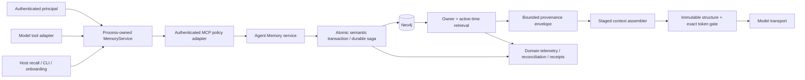
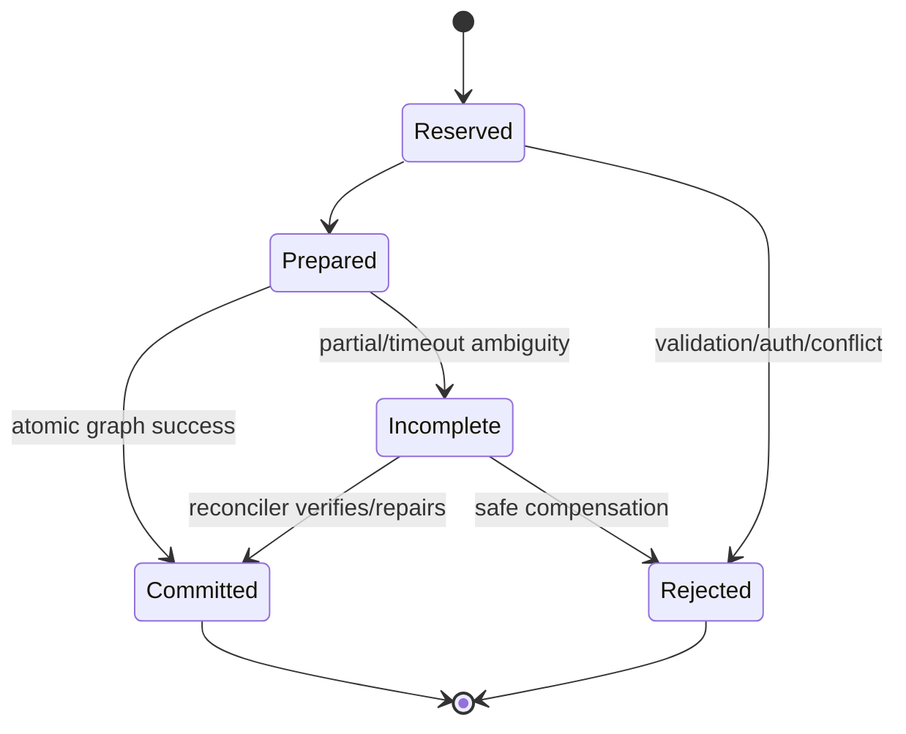

# Target Architecture

## Design outcome

The target is one authenticated, typed MemoryService boundary; atomic and
versioned memory semantics behind it; an exact immutable final-context gate in
front of every model call; and product-capability health that observes semantic
rather than only transport success.



## Mandatory corrections

### 1. Authenticated ownership and contracts

- Establish a service principal on every MCP connection/session. Derive tenant
  identity from authenticated transport metadata, never tool payload.
- Separate tenant APIs from explicitly privileged, disabled-by-default admin
  resources. Remove global resources from the normal profile.
- Define conversation identity as `(principal_id, session_id)` with a database
  constraint and immutable owner.
- Carry a typed policy object from `ManagedServer.Source` through manager,
  mount, bridge, visibility, deferral, authorization, health, and telemetry.
- Treat the shared memory recipe as a singleton or define explicit isolated
  instance identity; aliases cannot change security behavior.

### 2. Versioned MCP semantic contract

Use a common initialize result and supported version/capability matrix. Each
operation returns a typed envelope such as:

```text
operation_id
principal_id_hash
kind
outcome = success | rejected | partial | indeterminate | error
resource_version
corpus_epoch
result/error
retryability
```

Transport success is never domain success. Gateway/idempotency completes only
`success`; `partial`/`indeterminate` remains recoverable and observable.

### 3. Atomic memory semantics

- One public create/update/supersede/forget operation is one graph transaction
  when feasible.
- Where external embedding/reranking makes that impossible, use a durable
  operation record/outbox with explicit prepare/commit/incomplete states and an
  idempotent reconciler.
- Use owner-scoped normalized semantic keys and database uniqueness for
  facts/preferences. Use `MERGE` or equivalent atomic upsert.
- Add optimistic resource versions for updates and monotonic per-session
  message sequence.
- Centralize active-time/supersession predicates for every normal retrieval.
- Preserve a corpus epoch/version that represents committed semantic state, not
  every internal sub-write.

### 4. Exact immutable context gate

Build context in explicit stages:

1. immutable canonical system prefix;
2. immutable current active user/tool round;
3. bounded historical rounds/checkpoint;
4. bounded untrusted memory/retrieval envelopes;
5. volatile host hints;
6. exact active tool schemas;
7. constrained hook deltas;
8. exact model-specific tokenization and structure validation;
9. send.

The final gate verifies byte identity of protected content, role/tool pairing,
one exact model-only current-user form, provenance placement, and total request
+ reasoning/output reserve. It runs after every hook and tool-loop growth.
Eviction may remove only explicitly lower-priority content; otherwise it returns
an actionable overflow error.

### 5. Verified lifecycle and erasure

- Define retention per memory class and conversation source of truth.
- Implement idempotent owner-scoped graph/conversation purge with shared-node
  rules, crash-safe journal, verification, and non-PII receipt.
- Do not delete identity until mandatory planes acknowledge or a durable tombstone
  makes further access impossible.
- Schedule tenant-safe retention/consolidation with dry-run review, bounded
  batches, metrics, and rollback/repair.

### 6. Semantic health and release gates

- Required/degraded/optional capability state per runtime profile.
- Functional authenticated memory contract readiness, not TCP-only.
- Domain outcomes, reconciliation backlog, auth denials, stale retrieval,
  context source tokens, invariant violations, purge backlog, and queue depth.
- Fail-first P0/P1 tests in CI and supported-topology E2E.

## Recommended hardening

### Memory provenance and conflict handling

Expose a bounded per-item envelope to the model:

```text
id, kind, normalized subject/category, value/description,
source class, confidence, valid_from, valid_until, rank,
retrieval method, reranker revision
```

The model does not receive arbitrary privileged instructions from memory.
Conflict handling should explicitly decide `ADD`, `UPDATE/SUPERSEDE`, `NOOP`, or
`REJECT`, with the decision and source recorded. Active normal recall excludes
superseded/expired entries; explicit as-of retrieval is separately authorized.

### One process-owned MemoryService

Replace per-turn raw recall sessions and CLI helper reuse with one process-owned
service abstraction:

- model adapter: narrow untrusted long-term tool surface;
- host adapter: typed recall/onboarding/operator methods;
- shared authenticated connection/pool, breaker, generation, timeout,
  operation identity, readiness, and telemetry;
- separate permissions remain explicit even though lifecycle is shared.

### Transport and resource safety

- Context-selectable MCP request queue and bounded close/drain.
- Atomic live tool-registry generations, or suppress/degrade on contract drift.
- Runtime-profile-derived redirect/dial/DNS SSRF policy.
- Request body, field, collection, result, rate, tenant concurrency, and
  container resource caps.
- Durable bounded observer queue keyed by `(principal,session)` or remove the
  short-term observer surface from the production profile.
- Migrate the knowledge client to the common hardened subprocess substrate and
  eliminate credentials in argv.

### Context storage and compaction

Use round-aware bounded queries or durable checkpoints so every turn does not
load/tokenize all history. Preserve raw history according to a separate audit
retention policy. If a summary/checkpoint is used, store its covered sequence,
source hashes, model/revision, provenance, and invalidation criteria; never
substitute a summary for the immutable active round.

## Optional optimizations

- Cross-kind learned recall allocator that selects one aggregate top-K.
- Cache owner-scoped retrieval by `(principal, query, corpus_epoch, contract
  revision)` with explicit invalidation.
- Batch embeddings and graph operations behind the semantic transaction/outbox.
- Precompile stable tool-schema token counts per model and registry generation.
- Adaptive recall can become champion only after reproducible quality/safety
  evidence; static/shadow operation is a valid controlled state.
- Read replicas or partitioning only after owner scope, correctness, and
  benchmark evidence are established.

## Failure recovery model



Every state transition is idempotent by operation ID. A caller retry reads the
state rather than repeating an unknown mutation. Reconciliation uses bounded
non-PII correlation IDs and produces an audit event.

## Backward-compatible migration

1. **Contain:** disable direct/global resources and short-term production
   surface; restrict network reachability; canonicalize memory aliases.
2. **Observe:** introduce typed envelopes and semantic metrics while accepting
   legacy success payloads only behind an explicit compatibility adapter that
   converts error-shaped content to failure.
3. **Dual write operation metadata:** add operation/canonical-key/version fields
   without changing current reads; backfill and report collisions/orphans in
   read-only mode.
4. **Repair/migrate:** after approval, reconcile duplicates/orphans and add
   constraints. Preserve export/rollback artifacts.
5. **Switch reads:** owner + active-time queries and provenance envelope behind
   a feature flag; shadow compare results.
6. **Switch writers:** atomic/saga contract, then make legacy writes read-only.
7. **Unify clients:** move recall/CLI/knowledge to shared lifecycle incrementally
   with parity tests.
8. **Enforce exact context gate:** shadow metric first, reject after false
   positives are resolved; never rely on provider truncation.
9. **Enable verified purge/retention:** dry-run enumeration, canary, receipts,
   then production enforcement.
10. **Remove compatibility paths:** only after telemetry shows no legacy callers
    and rollback window closes.

Rollback is contract/version based: keep the previous read adapter and export,
disable new writer while preserving operation records, and never roll back an
authorization/erasure containment control to the unsafe direct surface.
