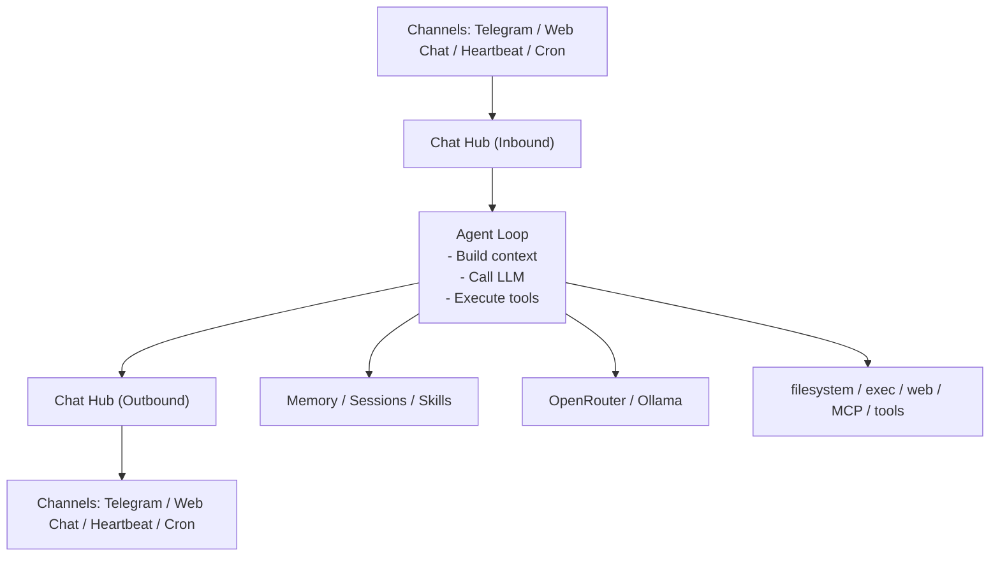

# PRD - Chat completa Aura

> **Status: HISTORICAL — web-chat product PRD. Active requirements consolidated into [prd.md §15 Web Chat Product Surface](../prd.md). Preserved as evidence per prd.md §3.2.**

**Versione:** 0.1  
**Data:** 2026-05-13  
**Stato:** proposta aggiornata con deep research e pronta per pianificazione  
**Owner:** Aura product / web dashboard  
**Riferimento visivo:** screenshot chat-style con sidebar conversazioni, contenuto markdown centrale e composer fisso in basso.

## 1. Sintesi

Aura deve aggiungere una chat web completa alla dashboard, con esperienza simile allo screenshot: sidebar sinistra con azioni rapide e cronologia, area centrale per il thread, rendering markdown ricco e composer persistente in basso con selezione modello e controlli strumenti.

La chat non deve diventare un clone generico di ChatGPT. Deve essere il front-door web di Aura: stesso agente, stessi tool, stessa memoria, stesso controllo locale e stesso tema logo-derived gia definito in `web/src/index.css`.

## 2. Contesto

Oggi Aura ha:

- dashboard React/Vite embedded, protetta da bearer token;
- tema light/dark/contrast basato su deep navy + electric cyan;
- renderer markdown con GFM in `web/src/components/Markdown.tsx`;
- archivio conversazioni leggibile da `/conversations`;
- endpoint sincrono `POST /api/chat` usato da `cmd/chat`;
- agente runtime e tool registry condivisi con Telegram.

Manca una superficie web di chat completa: thread navigabili, nuovo thread, composer avanzato, streaming UI, gestione allegati/tool, feedback e stati di errore user-facing.
Mancano anche upload file direttamente nel flusso chat e gestione strutturata delle domande: starter questions, follow-up questions e clarification questions quando Aura deve chiedere input prima di procedere.

### 2.1 Architettura target - Chat Hub

La nuova chat deve introdurre un'interfaccia centrale come nella reference: tutti i canali entrano nel **Chat Hub (Inbound)**, passano da un unico **Agent Loop**, poi tornano ai canali tramite **Chat Hub (Outbound)**.



Principio chiave: Telegram, web chat, heartbeat e cron non devono parlare direttamente con implementazioni diverse dell'agente. Devono produrre lo stesso tipo di messaggio inbound e consumare lo stesso tipo di evento outbound.

Responsabilita del Chat Hub inbound:

- normalizzare messaggi da Telegram, web chat, heartbeat e cron;
- assegnare o risolvere `thread_id`, `user_id`, `channel`, `locale`, `timezone`;
- allegare file/source refs, question answers e metadata del canale;
- applicare auth, allowlist e ownership prima dell'Agent Loop;
- selezionare modalita di consegna: streaming, deferred, silent, notification;
- costruire una richiesta agente indipendente dal canale.

Responsabilita dell'Agent Loop:

- build context da memoria, sessioni, skill e overlay;
- chiamare il provider LLM configurato: OpenRouter, Ollama o compatibile OpenAI;
- eseguire tool: filesystem, exec, web, MCP, source, wiki, scheduler;
- produrre eventi strutturati, non UI channel-specific.

Responsabilita del Chat Hub outbound:

- trasformare eventi agente in messaggi del canale corretto;
- gestire streaming delta, tool events, final answer, errori e cancellazione;
- renderizzare markdown secondo il canale: HTML Telegram, markdown web;
- consegnare question cards e follow-up nel formato supportato dal canale;
- associare output, usage e telemetry al thread persistente;
- garantire retry e fallback quando un canale non supporta streaming.

Contratto minimo dei messaggi:

```go
type InboundMessage struct {
    ID          string
    Channel     string // telegram | web | heartbeat | cron
    UserID      string
    ThreadID    string
    Text        string
    Attachments []AttachmentRef
    Question    *QuestionAnswer
    Locale      string
    TimeZone    string
    Mode        DeliveryMode
    CreatedAt   time.Time
}

type OutboundEvent struct {
    ID        string
    RunID     string
    ThreadID  string
    Channel   string
    Type      string // delta | tool_start | tool_end | question | final | error | done
    Seq       int64
    MessageID string
    Content   string
    Payload   map[string]any
    CreatedAt time.Time
}
```

Questo contratto e product-level: i nomi finali in Go possono cambiare, ma l'implementazione deve preservare il confine architetturale.

### 2.2 Deep research e razionale

La ricerca conferma che Aura deve evitare una chat web isolata e costruire invece un hub conversazionale multi-canale.

Pattern multi-canale:

- Microsoft Bot Framework usa un oggetto `Activity` come unita base di comunicazione, con campi come `type`, `channelId`, `conversation`, `from`, `recipient`, `text`, `attachments`, `suggestedActions`, `locale` e `channelData`. Questo valida un contratto Aura simile, dove Web Chat, Telegram, Heartbeat e Cron producono messaggi normalizzati invece di chiamare direttamente loop diversi.
- Bot Framework documenta inoltre che i canali possono comportarsi in modo diverso e includere dati extra nelle activity; per Aura questo significa mantenere `channel_metadata`/`channelData` fuori dall'Agent Loop e dentro gli adapter.

Streaming e agent events:

- MDN descrive Server-Sent Events come connessione one-way dal server al client tramite `EventSource`, adatta a notifiche progressive dalla generazione al browser.
- OpenAI raccomanda eventi semantici tipizzati per lo streaming delle Responses API, e Chat Completions usa stream SSE incrementali. Questo supporta la scelta Aura di non streammare solo testo, ma eventi con schema: messaggio, tool, question, usage, error.
- OpenRouter supporta streaming e segnala che commenti SSE possono arrivare per tenere viva la connessione; quindi il client Aura deve ignorare commenti non JSON e gestire errori mid-stream come eventi.
- Anthropic espone un flusso eventi con `message_start`, `content_block_delta`, `message_delta`, `message_stop` e error events; Ollama streamma NDJSON di default. Il Chat Hub deve quindi adattare provider eterogenei in un formato unico interno.

UX chat, opzioni e questions:

- Carbon Chatbot pattern definisce anatomia utile per Aura: header, system message, user message, structured response, input e cards. La parte "structured response" giustifica question cards e risposte guidate.
- NN/g raccomanda di combinare testo libero e opzioni selezionabili, chiarire le capability del bot, salvare informazioni tra task e gestire ambiguita/errori con recovery esplicita. Per Aura questo significa starter questions, follow-up cliccabili, clarification questions e memoria/thread persistente.
- LangChain human-in-the-loop descrive interrupt che salvano stato e riprendono dopo una decisione umana. In Aura il pattern diventa `question.requested` / `question.answered`, usabile sia per chiarimenti semplici sia per approvazioni di tool futuri.

Upload e accessibilita:

- MDN File Drag and Drop raccomanda drop zone piu fallback con `<input type="file">`; Aura deve supportare drag/drop e click, con preview e stati per file.
- WAI-ARIA live regions e feed pattern confermano che una timeline chat dinamica deve annunciare cambiamenti senza disturbare la lettura. Aura deve usare `aria-live="polite"` per stati e messaggi, non rileggere tutto il contenuto a ogni token.
- WCAG 2.2 richiede target pointer minimi di 24 x 24 CSS px con eccezioni; Aura adotta 44 px su mobile come standard interno piu comodo per toolbar, composer e file actions.

Fonti principali:

- [Microsoft Bot Framework Activity interface](https://learn.microsoft.com/en-us/javascript/api/botframework-schema/activity?view=botbuilder-ts-latest)
- [Microsoft Bot Framework basics](https://learn.microsoft.com/en-us/azure/bot-service/bot-builder-basics?view=azure-bot-service-4.0)
- [MDN Server-Sent Events](https://developer.mozilla.org/en-US/docs/Web/API/Server-sent_events/Using_server-sent_events)
- [OpenAI Streaming responses](https://platform.openai.com/docs/guides/streaming-responses?api-mode=chat)
- [OpenRouter Streaming](https://openrouter.ai/docs/api-reference/streaming)
- [Anthropic Streaming messages](https://docs.anthropic.com/en/docs/build-with-claude/streaming)
- [Ollama Streaming](https://docs.ollama.com/api/streaming)
- [Carbon Chatbot pattern](https://carbondesignsystem.com/community/patterns/chatbot/usage/)
- [NN/g User Experience of Chatbots](https://www.nngroup.com/articles/chatbots/)
- [LangChain Human-in-the-loop](https://docs.langchain.com/oss/python/langchain/human-in-the-loop)
- [MDN File drag and drop](https://developer.mozilla.org/en-US/docs/Web/API/HTML_Drag_and_Drop_API/File_drag_and_drop)
- [MDN ARIA live regions](https://developer.mozilla.org/en-US/docs/Web/Accessibility/ARIA/Guides/Live_regions)
- [WAI-ARIA Feed Pattern](https://www.w3.org/WAI/ARIA/apg/patterns/feed/)
- [WCAG 2.2](https://www.w3.org/TR/wcag/)

### 2.3 Decisione di prodotto

Approccio scelto: **Chat Hub First**.

Alternative valutate:

| Approccio | Vantaggi | Limiti | Esito |
| --- | --- | --- | --- |
| Quick Web Chat | Sblocca UI rapidamente usando `POST /api/chat` | Duplica il path Telegram, rende piu costosa la migrazione di upload/question/streaming | Non consigliato come architettura finale |
| Chat Hub First | Unifica Web, Telegram, Heartbeat e Cron; consente adapter puliti e Agent Loop riusabile | Richiede un primo slice backend prima del polish UI | Scelto |
| Full Event Sourcing | Massima auditabilita, replay e debug | Troppo pesante per v1, aumenta schema e migrazioni | Rimandato |

La v1 deve implementare un event log sufficiente per thread, messaggi, allegati, questions e run status, senza introdurre un sistema event-sourcing completo.

### 2.4 Decisioni bloccanti chiuse dopo verifica

La verifica indipendente del piano ha evidenziato che alcune open questions erano in realta decisioni architetturali. Per rendere il PRD eseguibile, queste decisioni sono chiuse qui:

| Tema | Decisione v1 |
| --- | --- |
| Memoria Web/Telegram | Web e Telegram condividono la memoria curata dello stesso principal Aura quando gli account sono collegati; i thread restano separati per canale/thread. |
| Identita | Introdurre un principal canonico channel-neutral. Telegram user, dashboard bearer user, heartbeat e cron si mappano a quel principal; i nuovi endpoint non accettano `user_id` dal client. |
| Runtime chat interattiva | Chat Hub usa un runtime channel-neutral estratto dall'attuale path Telegram/agentruntime/agentloop. `agent.Runner` resta valido per swarm/background e fallback non-streaming, ma non e il core per streaming/tool events della chat interattiva. |
| Model selector | Read-only in v1: mostra il modello attivo. Cambio modello per thread solo dopo catalogo modelli affidabile e persistenza `chat_threads.model`. |
| Upload default | Source-first sempre. Se l'utente invia file senza prompt: `solo carica`. Se invia file + prompt o sceglie esplicitamente: `carica e analizza`. |
| Ingest upload | L'upload chat deve restituire rapidamente attachment/source ref; OCR/extract/ingest possono proseguire asincroni con eventi `attachment_status`. |
| Delete thread | Soft-delete in v1, con retention/purge successivo. |
| Questions | Primitive backend, non euristica solo frontend. Empty state puo usare starter statiche conservative; follow-up e clarification arrivano dal backend. |
| Clarification format | Usare `chat_questions` canonico, riutilizzabile in futuro da automazioni/task. |
| Heartbeat/Cron silent | Supportati tramite `DeliveryMode=silent`: aggiornano thread/memoria senza notifica, salvo opt-in del task. |
| `/api/chat` | Mantenerlo come compat wrapper sopra Chat Hub durante la migrazione; non aggiungere nuove feature solo li. |

Queste decisioni sostituiscono le precedenti open questions bloccanti.

### 2.5 Vincoli emersi dalla verifica del piano

- Il PRD non e implementabile in modo sicuro se la prima fase prova a costruire la UI sopra `POST /api/chat` e poi "aggiungere" il Chat Hub. Il primo slice deve estrarre il runtime channel-neutral.
- Lo streaming web non puo dipendere dall'attuale `agent.Runner`, che oggi produce un risultato finale one-shot. Serve un event emitter attorno a `agentloop/agentruntime` o una nuova interfaccia streaming equivalente.
- Le questions richiedono una state machine con run sospendibile o almeno un run che termina in `waiting_for_user`, non solo messaggi markdown.
- L'upload chat richiede un lifecycle thread-aware: l'endpoint source esistente e riusabile come storage, ma non basta per attachment progress, cancel, retry e associazione a messaggio/thread.
- Il prompt e le policy devono diventare channel-neutral: niente assunzione hardcoded che Aura raggiunga l'utente solo via Telegram.

## 3. Obiettivi

1. Rendere `/chat` la nuova esperienza conversazionale web primaria di Aura.
2. Replicare la struttura dello screenshot: sidebar cronologia, area messaggi centrale, input fisso in basso.
3. Usare l'identita visiva Aura: token CSS esistenti, dark mode default, accento cyan, superfici deep navy, Geist, bordi e radius coerenti.
4. Riutilizzare il runtime Aura esistente: stesso tool registry, stessi limiti budget/context, stesso modello configurato in Settings e runtime chat channel-neutral estratto da agentruntime/agentloop.
5. Supportare conversazioni persistenti, rinominabili, eliminabili e ricercabili.
6. Mostrare output markdown completo: heading, liste, tabelle, code block, link, blockquote.
7. Rendere visibili stati di lavoro: streaming, tool in corso, errori, retry, annullamento.
8. Supportare upload file nativo dalla chat, con progress, preview e ingest nel source inbox.
9. Supportare question UX: domande suggerite, domande di chiarimento dell'agente e follow-up cliccabili.
10. Introdurre il Chat Hub come interfaccia unica per inbound/outbound multi-canale.

## 4. Non obiettivi

- Non sostituire Telegram come canale supportato.
- Non creare un nuovo agente o prompt separato per la web chat.
- Non introdurre un provider LLM hardcoded lato frontend.
- Non esporre tool distruttivi senza gli stessi gate gia presenti in Aura.
- Non creare una landing page o una pagina marketing.
- Non creare un secondo loop agente solo per la web chat.

## 5. Utenti e casi d'uso

**Operatore self-hosted**

- Vuole usare Aura dal browser quando e al PC.
- Vuole scegliere o verificare il modello attivo.
- Vuole vedere quando Aura usa tool, memoria, file o ricerca.
- Vuole riprendere conversazioni precedenti.

**Power user / developer**

- Vuole incollare prompt lunghi, leggere tabelle e codice con comodita.
- Vuole fare debug del comportamento agente senza passare da Telegram.
- Vuole allegare file e farli entrare nel source inbox.

## 6. UX target

La prima schermata di `/chat` deve essere direttamente utilizzabile.

Layout desktop:

- viewport full-height senza scroll del body;
- sidebar chat larga circa 248-280 px;
- contenuto thread centrato con max-width leggibile, circa 760-920 px;
- composer sticky/fixed in basso, centrato come nello screenshot;
- scroll separato per sidebar e thread;
- nessuna card esterna attorno alla chat principale.

Layout mobile:

- sidebar collassata in drawer;
- top bar compatta con bottone menu, titolo thread e azioni;
- composer sempre raggiungibile, safe-area aware;
- messaggi full-width con padding laterale ridotto.

Shell:

- `/chat` deve usare una shell dedicata fullscreen oppure la shell esistente deve supportare un `fullscreenChat` mode;
- non e accettabile renderizzare la chat dentro il `<main>` scrollabile della dashboard se questo rompe scroll separato, composer fisso o sidebar chat;
- il body/root resta senza scroll globale; scrollano solo sidebar conversazioni e thread;
- il composer richiede spacer/`scroll-padding-bottom` pari alla sua altezza massima visibile.

## 7. Navigazione e sidebar

La sidebar della chat deve includere:

- toggle collasso sidebar;
- `New Chat` con icona lucide;
- `Launch` come accesso rapido alla dashboard operativa Aura;
- `Settings` come accesso rapido a `/settings`;
- lista conversazioni raggruppata per periodo: Today, This week, Older;
- titolo thread generato dal primo messaggio o dal primo assistant summary;
- stato attivo con highlight coerente con `--sidebar-accent` e `--primary`;
- menu contestuale su thread: rinomina, elimina, esporta markdown/json.

La chat puo vivere in una shell dedicata (`ChatShell`) invece della sidebar amministrativa completa, pur mantenendo accesso rapido alla dashboard tramite `Launch`.

## 8. Thread e messaggi

Requisiti funzionali:

- Creare un nuovo thread vuoto.
- Inviare messaggi utente.
- Renderizzare risposta assistant in streaming.
- Preservare cronologia per thread.
- Riprendere un thread esistente senza perdere contesto.
- Mostrare messaggi `user`, `assistant`, `tool`, `system/error` con stili distinti.
- Supportare copia messaggio, retry ultima risposta, stop generazione.
- Auto-scroll verso il basso solo se l'utente era gia vicino al fondo.
- Non forzare auto-scroll se l'utente sta leggendo contenuto piu vecchio.

Messaggi assistant:

- markdown GFM completo;
- tabelle leggibili come nello screenshot;
- code block con overflow orizzontale;
- tabelle dentro wrapper `overflow-x-auto`, con container `min-width: 0` per evitare overflow mobile;
- link aperti in nuova tab;
- fallback raw text se markdown crasha.

Messaggi tool:

- collassati di default;
- mostrano nome tool, stato, durata, errore eventuale;
- espandibili per output tecnico;
- nessun secret o argomento sensibile in chiaro.

## 9. Composer

Il composer deve restare fisso in basso e includere:

- textarea multilinea autosize, min 1 riga, max circa 8 righe;
- placeholder `Send a message` in inglese o localizzato via i18n;
- invio con Enter, nuova riga con Shift+Enter;
- bottone `+` per allegati/azioni;
- bottone web/search o tool mode quando disponibile;
- selector modello con valore attivo, per esempio `deepseek-v4-flash:cloud`;
- bottone send circolare;
- bottone stop mentre la generazione e attiva;
- stato disabled se LLM non configurato, token scaduto o budget hard raggiunto.

Menu `+`:

- upload file verso source inbox;
- incolla/importa testo come source;
- crea task/reminder da prompt selezionato, se pianificatore attivo;
- link rapido ai file workspace quando disponibile.

### 9.1 Upload file

L'upload file e una funzione primaria del composer, non un extra nascosto.

Requisiti:

- drag and drop sul thread e sul composer;
- selezione file tramite bottone `+`;
- multi-file upload;
- preview allegati prima dell'invio con nome, estensione, dimensione e stato;
- rimozione singolo allegato prima dell'invio;
- progress per file durante upload;
- retry per file fallito;
- limite dimensione coerente con `MaxUploadMB` e source inbox;
- validazione tipo file coerente con gli extractor supportati;
- allegati inviabili insieme a un prompt testuale;
- opzione `solo carica` e opzione `carica e analizza`;
- dopo upload riuscito, mostra chip/link al source `src_*`;
- se l'ingest parte automaticamente, mostra stato `stored`, `extracting`, `extract_complete`, `ingested` o `failed`;
- se l'upload genera wiki pages, la risposta deve linkare le pagine create.

Formati iniziali:

- PDF;
- TXT/MD;
- JSON/CSV;
- DOCX/XLSX quando gia supportati dal backend;
- immagini solo se esiste un backend OCR/image-to-text configurato.

Stati UI:

- `queued`;
- `uploading`;
- `stored`;
- `ocr_complete`;
- `extracting`;
- `extract_complete`;
- `ingested`;
- `failed`;
- `cancelled`.

Mapping con source store:

- `chat_attachments.source_id` e valorizzato appena il source store crea `src_*`;
- `stored` corrisponde a file persistito ma non ancora analizzato;
- `ocr_complete` e `extract_complete` rispecchiano gli stati source quando il backend li espone;
- `ingested` indica che il contenuto e entrato nell'indice/memoria disponibile per `search_memory`/source tools;
- `failed` mantiene errore breve user-facing e errore tecnico redatto in `payload_json`;
- `cancelled` e ammesso solo prima che l'upload sia completato o prima che un job asincrono inizi una fase non cancellabile.

Vincoli:

- Non mostrare path locali completi del browser.
- Non inviare file al provider LLM se Aura puo prima salvarli nel source store.
- Non bloccare il composer durante upload lunghi: l'utente puo continuare a scrivere.
- L'upload deve essere cancellabile finche il request body non e completato.
- Progress upload reale richiede `XMLHttpRequest.upload.onprogress` o una primitive equivalente; se si usa `fetch`, la UI deve dichiarare progresso indeterminato invece di simulare percentuali false.
- Ogni file ha un `client_attachment_id` stabile per correlare preview locale, upload response, eventi SSE e retry.
- Multi-file v1 puo caricare in sequenza, ma la UI deve mostrare stato per file e non perdere il batch se un file fallisce.

### 9.2 Question UX

La chat deve trattare le domande come elementi di interazione, non solo testo libero.

Tipologie:

- **Starter questions:** suggerimenti nella chat vuota, coerenti con Aura e con la memoria disponibile.
- **Follow-up questions:** suggerimenti dopo una risposta, generati dal contesto del thread.
- **Clarification questions:** domande che Aura deve fare quando mancano dati necessari per agire.
- **Question cards:** blocchi compatti con 2-4 opzioni quando una scelta strutturata e piu sicura del testo libero.

Requisiti:

- nella empty state mostrare 3-5 starter questions utili;
- dopo ogni risposta assistant, mostrare fino a 3 follow-up questions cliccabili;
- clic su una question compila e invia il composer, o lo precompila se richiede modifica;
- le clarification questions devono bloccare solo l'azione specifica, non l'intera chat;
- le question cards devono supportare scelta singola, scelta multipla e risposta libera;
- le risposte alle question cards entrano nel thread come messaggi utente leggibili;
- le questions devono poter essere disabilitate per thread;
- non mostrare suggerimenti se l'assistant e in errore o se il thread e in streaming;
- le questions non devono inventare capability: devono rispettare tool e backend disponibili.

Contratto minimo `Question`:

```go
type Question struct {
    ID               string
    RunID            string
    ThreadID         string
    MessageID        string
    Kind             string // starter | follow_up | clarification | approval
    Prompt           string
    Options          []QuestionOption
    Multiple         bool
    FreeTextAllowed  bool
    FreeTextRequired bool
    DefaultOptionID  string
    BlockingScope    string // none | run | tool_call | attachment | thread
    Dismissible      bool
    Status           string // pending | answered | dismissed | expired
}

type QuestionOption struct {
    ID    string
    Label string
    Value string
}
```

Flow obbligatorio:

- `question_requested` crea una riga `chat_questions` e mette il run in `waiting_for_user` quando `BlockingScope != none`;
- risposta web o Telegram produce `question_answered` con `question_id`, `answer`, `selected_option_ids` e `answered_message_id`;
- il backend riprende il run se il run e resumable, oppure crea un nuovo inbound message collegato al run precedente;
- se l'utente risponde con testo libero non valido, Aura emette una nuova clarification invece di fallire in modo opaco;
- rendering accessibile: scelta singola come radio group, scelta multipla come checkbox group, prompt come `legend`, risposta libera come textarea con label.

Esempi di starter questions:

- "Riassumi gli ultimi documenti caricati"
- "Cerca nella mia wiki cosa sappiamo su questo tema"
- "Crea una tabella comparativa dai file allegati"
- "Pianifica un promemoria da questa conversazione"

Esempi di clarification questions:

- "Vuoi solo caricare il file o anche analizzarlo ora?"
- "Devo creare una pagina wiki o rispondere solo in chat?"
- "Quale modello vuoi usare per questo thread?"

Selector modello:

- legge modello corrente da Settings o endpoint dedicato;
- se la lista modelli non e disponibile mostra solo il valore attivo;
- cambio modello per thread opzionale, ma deve essere esplicito e persistito.

## 10. Tema Aura

La UI deve usare i token esistenti:

- `--bg`, `--surface`, `--surface-raised`, `--surface-sunken`;
- `--text`, `--text-strong`, `--text-dim`, `--text-muted`;
- `--brand`, `--brand-strong`, `--brand-soft`, `--brand-tint`;
- `--user-bubble`, `--assistant-bubble`, `--tool-bubble`;
- `--sidebar`, `--sidebar-border`, `--sidebar-accent`;
- `--radius-sm`, `--radius`, `--radius-lg`.

Vincoli visivi:

- dark mode deve essere il riferimento principale.
- Niente palette monocromatica grigia: il cyan Aura deve essere visibile ma misurato.
- Niente hero, card marketing, orb decorativi o gradienti decorativi fuori dal background globale gia esistente.
- Sidebar piu scura del thread, con confine sottile.
- Thread su canvas pulito, non dentro una card.
- Composer con superficie rialzata, border sottile e radius generoso ma coerente.
- Bottoni icon-only con tooltip accessibile.
- Usare icone `lucide-react`.
- Font Geist, nessun font-size basato su viewport width.
- La chat non deve usare colori Tailwind raw quando esiste un token semantico Aura equivalente.

Mapping token minimo:

| Elemento | Token |
| --- | --- |
| Canvas thread | `--bg`, `--surface-sunken` |
| Sidebar chat | `--sidebar`, `--sidebar-border`, `--sidebar-accent` |
| Messaggio user | `--user-bubble` |
| Messaggio assistant | `--assistant-bubble` |
| Messaggio/tool event | `--tool-bubble`, `--brand-soft` |
| Composer | `--surface-raised`, `--border`, `--brand` |
| Stato errore | `--destructive`, `--destructive-foreground` |
| Focus ring | `--brand` |

## 11. API e backend

### 11.1 Stato attuale

`POST /api/chat` e sincrono e ritorna:

```json
{
  "reply": "...",
  "elapsed_ms": 1234,
  "llm_calls": 1,
  "tool_calls": 2,
  "tokens": 1234
}
```

Questo basta per una chat minimale, ma non per la chat completa.

### 11.2 API richieste

Nuovi endpoint consigliati:

| Metodo | Path | Scopo |
| --- | --- | --- |
| `GET` | `/api/chat/threads` | Lista thread dell'utente autenticato |
| `POST` | `/api/chat/threads` | Crea thread |
| `GET` | `/api/chat/threads/{id}` | Dettaglio thread + messaggi |
| `PATCH` | `/api/chat/threads/{id}` | Rinomina, archivia, aggiorna modello |
| `DELETE` | `/api/chat/threads/{id}` | Elimina thread |
| `POST` | `/api/chat/threads/{id}/messages` | Invio non-streaming fallback |
| `POST` | `/api/chat/threads/{id}/stream` | Invio con streaming |
| `POST` | `/api/chat/threads/{id}/stop` | Best-effort cancel generazione |
| `POST` | `/api/chat/threads/{id}/attachments` | Upload allegati verso source inbox |
| `POST` | `/api/chat/threads/{id}/attachments/{attachment_id}/ingest` | Avvia ingest/analisi di un allegato |
| `DELETE` | `/api/chat/threads/{id}/attachments/{attachment_id}` | Rimuove allegato non ancora usato |
| `GET` | `/api/chat/threads/{id}/questions` | Suggerimenti e clarification questions correnti |
| `POST` | `/api/chat/threads/{id}/questions/{question_id}/answer` | Risponde a una question strutturata |
| `GET` | `/api/chat/models` | Modello attivo e lista disponibile best-effort |

Streaming:

- preferenza: Server-Sent Events per semplicita e compatibilita;
- alternativa: `fetch` con `ReadableStream`;
- eventi minimi: `run_started`, `message_created`, `message_delta`, `message_done`, `tool_start`, `tool_delta`, `tool_end`, `attachment_status`, `question_requested`, `question_answered`, `usage`, `done`, `error`;
- ogni evento deve includere `thread_id`, `message_id` o `client_message_id`.
- commenti SSE e keepalive non JSON devono essere ignorati dal client;
- errori mid-stream devono diventare eventi UI recuperabili, non crash del parser;
- il formato interno deve restare indipendente dal provider: SSE OpenAI/OpenRouter/Anthropic e NDJSON Ollama vanno adattati prima di arrivare al frontend.
- ogni evento persistibile include `event_id`, `run_id`, `seq`, `created_at` e `idempotency_key` quando deriva da retry;
- l'ordine e per `run_id, seq`; il client deve ignorare duplicati e tollerare replay parziale;
- il server deve inviare heartbeat SSE periodici durante attese lunghe;
- backpressure: il backend puo coalescere `message_delta` frequenti, ma non puo riordinare tool/question/error events;
- fallback non-streaming deve produrre almeno `message_created`, `message_done`, `usage`, `done` persistiti in `chat_events`.

### 11.3 Persistenza

Serve una persistenza web-chat separata o un'estensione compatibile dell'archivio conversazioni.

Schema consigliato:

- `chat_principals`: id, display_name, created_at, updated_at;
- `chat_channel_accounts`: id, principal_id, channel, external_user_id, metadata_json, created_at, updated_at;
- `chat_threads`: id, owner_user_id, title, model, status, created_at, updated_at, last_message_at;
- `chat_runs`: id, thread_id, status, model, started_at, completed_at, cancelled_at, error, metadata_json;
- `chat_messages`: id, thread_id, role, content, status, tool_calls_json, usage_json, created_at, updated_at;
- `chat_events`: id, thread_id, message_id, run_id, type, payload_json, created_at;
- `chat_attachments`: id, thread_id, message_id, source_id, filename, mime_type, size_bytes, status, error, created_at;
- `chat_questions`: id, thread_id, message_id, kind, prompt, options_json, status, answered_message_id, created_at;
- indici su owner_user_id, last_message_at, thread_id;
- retention integrata con i controlli conversazioni esistenti.

Nota: l'attuale tabella `conversations` usa `chat_id` numerico e nasce dal mondo Telegram. La web chat deve evitare collisioni semantiche con gli ID Telegram.

### 11.4 Runtime agente

La web chat deve:

- riusare `tools.Registry` e il runtime agentico esistente, ma non usare l'attuale `agent.Runner` come core della chat interattiva finche resta non-streaming;
- estrarre un runtime channel-neutral dall'attuale path Telegram basato su `conversation`, `agentruntime` e `agentloop`;
- usare lo stesso `conversation.RenderSystemPrompt` e overlay;
- rispettare `AURA_AGENT_LOOP_MAX_STEPS`, budget, tool result caps e microcompaction;
- registrare telemetry per turno;
- archiviare user message, assistant message e tool result in modo auditabile;
- non duplicare logica Telegram-specific come progressive edit.

Estrazione obbligatoria prima dello streaming web:

- prompt assembly, runtime context, tool provider, budget guard e executor devono vivere fuori da `internal/telegram/conversation.go`;
- Telegram diventa un adapter inbound/outbound che usa lo stesso runtime;
- Web/SSE diventa un adapter outbound che serializza `OutboundEvent`;
- `agent.Runner` resta adatto a swarm, cron/background e compat non-streaming, oppure va esteso esplicitamente con callback/event emitter prima di usarlo per `/chat/stream`.

### 11.5 Chat Hub interfaces

Backend consigliato:

- `internal/chathub` come package nuovo;
- `InboundAdapter` per Telegram, web chat, heartbeat e cron;
- `OutboundAdapter` per Telegram, web/SSE e notifiche deferred;
- `AgentLoop` come porta unica verso il runtime channel-neutral basato su `agentruntime/agentloop`; `agent.Runner` resta compat/background finche non espone eventi streaming;
- `SessionResolver` per collegare `thread_id`, memoria e archive;
- `AttachmentResolver` per trasformare upload web o documenti Telegram in `source_id`;
- `QuestionRenderer` per convertire question cards nei formati canale.

Interfacce product-level:

```go
type InboundAdapter interface {
    Normalize(ctx context.Context, raw any) (InboundMessage, error)
}

type AgentLoop interface {
    Run(ctx context.Context, msg InboundMessage, emit func(OutboundEvent) error) error
}

type OutboundAdapter interface {
    Deliver(ctx context.Context, event OutboundEvent) error
}

type Hub interface {
    Receive(ctx context.Context, msg InboundMessage) error
}
```

Regole:

- Telegram deve migrare gradualmente verso il Chat Hub invece di restare un path speciale.
- Web chat deve usare il Chat Hub fin dal primo slice con backend reale.
- Heartbeat e cron producono inbound messages con `Channel=heartbeat` o `Channel=cron`.
- Outbound web usa SSE quando possibile e fallback non-streaming quando necessario.
- Outbound Telegram mantiene progressive edit ma lo implementa come adapter, non dentro l'Agent Loop.
- `channelData`/metadata canale sono consentiti sugli adapter, ma non devono contaminare prompt building e tool execution.
- Le questions sono eventi outbound a tutti gli effetti: il web le renderizza come card, Telegram come inline keyboard quando possibile, heartbeat/cron come pending state o notifica.
- Gli allegati sono risolti in `source_id` prima che l'Agent Loop decida se leggerli, riassumerli o citarli.

State machine run/eventi:

```text
queued
  -> running
  -> waiting_for_user
  -> running
  -> completed

running
  -> cancelling
  -> cancelled

running
  -> failed
```

Sequenza minima SSE:

```text
run_started
message_created
message_delta*
tool_start/tool_delta*/tool_end*
question_requested?   # se serve input utente
message_done
usage?
done | error | cancelled
```

Regole state machine:

- `run_id` e obbligatorio per ogni evento generato da un turno agente;
- `seq` e monotono per run;
- `question_requested` con `BlockingScope != none` porta il run a `waiting_for_user`;
- `/stop` usa una registry centrale `run_id -> cancel`, best-effort e idempotente;
- retry di un run fallito crea un nuovo `run_id` collegato al precedente in metadata;
- replay di eventi da `chat_events` deve poter ricostruire almeno messaggio finale, tool timeline, attachment status e pending questions.

## 12. Stati e feedback

Stati obbligatori:

- vuoto: nessun thread selezionato o nuovo thread;
- loading thread;
- sending;
- streaming;
- tool running;
- upload queued/uploading/stored/ingesting/failed;
- question pending/answered/dismissed;
- cancelled;
- failed with retry;
- token scaduto, redirect login;
- LLM non configurato;
- budget hard raggiunto;
- offline/network error.

Tutti gli stati devono essere visibili senza modal bloccanti, salvo conferme distruttive.

## 13. Sicurezza e privacy

- Tutte le API sono bearer-gated come il resto della dashboard.
- I thread sono filtrati per utente autenticato.
- I nuovi endpoint chat derivano sempre `owner_user_id` dal contesto auth; qualsiasi `user_id` inviato dal client e ignorato o rifiutato.
- Ogni accesso a `{thread_id}`, `{message_id}`, `{attachment_id}`, `{question_id}` verifica ownership rispetto al principal autenticato.
- Upload file usa gli stessi limiti di size e type della source inbox.
- Tool output sensibili restano redatti secondo policy esistenti.
- Delete thread richiede conferma.
- Export thread non include segreti, token o argomenti tool redatti.
- Logging lato backend non deve includere prompt completi se violerebbe policy esistente di arg logging.

## 14. Accessibilita

- Tutti i bottoni icon-only hanno `aria-label` e tooltip.
- Focus ring usa `--brand`.
- Composer e sidebar navigabili da tastiera.
- `Escape` chiude menu/drawer.
- Contrasto AA in light/dark, high contrast usa il tema `contrast`.
- Messaggi streaming annunciano stato con `aria-live="polite"` senza rileggere tutto il contenuto.
- La timeline messaggi usa semantica compatibile con feed/log: ogni messaggio e un articolo/entry con autore, timestamp e stato.
- Tool status e upload status usano live region dedicate e concise, separate dal contenuto markdown lungo.
- Le live region non ricevono token delta: annunciano solo stati debounced come `Aura sta rispondendo`, `Tool completato`, `Upload fallito`, `Risposta completata`.
- Question cards usano controlli form reali: radio, checkbox, textarea, fieldset/legend e focus management dopo risposta.
- Touch target minimi 44 px su mobile.
- Toolbar composer e attachment actions hanno `min-width`/`min-height` 44 px su mobile anche quando il componente base e piu piccolo.

## 15. Performance

- Primo render chat sotto 1 s su dashboard gia caricata.
- Lista thread paginata o virtualizzata oltre 100 thread.
- Thread virtualizzato oltre 300 messaggi.
- Streaming con batch UI per evitare re-render a ogni token singolo.
- Markdown render memoizzato per messaggi completati.
- Composer non deve causare layout shift quando cresce.

## 16. i18n

Tutte le stringhe UI passano da `web/src/i18n/locales/{it,en}.json`.

Stringhe minime:

- New Chat / Nuova chat
- Launch / Apri dashboard
- Settings / Impostazioni
- Send a message / Scrivi un messaggio
- Stop / Interrompi
- Retry / Riprova
- Rename / Rinomina
- Delete / Elimina
- Today / Oggi
- This week / Questa settimana
- Older / Piu vecchie
- Attach file / Allega file
- Upload and analyze / Carica e analizza
- Upload only / Solo carica
- Suggested questions / Domande suggerite
- Answer question / Rispondi alla domanda
- Ask a follow-up / Fai una domanda di follow-up

## 17. Tracciamento successo

Metriche:

- p50 e p95 time-to-first-token;
- p50 e p95 total response time;
- error rate per invio;
- percentuale turni cancellati;
- tool calls per turno;
- token in/out per turno;
- thread creati, ripresi, eliminati;
- upload riusciti/falliti dalla chat.

Le metriche devono restare locali e osservabili via log/API, coerenti con l'approccio self-hosted.

## 18. Slice di implementazione

### Slice 0 - Chat Hub contract

- Creare package/contratto `internal/chathub`.
- Definire `InboundMessage`, `OutboundEvent`, attachment refs e question answers.
- Definire `Principal`, `ChannelAccount`, `Run`, event ordering, idempotency, cancel registry e state machine.
- Estrarre runtime channel-neutral dall'attuale path Telegram/agentruntime/agentloop.
- Adattare CLI chat pipe al contratto come compat wrapper non-streaming.
- Preparare Telegram adapter senza cambiare comportamento utente.
- Definire event type canonici e adapter provider: OpenAI/OpenRouter SSE, Anthropic SSE, Ollama NDJSON.
- Testare che web, Telegram-like fixture, heartbeat e cron-like fixture producano la stessa richiesta agente normalizzata.

### Slice 1 - Chat shell statica

- Route `/chat`.
- `ChatShell` con sidebar, thread viewport e composer.
- Styling Aura dark/light/contrast.
- Mock data locale per validare layout desktop/mobile.

### Slice 2 - Chat non streaming su API esistente

- Collegare composer a `POST /api/chat`.
- Far passare il request handler dal Chat Hub, non direttamente dal runner.
- Mostrare user message + assistant reply.
- Stati loading/error/retry.
- Nessuna persistenza thread oltre sessione browser.

### Slice 3 - Persistenza thread

- Nuove tabelle e API thread/messages.
- Sidebar con cronologia raggruppata.
- Nuovo thread, rinomina, elimina.
- Ripresa contesto per thread.

### Slice 4 - Streaming

- Endpoint streaming.
- Deltas assistant.
- Tool status in tempo reale.
- Stop generation.
- Usage finale.
- Parser robusto per SSE comments, keepalive e errori mid-stream.
- Batch rendering lato frontend per evitare re-render a ogni token.

### Slice 5 - Allegati e tool UX

- Upload file dal composer.
- Drag and drop file sul thread.
- Preview allegati e progress per file.
- Scelta `solo carica` / `carica e analizza`.
- Stato source inbox.
- Attachment lifecycle con `client_attachment_id`, `source_id`, retry, cancel e mapping source status.
- Tool timeline collassabile.
- Link a source/wiki generati.

### Slice 6 - Polish e hardening

- Starter questions e follow-up questions.
- Clarification question cards.
- Question contract backend e flow `question_requested -> question_answered -> resume`.
- Mobile drawer.
- Keyboard shortcuts.
- Empty/error states.
- E2E Playwright su desktop e mobile.
- A11y pass.

## 19. Acceptance criteria

La feature e pronta quando:

1. `/chat` mostra una schermata completa simile alla reference, con tema Aura.
2. L'utente puo creare una chat, inviare messaggi e ricevere risposte.
3. Il markdown della risposta renderizza tabelle, liste e heading come nello screenshot.
4. La sidebar mostra almeno Today, This week e Older.
5. Il composer resta fisso e non copre l'ultimo messaggio.
6. La chat funziona in dark, light e contrast.
7. La chat funziona da mobile senza overlap o testo tagliato.
8. Errori LLM/network sono recuperabili con retry.
9. Nessun endpoint chat e accessibile senza bearer token.
10. Web chat, Telegram adapter, heartbeat e cron passano dallo stesso Chat Hub contract.
11. L'Agent Loop non contiene logica di rendering Telegram o web-specific.
12. L'utente puo allegare almeno un PDF e vedere source id, stato upload e stato ingest.
13. L'utente vede starter questions nella chat vuota e follow-up questions dopo una risposta.
14. Aura puo mostrare una clarification question strutturata e usare la risposta per continuare.
15. I test frontend includono almeno: render route, send success, send failure, sidebar thread selection, mobile composer, file upload success/failure, question click.
16. I test backend includono almeno: inbound normalization, outbound event delivery, SSE fallback, Telegram adapter fixture, heartbeat/cron fixture.
17. Lo streaming usa `run_id` e `seq` monotono, ignora duplicati e gestisce errori mid-stream senza crash client.
18. `/stop` cancella best-effort un run attivo tramite registry centrale e resta idempotente se chiamato due volte.
19. Upload multi-file mostra stato per file, retry per fallimento parziale e cancellazione prima del completamento request.
20. Le question cards supportano scelta singola, multipla e testo libero con controlli accessibili.
21. Playwright verifica almeno: tabella markdown larga mobile, nessun auto-scroll mentre l'utente legge, composer non sovrapposto, drawer Escape/focus restore, contrast theme, upload cancel/retry, question radio/checkbox.
22. Backend verifica ownership: nessun thread/message/attachment/question e accessibile da principal diverso.

## 20. Rischi

- Streaming richiede separare la logica Telegram-specific dal loop agente.
- Persistenza web-chat puo duplicare concetti dell'archivio conversazioni.
- Tool output lunghi possono degradare performance markdown.
- Upload multi-file puo creare stati parziali difficili da spiegare se un file riesce e uno fallisce.
- Question suggerite possono diventare rumore se troppo generiche o non legate alla memoria reale.
- Migrare Telegram verso Chat Hub puo introdurre regressioni se progressive edit e markdown HTML non restano confinati nell'outbound adapter.
- Se il Chat Hub diventa troppo astratto troppo presto, puo rallentare la feature. Il contratto deve restare piccolo.
- Se il model selector viene esposto troppo presto, puo creare aspettative non supportate dal provider.
- La shell chat dedicata puo divergere dalla dashboard se non riusa token e componenti comuni.

## 21. Decisioni consigliate

- Usare `/chat` come route dedicata e tenere `Launch` come ponte verso la dashboard esistente.
- Iniziare dal contratto Chat Hub, poi usare API non-streaming come fallback temporaneo, poi aggiungere SSE.
- Creare tabelle `chat_threads` e `chat_messages` invece di forzare tutto dentro `conversations`.
- Creare `chat_events` leggero per eventi UI/audit senza full event sourcing.
- Creare `chat_runs`, `chat_principals` e `chat_channel_accounts` per runtime, cancel e identita channel-neutral.
- Riutilizzare `Markdown`, `Button`, `Tooltip`, `Sheet`, `Dialog`, `Skeleton` e `sonner`.
- Mantenere il model selector read-only nella prima release se la lista modelli non e affidabile.
- Implementare questions come primitive backend, non come euristica solo frontend.
- Implementare upload come source-first: il file entra in source store, poi l'agente decide come usarlo.
- Creare primitive frontend dedicate `ChatTextarea`, `ChatActionMenu`, `ModelSelector`, `QuestionCard`, `AttachmentTray` invece di piegare componenti dashboard non adatti.

## 22. Questioni non bloccanti

Le decisioni bloccanti sono chiuse in `2.4`. Restano non bloccanti:

1. Allegare in `docs/assets/` una reference visiva stabile dello screenshot e annotare breakpoint/golden states.
2. Scegliere la scorciatoia globale definitiva per aprire `/chat`; v1 puo affidarsi alla navigazione visibile.
3. Decidere se il full event sourcing servira in una release futura per replay/debug avanzato.
4. Valutare se il catalogo modelli puo arrivare da OpenRouter/Ollama o solo da settings locali.
5. Decidere se export thread includera eventi tool completi o solo transcript redatto.

## 23. Fonti e note di ricerca

Le fonti sono state usate per derivare requisiti, non per importare soluzioni 1:1.

| Area | Fonte | Implicazione per Aura |
| --- | --- | --- |
| Multi-canale | [Microsoft Activity interface](https://learn.microsoft.com/en-us/javascript/api/botframework-schema/activity?view=botbuilder-ts-latest) | Envelope unico con channel, conversation, text, attachments, suggested actions e metadata |
| Canali bot | [Bot Framework basics](https://learn.microsoft.com/en-us/azure/bot-service/bot-builder-basics?view=azure-bot-service-4.0) | Adapter per differenze di canale, Agent Loop indipendente dal rendering |
| Streaming web | [MDN Server-Sent Events](https://developer.mozilla.org/en-US/docs/Web/API/Server-sent_events/Using_server-sent_events) | SSE come default per eventi outbound web |
| Streaming LLM | [OpenAI Streaming responses](https://platform.openai.com/docs/guides/streaming-responses?api-mode=chat) | Eventi tipizzati e semantic stream, non solo testo delta |
| Routing LLM | [OpenRouter Streaming](https://openrouter.ai/docs/api-reference/streaming) | Gestione commenti SSE, errori mid-stream e generation id |
| Provider events | [Anthropic Streaming messages](https://docs.anthropic.com/en/docs/build-with-claude/streaming) | Adapter da event flow provider a eventi Aura canonici |
| Local LLM | [Ollama Streaming](https://docs.ollama.com/api/streaming) | Adapter NDJSON verso stessi eventi interni |
| Chat UI | [Carbon Chatbot pattern](https://carbondesignsystem.com/community/patterns/chatbot/usage/) | Anatomia: message roles, structured responses, input, cards |
| Conversational UX | [NN/g Chatbots UX](https://www.nngroup.com/articles/chatbots/) | Free text + opzioni, memoria tra task, recovery da ambiguita |
| Human input | [LangChain Human-in-the-loop](https://docs.langchain.com/oss/python/langchain/human-in-the-loop) | Clarification/approval questions come interrupt resumable |
| File upload | [MDN File drag and drop](https://developer.mozilla.org/en-US/docs/Web/API/HTML_Drag_and_Drop_API/File_drag_and_drop) | Drop zone piu input fallback, preview e multi-file |
| Live updates | [MDN ARIA live regions](https://developer.mozilla.org/en-US/docs/Web/Accessibility/ARIA/Guides/Live_regions) | `aria-live="polite"` per stati e messaggi dinamici |
| Timeline | [WAI-ARIA Feed Pattern](https://www.w3.org/WAI/ARIA/apg/patterns/feed/) | Timeline navigabile senza rompere screen reader/scroll |
| Accessibilita | [WCAG 2.2](https://www.w3.org/TR/wcag/) | Target pointer minimi e criteri AA; Aura usa 44 px su mobile |
