# Media editing — live verification (Plan A, Task 12)

Run on 2026-09-19 between 21:34 and 21:46 UTC. Target: the running appliance at
`https://localhost`. No product code, compose file, Caddy file or `.env` was changed.

## Verdict

| Flow | Unmodified appliance | With the Garage forward (see Method) | Key number |
|---|---|---|---|
| 1. Studio image → Filters → Save to library → picker | **FAIL**: "Saving failed: upload failed" | PASS on desktop and phone | stored WebP warm share 0.242 → 0.997 |
| 2. Agent video → trim 1–3 s → download | PASS (no upload involved) | — | ffprobe 2.042 s on Chrome, phone and Firefox |
| 3. Phone MP4 + JPEG as chat attachments → Edit | **FAIL**: the attachment chip says "Failed" | PASS on desktop and phone | trimmed phone clip 2.000 s, rotation kept |
| 4. Firefox trim + HEVC | Trim PASS | HEVC trim is **not** refused; HEVC crop **is** refused with the sentence | Firefox trim 165 ms, 2.042 s |
| 5. Rotation-only export | — | **Copy path** | 52–65 ms, codec parameters identical to the source |

The editors do their part on every surface tried. **Every browser upload on this appliance
fails**, because Caddy does not route the per-identity bucket path to Garage (Bug 1). Until
that is fixed, Save to library and chat attachments do not work for a real operator.
Trimming, rotating, cropping and downloading involve no upload, so they work unmodified.

## What was run

| | |
|---|---|
| Revision | `docker inspect aura --format '{{index .Config.Labels "org.opencontainers.image.revision"}}'` → `09b764cfd1f89aeba22479a1ad5b661c19be990b` (image `ghcr.io/chetto1983/aura:edge`, container started 2026-09-19T21:26:00Z) |
| Origin | `AURA_E2E_ORIGIN=https://localhost`, logged in through `web/e2e/auth.ts` (Authula, operator credentials from `.e2e.env`, session cached under `web/test-results/.auth`) |
| Harness | Playwright 1.63.0 test runner with a scratch config and spec kept outside the repo; one worker; `serviceWorkers: 'block'` |
| Chrome desktop | Branded Chrome 153.0.8010.52 (headless), 1440×900, DPR 1 |
| Phone | The same Chrome with device emulation: 390×844, DPR 3, `isMobile`, `hasTouch`, an Android user agent |
| Firefox | Playwright's Firefox 155.0 (headless), 1440×900 |
| ffprobe | `jrottenberg/ffmpeg:7.1-alpine`, run from Git Bash with `MSYS_NO_PATHCONV=1` |

### Media used

Real media already on the stack:
- The Studio image record `9778389b…`: `generated.webp`, 1024×1024, 61 994 B, from `sourceful/riverflow-v2.5-fast`.
- The Studio video record `9a26b64e…`: `generated.mp4`, from `google/veo-3.1-lite`. H.264 High L3.1, 1280×720, 24 fps, 96 frames, 4.000 s, 6 796 942 b/s, no audio, 3 408 236 B.

**Substitution:** no chat on the stack holds an agent-generated video. All three
conversations are text only; `/threads/{id}/messages` carries no media. The Veo clip above
is the only agent-generated video, so flow 2 trims it on the Studio stage.

Uploads, generated with ffmpeg for this run:
- `phone.mp4`: coded 1920×1080 H.264 High L4.0, 30 fps, 6 s, AAC 48 kHz. Display matrix rotation 90, so it displays at 1080×1920. 2 922 497 B.
- `photo.jpg`: 1600×1200 baseline JPEG, 109 927 B.
- `hevc.mp4`: HEVC Main L3.1 (`hvc1`), 1280×720, 30 fps, 4 s, AAC. 837 693 B.

## Method

The run did not start a paid generation or a model turn.
- **No Studio Generate.** The Studio was only read and edited.
- **The run was held in the browser.** `**/agent/run` was routed to a handler that never
  answers, so the request never left Chromium or Firefox. Server evidence:
  - The 7 conversations the sends created all read `TotalInputTokens 0`, `TotalOutputTokens 0`, `TotalCostUSD 0`.
  - The aura log for 21:30–21:46 UTC holds only MCP grant and embed-backfill lines, with no run.
- **No vision summary.** A chat image's regular finalize (`internal/assets/service.go:147`)
  queues the image processor. Its vision call goes to the primary model whenever that
  model takes images (`internal/multimodal/vision.go:145`), which can be a paid OpenRouter
  call. So for **the JPEG only**, the test routed the composer's
  `POST /api/assets/{id}/finalize` to the Studio's `POST /api/studio/uploads/{id}/finalize`.
  That route is `FinalizeUnprocessed` (`service.go:165`): the same acceptance checks, no
  processing. The MP4 and HEVC files took the regular finalize, because no processor is
  wired for video.

**The Garage forward.** This is the substitution that let flows 1 and 3 continue past Bug 1.
- The browser's PUT to `https://172.31.131.222/aura-<identity>/…` was carried to Garage on
  `127.0.0.1:3900`. It kept its signed `Host` and its presigned query, and got a CORS
  answer.
- Nothing else changed: presign, signature, finalize, Studio library and download are all
  the running server's.
- The chat composer uploads a `File` by XHR, and Playwright's interception exposes no body
  for that. So for those PUTs the forward sent the attached file itself, named by the
  signed `x-amz-meta-filename` header.
- Checked afterwards: every stored object reads back through `/api/assets/{id}/download`
  with the local file's SHA-256 (`phone.mp4` `ba65bbfd…`, `photo.jpg` `3fa80881…`).
- The Studio's Save to library uploads with `fetch` and a Blob. Its real browser body was
  forwarded as is.

## Flow 1 — Studio image → Filters → Save to library → library picker

Steps: Studio → select the image record → Edit → Filters (on the phone behind Filerobot's ☰
menu) → Sepia → Save to library. Then close the editor and open Start frame → Your images.

**Unmodified appliance: FAIL (desktop).**
- `POST /api/assets/presign` returned 200.
- The `PUT https://172.31.131.222/aura-214f9d28-…/chat/52396265-….webp` failed with
  `net::ERR_FAILED`.
- The editor shows "Saving failed: upload failed" with Retry.
- The asset row `c5265375…` stays `presigned` with 0 bytes, and nothing reached the library.

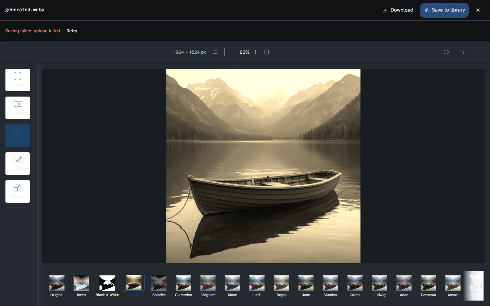

**With the forward: PASS on desktop and phone.**

| | desktop | phone |
|---|---|---|
| Save to library → "Saved to the Studio library" | 443 ms | 364 ms |
| New library asset | `be8db27e…` `generated-edited.webp`, image/webp, 82 932 B | `3d56b2ec…` `generated-edited.webp`, 73 016 B |
| Stored image | 1024×1024 | 1024×1024 |
| Warm share (R ≥ G ≥ B), source 0.242 | **0.997** | **0.997** |
| Mean R−B, source −2.4 | **+38.9** | **+38.9** |
| `/api/studio/library` count | 6 → 7 | 9 → 10 |
| First tile in "Your images" | `generated-edited.webp` | `generated-edited.webp` |

The warm share and R−B are measured on the bytes read back from the download route, not on
the canvas.

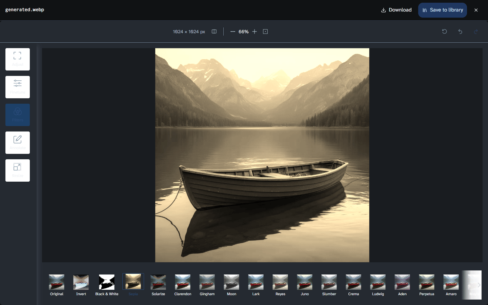
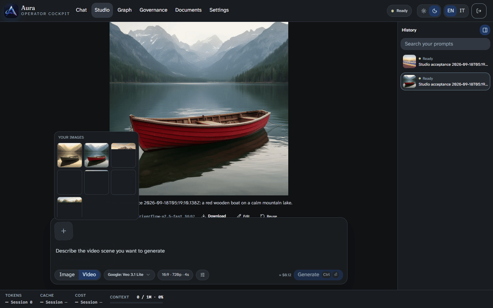

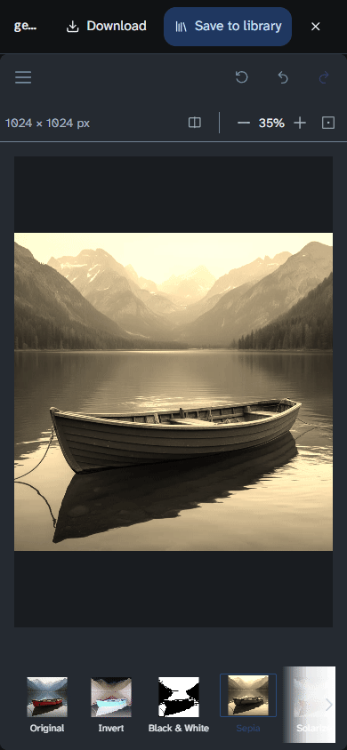 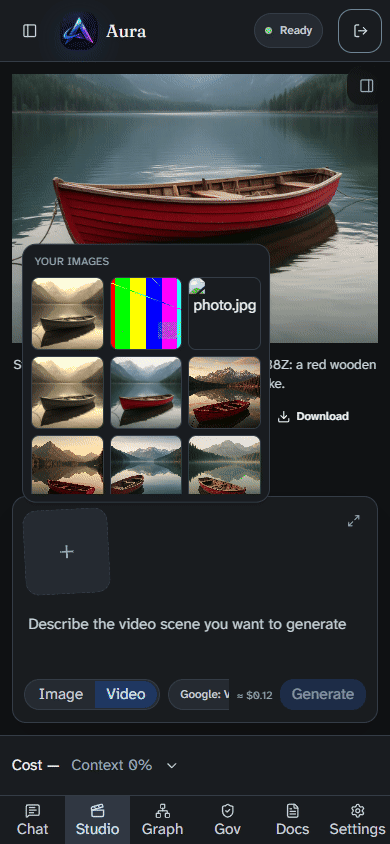

In the phone picker the broken `photo.jpg` tile is residue of this run, not of the app. It
was a 0-byte chat attachment my first forward attempt stored (see Bug 2), deleted
afterwards. The colour-bar `photo.jpg` is the desktop chat attachment of flow 3.
"Your images" lists usable images from any thread by design (`service.go:31`).

## Flow 2 — agent-generated video → trim 1–3 s → download

Steps: Studio → select the Veo record → Edit → Start `1` → End `3` → Save.

| Browser | Export (click → download) | File | ffprobe |
|---|---|---|---|
| Chrome desktop | 61 ms, 56 ms (two runs) | `generated-edited.mp4`, 2 558 958 B | **2.041667 s**; H.264 High L3.1 1280×720, 24 fps |
| Phone | 58 ms | same size | **2.041667 s** |
| Firefox | 165 ms | same size | **2.041667 s** |

- **It is a copy.** Profile, level and resolution are the source's.
- **The stream holds 73 frames.** That is the key frame before 1 s onward: the `expand`
  policy keeps it behind an edit list. The edit list presents 2.04 s, one 24 fps frame
  over 2 s.
- The filmstrip drew 10 frames in all three browsers.

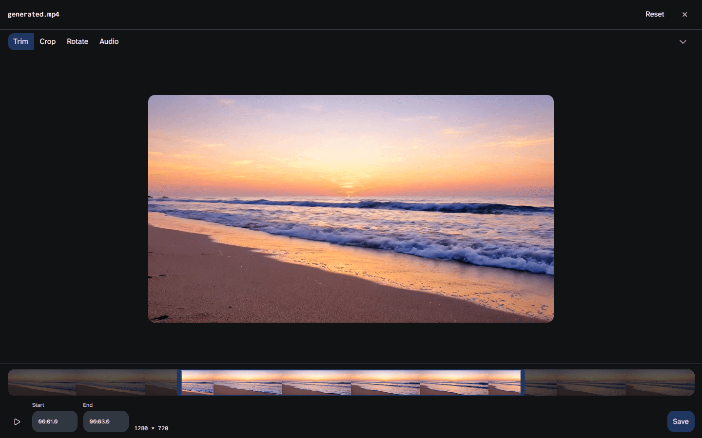

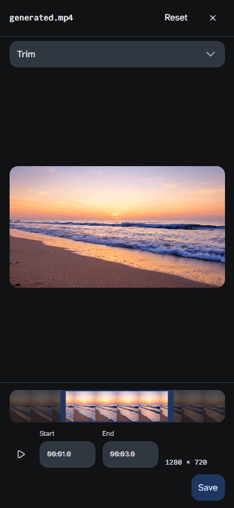

## Flow 3 — phone MP4 and JPEG as chat attachments

Steps: New chat → Add files (`phone.mp4` + `photo.jpg` together) → text → Send, with the
run held. Then the attachment card's Edit (pencil).

**The composer cannot open Edit before sending.** The pending chip (`AttachmentChip.tsx`)
offers only Remove. The Edit button lives on the sent message's `AttachmentCard`. So the
message was sent with `/agent/run` held.

**Unmodified appliance: FAIL.**
- The chip reads **Failed**.
- The console reports the CORS block on `https://172.31.131.222/aura-214f9d28-…/chat/….mp4`,
  and the PUT fails with `net::ERR_FAILED`.
- Asset `1fa1ff9f…` stays `presigned`, 0 bytes.

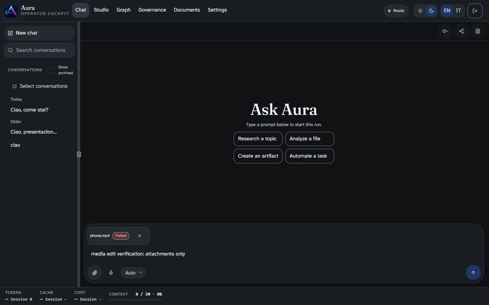

**With the forward: PASS on desktop and phone.**

Requests the browser made:
1. `presign` ×2, then `PUT` ×2.
2. `finalize` ×2: the MP4's regular, the JPEG's the Studio's unprocessed one (see Method).
3. `POST /api/conversations` 201.
4. `POST /agent/run`, held.

The cards show a pencil named "Edit phone.mp4" and "Edit photo.jpg".

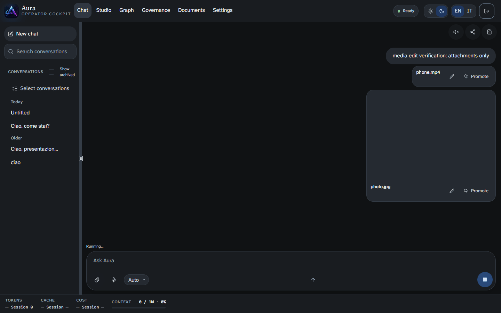

| | desktop | phone |
|---|---|---|
| `phone.mp4` editor size label | **1080 × 1920** (file rotation applied) | **1080 × 1920** |
| Trim 1–3 s → download `phone-edited.mp4` | 58 ms | 74 ms |
| ffprobe of the cut | video **2.000 s**, 60 frames, H.264 High L4.0, coded 1920×1080, **display matrix rotation 90 kept**; AAC 2.008 s; 977 093 B | identical |
| `photo.jpg` → Filters → Inkwell → Download | `photo-edited.jpeg`, 65 280 B, `ffd8ff`, 1600×1200 | 51 346 B, `ffd8ff`, 1600×1200 |
| Grey share (\|R−G\|, \|G−B\| ≤ 6), source 0.00003 | **1.000** | **1.000** |

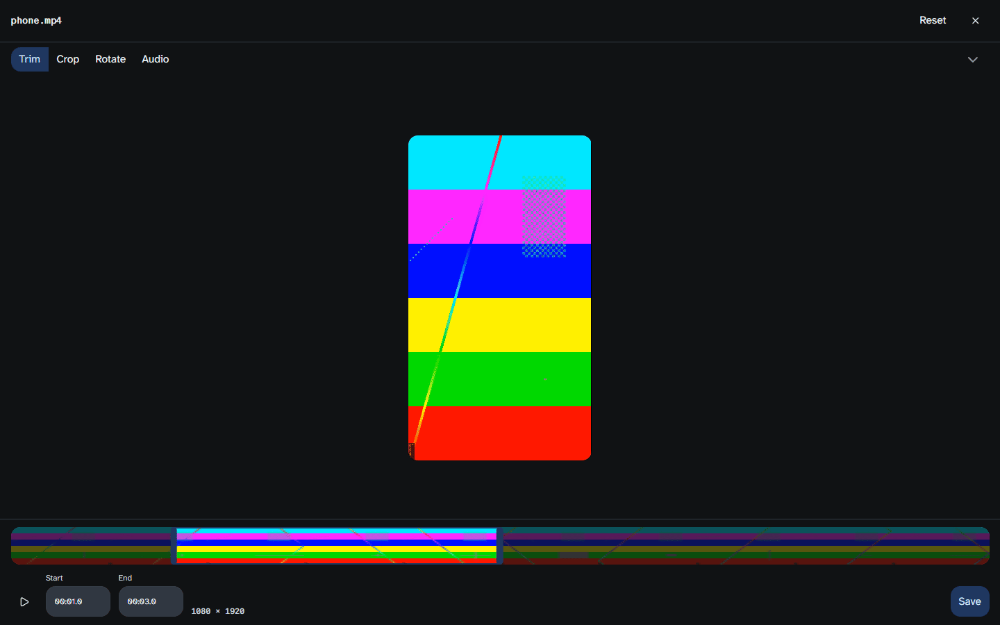
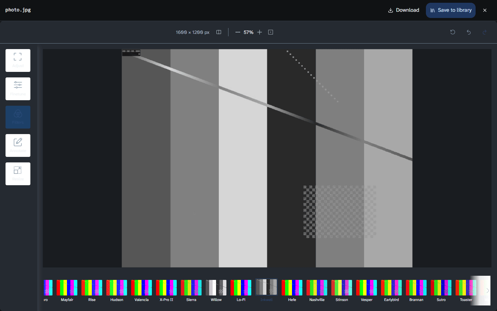

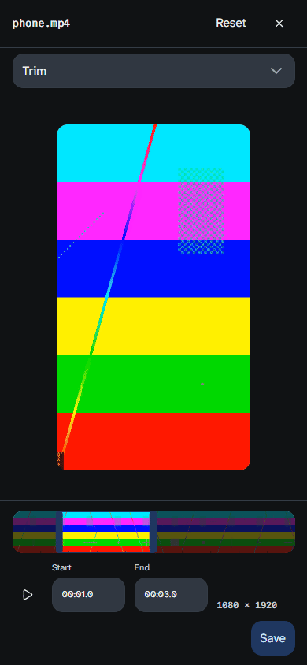 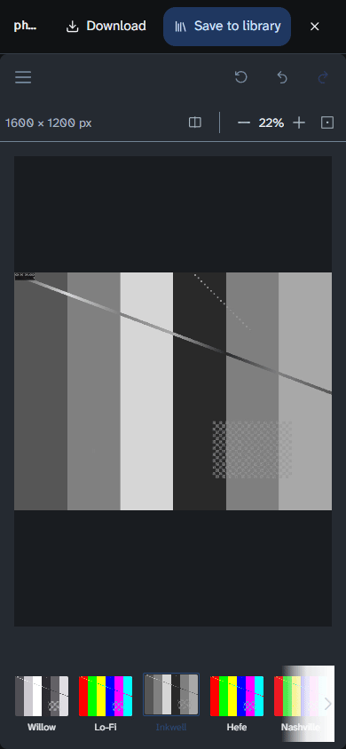

## Flow 4 — Firefox, and an HEVC source

**Firefox trim of the Veo clip: PASS.** 165 ms, 2.041667 s, the same 2 558 958 B file
Chrome writes. The filmstrip drew 10 frames.

**HEVC, uploaded as a chat attachment.** Firefox needed no body substitution: its PUT body
reached the forward.

| | Firefox 155 | Chrome 153 on this host |
|---|---|---|
| Editor opens | yes; preview black, filmstrip **0** frames | yes; filmstrip 10 frames |
| Trim 1–3 s | **not refused**: 136 ms, 623 564 B, HEVC Main 2.033 s + AAC 2.008 s | 50–55 ms, the same 623 564 B file |
| Crop 1:1 | **refused** in 383 ms: "This browser cannot process the video track (hevc). Try Chrome or Edge." No file. | transcoded in 616 ms: H.264 High L3.1 **720×720**, `has_b_frames=0`, 120 frames, 4.000 s, 2 890 784 b/s + AAC |

- **A trim or rotation never refuses HEVC.** It is a copy, and a copy needs no decoder, so
  Firefox writes a valid HEVC file it cannot itself play.
- **The refusal appears only when a transcode is needed.** A crop is the case measured.
- **The sentence is the app's own.** It is `mediaEdit.video.blocked` in English, not a raw
  Mediabunny error. The Italian string was not exercised live.

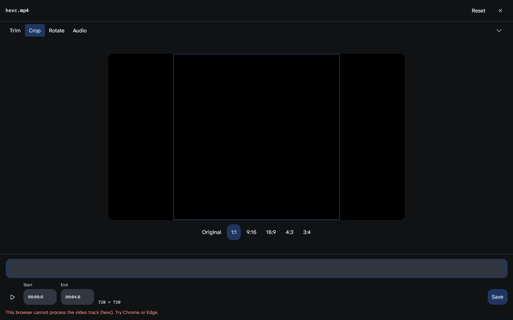

## Flow 5 — rotation only (90°, no trim change, no crop)

Chrome desktop: Reset → Rotate → "Rotate 90° right" → Save.

| Source | Size label | Export | Result (ffprobe) |
|---|---|---|---|
| `phone.mp4`, matrix +90, shown 1080×1920 | 1920 × 1080 | **65 ms** | H.264 High L4.0, coded 1920×1080, 180 frames, 6.000 s, **3 758 957 b/s = source**; AAC 126 759 b/s = source; **no display matrix** (+90 and −90 cancel); 2 919 342 B (source 2 922 497 B) |
| Veo `generated.mp4`, no matrix, 1280×720 | 720 × 1280 | **52 ms** (both runs) | H.264 High L3.1, coded 1280×720, 96 frames, 4.000 s, **6 796 942 b/s = source**; **display matrix rotation −90** (90° clockwise); 3 400 536 B (source 3 408 236 B) |

**Verdict: copy path.**
- Profile, level, `has_b_frames`, frame count and stream bit rate are identical to the source.
- Only the display matrix changes.
- The export finishes in tens of milliseconds.

A real transcode shows new encoder parameters. The HEVC crop above is one: a new codec,
`has_b_frames=0`, a new size and a new bit rate. Its time was 616 ms, not seconds, because
the clip is 4 s of 720p and Chrome encodes in hardware. On a short clip the time does not
separate the two paths; the codec parameters do.

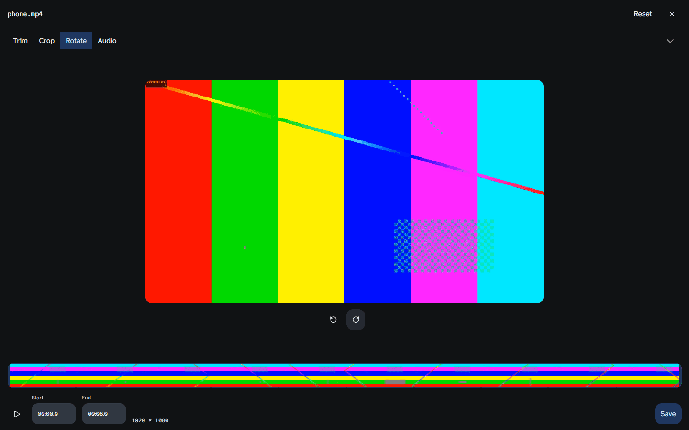

## Bugs found (not fixed here; the controller decides)

### Bug 1 — every browser upload fails on the appliance (blocker)

The presigned PUT and Caddy do not match.
- `AURA_OBJECTSTORE_PUBLIC_ENDPOINT=https://172.31.131.222`, and per-identity isolation
  names the bucket `aura-<identity>`. The presigned URL is therefore
  `https://172.31.131.222/aura-214f9d28-a020-4627-8611-4ee85ab4e1dc/chat/<uuid>.<ext>`.
- `caddy/Caddyfile:33` sends only `/aura-assets/*` to `garage:3900`. Everything else goes
  to `aura:9080`, which answers the preflight with 401 and no CORS headers.

Preflight measured with `curl -k -X OPTIONS -H 'Origin: https://localhost' -H 'Access-Control-Request-Method: PUT'`:

| Path | via `https://localhost` | via `https://172.31.131.222` |
|---|---|---|
| `/aura-assets/x` | 200 | 200 |
| `/aura-214f9d28-…/chat/x.webp` | **401** | **401** |

Effects seen:
- Save to library: "Saving failed: upload failed".
- Chat attachments: the chip says "Failed".
- The Studio's own "Upload a file" frame upload takes the same presign route, so it
  presumably fails too. That was not exercised.
- Failed attempts leave `presigned` 0-byte asset rows (`c5265375…`, `1fa1ff9f…`).
- The committed E2E (`web/e2e/media-edit.spec.ts`) cannot catch this. It runs against a
  side stack with a shared bucket and no Caddy in front.

### Bug 2 — finalize accepts an object shorter than declared (minor, server)

`accept` (`internal/assets/service.go:183-217`) checks the stored size only against the
modality limit. It never compares it with `declared_size_bytes` and does not refuse 0 bytes.

This run's first forward attempt stored empty objects. The server accepted them:
- `ea7a6a19…` `phone.mp4`: declared 2 922 497 B, stored 0 B, status `complete`.
- `9395b01f…` `photo.jpg`: declared 109 927 B, stored 0 B, status `accepted`.
- Both have the content hash of the empty string (`e3b0c442…`).

The empty JPEG then showed in the Studio picker as a broken tile. The editor itself handled
the empty clip correctly ("The file could not be opened."). The empty objects came from the
test harness, not from a browser, but the server accepted them. Both were deleted after the
measurement (`DELETE /api/assets/{id}` → 200, now `deleting`).

### Bug 3 — a stray chevron on the desktop video tool row (cosmetic, Plan A)

- `VideoEditor.tsx:225` passes `className="sm:hidden"` to `NativeSelect`, which applies it
  to the inner `<select>`.
- The wrapper, which turns `w-full` through `has-[select.w-full]` (`native-select.tsx:13`),
  stays, and so does its `ChevronDownIcon`.
- So at ≥ 640 px a lone chevron sits at the right end of the Trim / Crop / Rotate / Audio
  row. It is visible in every desktop and Firefox video-editor screenshot above.

### Bug 4 — portrait filmstrip frames are stretched (cosmetic, Plan A)

- `VideoTimeline.tsx` `Frame` draws every thumbnail with
  `drawImage(source, 0, 0, 160, 90)`, whatever the frame's shape.
- A portrait clip's frames (about 51×90) come out stretched about 3× wide.
- The phone MP4 filmstrips above show horizontal bars smeared across each slot, while the
  preview above them is correct.

## Left on the stack by this run

- **Studio library:** two `generated-edited.webp` (`be8db27e…`, `3d56b2ec…`).
- **Chat attachments:**
  - `phone.mp4` (`a412e854…`, `99e3a259…`) and `photo.jpg` (`27caec9a…`, `59000641…`).
    The two JPEGs also appear in the Studio picker.
  - `hevc.mp4` ×4 (`8cfcab37…`, `7ade2453…`, `f50e974b…`, `342db6bc…`).
- **Failed attempts:** `presigned` 0-byte rows `c5265375…` and `1fa1ff9f…`.
- **Deleted:** the empty `ea7a6a19…` and `9395b01f…`, now `deleting`.
- **Conversations:** 7 empty "Untitled" ones (`01a0bb9c…`, `01a0bb9e…`, `01a0bb9f…`,
  `01a0bba0-9ed7…`, `01a0bba0-ce5a…`, `01a0bba1-9b58…`, `01a0bba1-b6b0…`). Send creates the
  conversation (`POST /api/conversations` 201) before the held run. They were not deleted.

## What this does not prove

- **Safari and iOS.** WebKit was not run (the `mobile-safari` project was not enabled), and
  no real iPhone was used.
- **A real phone.** "Phone" is desktop Chrome's device emulation on Windows, not Android
  Chrome's codec stack or memory limits.
- **Very large clips.** The largest source was 3.4 MB and 6 s. Neither the 500 MB "Open
  anyway" gate nor memory under a long 4K clip was exercised.
- **Uploads on the appliance as it stands.**
  - Every successful Save to library and chat attachment here went through the in-test
    Garage forward (Bug 1).
  - The chat composer's PUT body was re-sent from the attached file, not from the browser.
  - Whether a real browser also trusts Caddy's internal certificate for `172.31.131.222` was
    not measured: the harness ignores HTTPS errors.
- **The regular chat image path.** The JPEG took the Studio's unprocessed finalize, so the
  vision summary and document naming of a chat image did not run.
- **A persisted chat message.** With the run held, the cards are the client's optimistic
  message. That they survive a reload of the thread was not checked.
- **The other Edit entry points.** Edit on an agent-delivered video or image inside a chat
  (`LocalArtifactDisplay`, `GeneratedImagePreview`, `PreviewModal`) was not exercised: no
  such chat exists, and making one needs a model turn.
- **Other tools and editor states.**
  - Photo editor: only the Filters tab was used (no crop, rotate, annotate or resize).
  - Video editor: mute, and a crop of an H.264 source, were not exercised.
  - The Italian locale was not used live.
- **Other hosts.** Firefox is Playwright's 155.0 build, headless. Chrome's HEVC decode
  comes from this Windows host; on a host without it Chrome would refuse the HEVC crop as
  Firefox did, but that was not measured.
