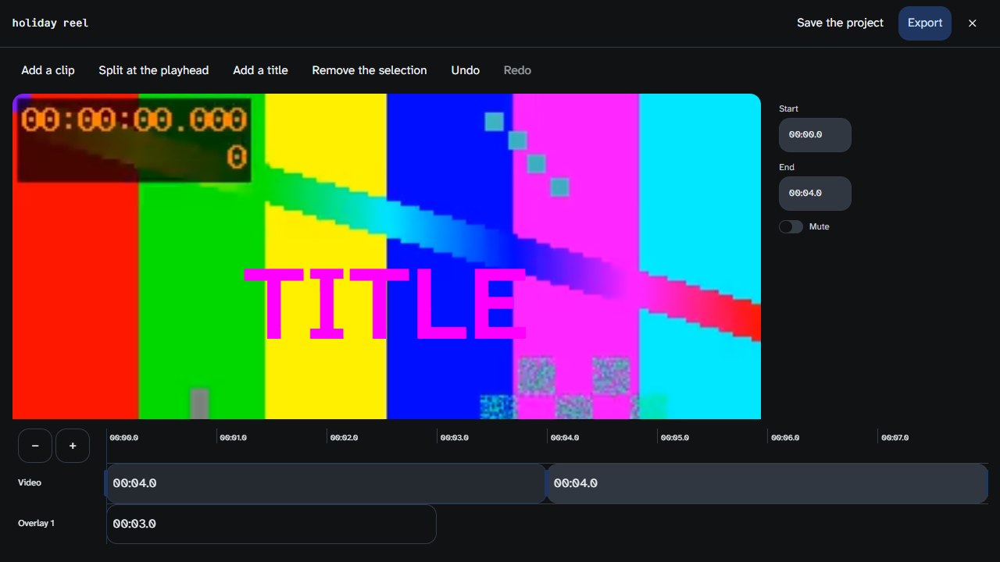
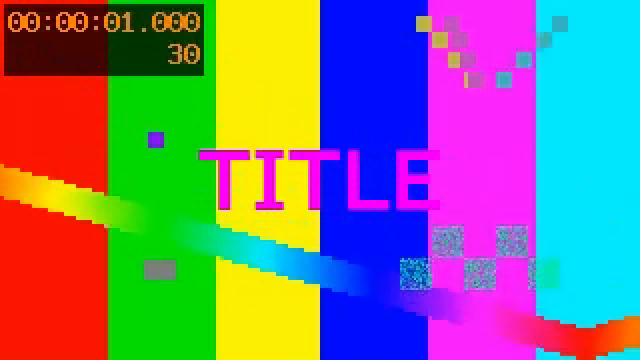
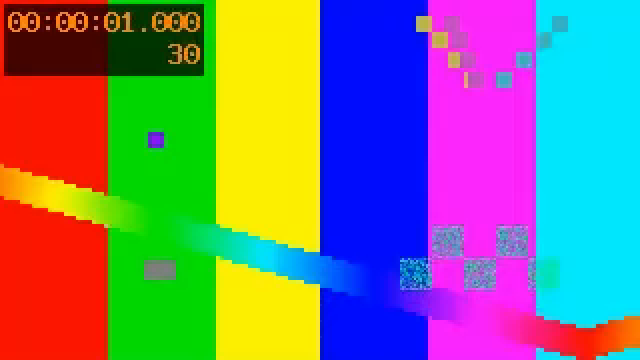
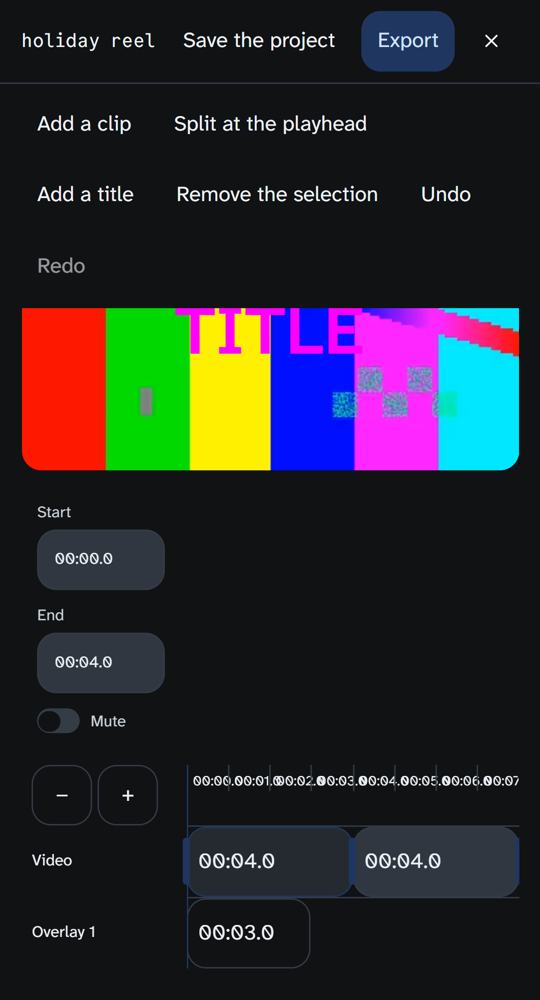

# Live verification — the multi-track video editor makes a file

Measured 2026-09-20 on the running appliance at `https://localhost`, through the cockpit, by
`web/e2e/video-studio.spec.ts`. Plan:
[`docs/superpowers/plans/2026-09-20-video-studio-cycle-1.md`](../plans/2026-09-20-video-studio-cycle-1.md).
The measurement the export rests on:
[`.planning/spikes/108-video-studio-audio/README.md`](../../../.planning/spikes/108-video-studio-audio/README.md).

| | |
|---|---|
| Image before the update | `ghcr.io/chetto1983/aura:edge`, built by CI 2026-09-20 21:57 from `be83178e0` — its dist had **no** VideoStudio chunk at all |
| Image the cases first ran on | built from this working tree; `aura version` → `commit: task9-worktree-50d66107a` |
| Image the cases were **repeated** on | the published `ghcr.io/chetto1983/aura:edge` after the push; `aura version` → `commit: be4a7748a9e4acfb2cc9f5fddf66b44e44755415`. All six cases pass on the artifact an operator receives, unchanged |
| Bundle the browser loaded | entry `assets/index-g4THe68B.js`, SHA-256 `e125d0d515ecf469205d2e05573a09239dac7fa5e9bf61d974e17a53ce4b73b0` — **byte-identical** to the `internal/webui/dist` committed with this change |
| Browsers | Chrome (`chrome` project) and Pixel 5 emulation (`mobile-chrome`). No WebKit — see *Not proven* |
| Front door | Caddy `:443`, internal CA, on-demand TLS; object store fronted on the same authority at `^/aura-…` |

## The material

Two fixtures, `web/e2e/fixtures/video-studio/clip-{a,b}.mp4`, made with spike 108's own ffmpeg
recipe (`testsrc2=s=320x180:r=30:d=4` + a sine tone, `libx264` / `aac`), 165 496 B and 165 234 B.
They are deliberate **twins**: the same `testsrc2`, so their video streams share an MD5
(`aa2dd15028f20ab9d7ffdabdcdb62bf8`) and differ only in their audio tone (440 Hz / 880 Hz).

That is what makes the title findable without OCR. In a composition of clip A then clip B, the
instants `t` and `t + 4` show the *same source frame*, so every pixel that differs between them
was put there by the editor. `testsrc2` also burns its own timecode into the picture, which turns
the same pair into an independent check that the cut landed where the model says it did.

A third fixture, `unplayable.mp4`, is MPEG-4 Part 2 (`mp4v`) in an MP4 container: Mediabunny
parses it and reports 320×180 and 2.000 s, and no browser holds a decoder for it.

## Case 1 — two clips and a title, exported and read back

Driven through the real UI: a completed Studio video record (its asset uploaded through the real
presign → PUT → finalize) opened with **Open in the video editor**; `clip-b.mp4` picked through
**Add a clip**; **Add a title** at the playhead; and the inspector given `TITLE`, size `14`,
colour `#ff00ff`.

**Export → `video-studio-cycle-one.mp4`, 631 868 B.** Read back two ways:

| Measured | By Mediabunny in Node | By ffmpeg 7.1, independently |
|---|---|---|
| Duration | **8.000 s** (the spec allows 8 ± 0.1) | `Duration: 00:00:08.00` |
| Frame | **320 × 180** — the size the project asks for, taken from its first source | `h264 (avc1) … 320x180 … 30 fps` |
| Audio | present | `aac (mp4a) 48000 Hz, stereo, 192 kb/s` |

**The title is inside its window and nowhere else.** The frames were decoded in the browser from
the downloaded bytes and diffed against their twins:

| Pair | Pixels changed (of 57 600) | …where the title's colour appeared |
|---|---|---|
| t = 1.0 s vs t = 5.0 s (inside the 0–3 s window) | **1 966** | **949** |
| t = 3.5 s vs t = 7.5 s (outside it) | **0** | **0** |

On this host the control is a hard zero: the two halves encode the same picture the same way, so
anything above the noise line is the editor's. For scale, re-encoding the two fixtures end to end
with x264 and diffing the same twin frames leaves 24 and 52 pixels above that line — the codec's
own noise. The threshold is 48 of 255 on one channel.

“The title's colour appeared” is the exact wording of the second column and it was earned. The
first version of this measurement counted a changed pixel that merely *was* near the title's
colour, and CI's encoder — a different one from this host's — left **4** such pixels outside the
window, all of them jitter inside `testsrc2`'s own magenta bar, where both frames are that colour
already. A pixel that was the colour before the title existed is not evidence the title is there.
The metric now requires the colour to be near in the first frame and **not** near in its twin, and
the assertion is that the ink outside the window is under a hundredth of the ink inside — the
claim that survives an encoder nobody controls. A title is a word, not four pixels.

Both frames carry `testsrc2`'s burned-in `00:00:01.000 / 30`. That is a second, independent
witness: clip B starts at exactly 4.000 s and the renderer sampled source frame 30 in both halves,
which is the cut nudge from spike 108 §7 doing its job at 30 fps over a 30 fps source.

## Case 2 — a source the browser cannot decode, refused at the door

`unplayable.mp4` picked through **Add a clip**:

- the alert reads *“This browser cannot decode that clip, so it would export as black frames.
  Convert it to MP4, or try Chrome or Edge.”* — `videoStudio.refusal.sourceUndecodable`, translated;
- `/api/assets/presign` was called **0 times**, so the refusal cost no transfer;
- no second clip reached the lane.

**This case did not pass before today.** See *What this verification found*, below.

## Case 3 — nothing left the appliance

Every test records every `http(s)` origin the session touched, on the page **and** on its context
(the export runs `worker: true`, and a worker's requests surface on the context). Measured:

- the session that opens the editor and refuses a clip — login, upload, Studio, the DOM renderer
  and its local fonts — touched **one origin**, the cockpit's own. No `fonts.googleapis.com`, no
  `fonts.gstatic.com`, nothing;
- across the **render itself** — from the click on Export to the download — the set of origins
  grew by **zero**. The worker, the font loading and the clips it re-fetches all stayed home.

One honest qualification, because the number depends on the deployment and not on the editor. An
upload goes to a presigned URL, and this appliance is configured with
`AURA_OBJECTSTORE_PUBLIC_ENDPOINT=https://172.31.131.222` — its own LAN address, fronted by the
same Caddy (`@objectstore path_regexp ^/aura-…`) that serves the cockpit, but a *different origin*
from `https://localhost`. So the assertion is not a hard-coded allow-list: the only origin
tolerated besides the page's own is one the cockpit's **own `/api/assets/presign` answer named**,
and anything else fails. Browsed at `https://172.31.131.222` the two collapse into one and the
session is literally single-origin; in CI, where the store is presigned at `127.0.0.1:3900`, the
same rule holds without editing the test.

## The phone

`mobile-chrome` (Pixel 5, 393 × 851, touch):

- the editor opens, both clips land on the lane, and the overlay lane shows the 3 s title;
- **the lanes move**: a tap on *Zoom in* changes the ruler — the timeline's view is a range, not
  a scrollbar, so that is what “scrolling” is here;
- **the fields work**: a tap selects a clip and the inspector's End field commits (00:04.0 →
  00:03.0) from the on-screen keyboard's input;
- and the export runs from the phone project too, producing the same 8.000 s / 320 × 180 file.
- Stage geometry, measured rather than eyeballed: the stage box is 362 × 204 CSS px (1.775) and
  VideoFlow's canvas fills it exactly — 958 × 539 on desktop. The preview is not cropping.

**Skipped, with the reason in the skip and not hidden:** the pointer-drag reorder, the trim-handle
drag and the Alt+Arrow keyboard reorder. A 44 px trim handle wants a mouse and Alt+Arrow wants a
hardware keyboard; Playwright drives one touch point and sends no hardware keys, so a phone
project cannot make either gesture. They are covered on the desktop project, in the same file.

## What this verification found

Two defects that no unit test in this cycle could see, both fixed in the same change.

**1. The door checked that a file *parses*, not that it *decodes*.** `probeSource` called
`probeVideo`, which asks for a video track, a duration and a display size — and Mediabunny answers
all three for an MPEG-4 Part 2 clip it cannot decode, logging `Unsupported video codec (sample
entry type 'mp4v')` and returning `codec: null`. The refusal was only reachable for a file with no
video track at all, while the sentence it shows describes exactly the case it could not detect. The
unit test that claimed to cover it mocked `probeVideo` into *rejecting*, so it proved the wrong
door. `VideoInfo` now carries `decodable` (`canDecode()`, i.e. `VideoDecoder.isConfigSupported`
through Mediabunny) and the multi-track door refuses on it. The single-clip editor is unchanged:
a copy-trim never decodes a frame, so it may still open such a file.

**2. A click on a clip selected nothing.** dnd-timeline is used here with dnd-kit's default
sensors, which carry no activation distance, so a plain press already counts as the start of a
drag: `handleStart` adds a capturing document `click` listener that calls `stopPropagation`
(`@dnd-kit/core` `core.esm.js:1504`) and the button's own `onClick` never runs. jsdom cannot
reproduce it — it lays nothing out, so the sensor never engages — which is why 34 green unit tests
sat on top of a timeline whose items could not be selected with a mouse or a thumb. Items now
select on `pointerdown`, and keep `onClick` for Enter and Space. (The deeper fix is a
`PointerSensor` with an activation distance, which needs `@dnd-kit/core` as a direct dependency;
that is a dependency decision for the controller, not for the closing task of a cycle.)

## Not proven

- **Safari, and WebKit at all.** The `mobile-safari` project only exists when
  `AURA_E2E_HTTPS_ORIGIN` points at a TLS terminator, and it was not run. The export path is
  WebCodecs `VideoEncoder`; nothing here says what Safari does with it, and the refusal fixture is
  undecodable in every browser, so it cannot tell one browser's codec support from another's.
- **Firefox.** Not run. Spike 105 measured Firefox silently dropping an HEVC video track; whether
  the new `decodable` gate catches that case in Firefox is untested.
- **A real phone.** Pixel 5 emulation in desktop Chrome is a viewport and a touch flag, not a
  device: no real GPU budget, no real thermal limit, no real on-screen keyboard.
- **A long project.** Eight seconds, 240 frames, 320 × 180, 631 KB. Nothing here says what a
  ten-minute 1080 p project costs in time or memory, and spike 108 measured 175.8 MB of live PCM
  for eight layers of a single 60 s clip. The export ran in seconds; that number is about these
  fixtures and must not be read as a rate.
- **The preview's cost per command.** Every edit still recompiles and reloads the preview. It was
  not measured here either, and the number that matters is a browser number on a big project.
- **The audio.** The export carries an AAC stereo track and that is all that is asserted. Nobody
  listened to it, and nothing checks that clip A's 440 Hz precedes clip B's 880 Hz.
- **Saving and reopening a project.** `saveProject` / `loadProject`, the *Reopen the last project
  you saved here* entrance and `videoStudio.refusal.sourceMissingAsset` are covered by unit tests
  and were not driven through the UI here.
- **Image overlays.** `addOverlay` carries them and the inspector edits their asset id, but cycle
  1's toolbar mints only titles, so no image overlay reached an export.
- **Two Studio results in one project.** The plan's step 6 asks for it; cycle 1's Studio entrance
  opens one record at a time and the library door is cycle 2's, so the second clip came from disk
  through *Add a clip* — the same probe, the same upload, the same lane.
